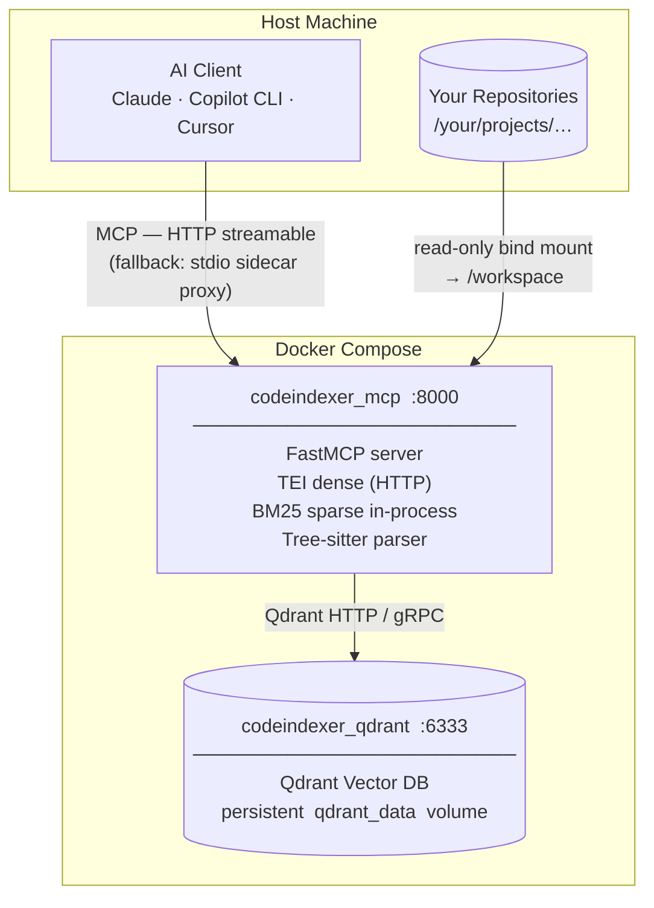
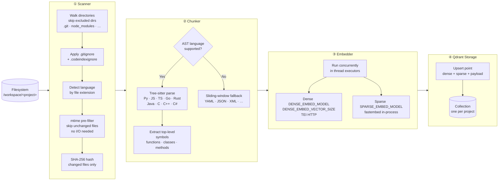
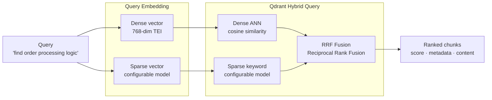

# Local Codebase Indexer MCP Server

A fully self-hosted, Docker-based MCP server that indexes your codebase into a local vector database using **TEI dense embeddings** plus in-process BM25 sparse search, then exposes semantic search tools to AI agents — minimising token consumption.

## Features

- **100% Local** — Zero external API calls; all processing stays on your machine
- **Semantic Code Search** — Tree-sitter AST-based chunking with TEI dense + in-process BM25 sparse hybrid search
- **Incremental Indexing** — Only re-indexes changed files (SHA-256 hash comparison)
- **Multi-Language** — Python, JavaScript, TypeScript, Go, Rust, Java, C, C++, C#
- **Token Efficient** — Returns only relevant code chunks, not full files. Three dedicated low-cost orientation tools (`get_collection_summary`, `search_symbols`, `get_file_outline`) eliminate exploratory searches entirely.
- **Vector Discovery** — `recommend_code` finds chunks similar to positive examples and dissimilar from negatives; `find_outlier_chunks` finds code semantically distant from a module context (Qdrant Recommendation API)
- **Optional GraphRAG** — index-time Neo4j code graph alongside Qdrant when `GRAPH_ENABLED=true` and `docker-compose.neo4j.yml` overlay is used ([ADR 0002](docs/adr/0002-graphrag-neo4j-qdrant.md)); disabled by default
- **MCP Compatible** — Works with Claude Desktop, Copilot CLI, Cursor, and more
- **GPU-default acceleration** — Dense TEI and ColBERT sidecar run on NVIDIA GPU by default ([ADR 0022](docs/adr/0022-gpu-default-cpu-fallback.md)); set `ACCELERATOR=cpu` only for explicit CPU-only hosts

## Documentation

| Document | Description |
|----------|-------------|
| [AGENTS.md](AGENTS.md) | Pointer to copilot-instructions, ADRs, tracker, and SKILL for AI agents |
| [CONTRIBUTING.md](CONTRIBUTING.md) | Dev setup (Python 3.12, uv), CI lint/type-check/test workflow, conventional commits |
| [CHANGELOG.md](CHANGELOG.md) | Release history (Keep a Changelog format) |
| [docs/ARCHITECTURE.md](docs/ARCHITECTURE.md) | Per-component responsibilities, indexing pipeline, embedding layer, hybrid search |
| [docs/adr/](docs/adr/) | Architecture Decision Records — see [0025](docs/adr/0025-huggingface-tei-dense-embedding.md) (TEI dense), [0021](docs/adr/0021-revert-jina-production-default-retire-qwen3.md) (Jina production default), [0016](docs/adr/0016-qwen3-embedding-default-dense-model.md) (Qwen3 experimental preset — historical), [0012](docs/adr/0012-retrieval-only-rag-split.md) (retrieval-only RAG), [0008](docs/adr/0008-optional-colbert-reranking.md) (ColBERT rerank), [0014](docs/adr/0014-vector-discovery-and-ops-automation.md) (recommendation search), [0015](docs/adr/0015-colbert-http-sidecar.md) (ColBERT sidecar) |
| [docs/DEPLOYMENT.md](docs/DEPLOYMENT.md) | GPU-default TEI compose, explicit `ACCELERATOR=cpu` exception, GraphRAG overlay, metrics, memory/CPU tuning |
| [docs/SEARCH_BEHAVIOR.md](docs/SEARCH_BEHAVIOR.md) | `search_codebase` / `search_symbols` caps, `min_score` vs RRF, `recommend_code`, `find_outlier_chunks`, ColBERT rerank |

## System Architecture



Each direct subdirectory of `/workspace` becomes one **collection** (one indexed project), named after the folder basename.

## Quick Start

```bash
# 1. Copy and edit .env
cp .env.example .env
# Set WORKSPACE_ROOT to the *parent* directory that contains all your repos.
# Every direct subdirectory becomes a separate indexed collection.
# Example: WORKSPACE_ROOT=C:\Users\me\repos  (not a single project folder)

# 2. Start services (NVIDIA GPU default; bundled TEI profile)
docker compose $(python scripts/compose_files.py) --profile bundled-tei up -d --build
# TEI downloads the model weights to the tei_data volume on first start — no manual pull step

# 3. Confirm all services are healthy
docker compose ps

# 4. Stream server logs (indexing progress, errors)
docker logs -f codeindexer_mcp

# 5. Add MCP client config (see below)
```

Requires NVIDIA driver + [Container Toolkit](https://docs.nvidia.com/datacenter/cloud-native/container-toolkit/install-guide.html) when `ACCELERATOR=gpu` (default). Verify GPU: `docker exec codeindexer_tei nvidia-smi` lists the GPU and the running TEI process.

### Explicit CPU-only (`ACCELERATOR=cpu`)

For CI, air-gapped CPU servers, or hosts without NVIDIA — not the production default. See [docs/DEPLOYMENT.md](docs/DEPLOYMENT.md).

```bash
# In .env: ACCELERATOR=cpu, TEI_GPU=0
docker compose $(ACCELERATOR=cpu python scripts/compose_files.py) --profile bundled-tei up -d --build
```

## MCP Client Configuration

After `docker compose up -d`, connect your AI client to the running HTTP server at `http://localhost:8000/mcp`.

### Cursor (recommended — native HTTP)

Add to `~/.cursor/mcp.json` (Windows: `%USERPROFILE%\.cursor\mcp.json`):

```json
{
  "mcpServers": {
    "codebase-indexer": {
      "url": "http://localhost:8000/mcp"
    }
  }
}
```

When `MCP_AUTH_TOKEN` is set in `.env`, add the bearer header:

```json
{
  "mcpServers": {
    "codebase-indexer": {
      "url": "http://localhost:8000/mcp",
      "headers": {
        "Authorization": "Bearer <your-token>"
      }
    }
  }
}
```

Verified with Cursor 3.7.12: remote MCP servers use `"url"` alone (no `type` field). Because Cursor talks directly to the published port, it **reconnects automatically** after `docker compose restart mcp_server` — no manual MCP reload.

> **Why HTTP?** The server already publishes `127.0.0.1:8000` with streamable HTTP. Pointing Cursor at that URL avoids coupling the IDE to a `docker exec` session that dies whenever `codeindexer_mcp` restarts.

### Claude Desktop and other HTTP clients

```json
{
  "mcpServers": {
    "codebase-indexer": {
      "url": "http://localhost:8000/mcp",
      "transport": "streamable-http"
    }
  }
}
```

Some clients require an explicit `transport` field; Cursor does not (see above). Add the same `headers.Authorization` entry when `MCP_AUTH_TOKEN` is set.

### Fallback: stdio sidecar proxy

Use when localhost HTTP is blocked (e.g. restrictive network proxies that intercept `localhost` and return 502, which the MCP SDK misreports as `MCPOAuthError`) or when a client only supports stdio.

1. Uncomment the disabled `proxy` service in [`docker-compose.yml`](docker-compose.yml) (block labeled `FALLBACK: stdio sidecar proxy`).
2. `docker compose up -d` to start `codeindexer_proxy`.
3. Add to `mcp.json`:

```json
{
  "mcpServers": {
    "codebase-indexer": {
      "command": "docker",
      "args": ["exec", "-i", "codeindexer_proxy", "python", "/app/stdio_proxy.py"]
    }
  }
}
```

The sidecar (`codeindexer_proxy`) is a lightweight `python:3.12-slim` container running `sleep infinity` with only `stdio_proxy.py` mounted. Cursor `docker exec`s into this container — not `codeindexer_mcp` — so the stdio session survives `mcp_server` restarts. When auth is enabled, the sidecar reads `MCP_AUTH_TOKEN` from compose env (already wired in the commented block).

> **`stdio_proxy` vs `main`** — the proxy is a thin shim that forwards JSON-RPC to the already-running HTTP server. No embedding models are reloaded on each session start. Indexing and search logs remain visible in `docker logs codeindexer_mcp`.

> **Deprecated:** `docker exec` into `codeindexer_mcp` with `uv run python -m codebase_indexer.stdio_proxy`. `uv run` re-synced the editable package and failed with `OSError: Readme file does not exist: ../README.md`; exec into the main container also broke the stdio pipe on every `mcp_server` restart, requiring a manual Cursor MCP reload.

### Copilot CLI

Add to `~/.copilot/mcp-config.json` (Windows: `%USERPROFILE%\.copilot\mcp-config.json`):

```json
{
  "mcpServers": {
    "codebase-indexer": {
      "type": "http",
      "url": "http://localhost:8000/mcp",
      "tools": ["*"]
    }
  }
}
```

> **Important:** Use `"type": "http"` (not `"type": "sse"`). The server uses streamable-http (POST-based) transport. Using `"sse"` causes the CLI to send an incompatible `Accept` header, resulting in HTTP 406 errors. When `MCP_AUTH_TOKEN` is set, add `"headers": {"Authorization": "Bearer <token>"}`.

After editing the config, run `/restart` in the CLI to reconnect. If the connection fails, check that all containers are running with `docker compose ps` — Qdrant stopping is the most common cause. Otherwise use the [stdio sidecar proxy](#fallback-stdio-sidecar-proxy) fallback.

## MCP Tools

### Indexing

| Tool | Description |
|------|-------------|
| `index_codebase` | Index a project. Blocks until done by default (`wait=True`); returns final stats in one call — no polling needed. Use `wait=False` for fire-and-forget background mode. |
| `index_status` | Check indexing progress. Only needed when `index_codebase` was called with `wait=False`. |
| `index_all` | Re-index all existing collections sequentially. Discovers collections in Qdrant and re-indexes them one at a time (memory-safe). Same params as `index_codebase` minus `path`/`collection`. |
| `stop_indexing` | Gracefully cancel a running indexing job |

### Token-Efficient Orientation

These tools use **zero embedding cost** (Qdrant payload scroll only). Use them first to orient yourself in an unfamiliar codebase and save tokens before running heavier semantic searches.

| Tool | Description | Token saving |
|------|-------------|-------------|
| `get_collection_summary` | File counts by language, directory tree (depth 2), symbol breakdown, top-chunked files, and `build_dependencies` (which other indexed collections are depended on via Maven/NuGet/npm/etc). Single call to understand a project. | Replaces 3–5 exploratory searches |
| `search_symbols` | Same hybrid search as `search_codebase` but returns **only** symbol locations — no code content. `top_k` capped at 30; RRF/`min_score` semantics match `search_codebase` — see [docs/SEARCH_BEHAVIOR.md](docs/SEARCH_BEHAVIOR.md). | ~90% vs `search_codebase` |
| `get_file_outline` | All symbols in a specific file (name, type, line numbers) — no code content, no embedding. | Replaces reading full file chunks |

### Semantic Search

| Tool | Description |
|------|-------------|
| `search_codebase` | Hybrid semantic + keyword search. `top_k` capped at 20. When `HYBRID_SEARCH` is on (default), RRF ranking applies and `min_score` is ignored; see [docs/SEARCH_BEHAVIOR.md](docs/SEARCH_BEHAVIOR.md). Use `max_content_chars` to truncate content and call `get_chunk` only for results you need in full. |
| `get_chunk` | Retrieve a specific chunk by ID from a prior search result |
| `find_cross_references` | Discover symbol/endpoint links across multiple collections. Reference types: `definition`, `import`, `usage`, `endpoint_definition`, `http_call`, `service_config`, `build_dependency`, `call_site`. Optional `member` (method name) and `receiver` (field/var name) filter by indexed call expressions — results use `match_type`/`reference_type` `call_site` (exact callee lookup, not semantic search). When `RERANK_ENABLED=true`, semantic paths participate in ColBERT rerank. To find true consumers of a method — especially inherited Spring `@Autowired` fields used in subclass bodies — pass `member="<method>"` and optionally `receiver="<field>"`; this grounds results in call sites, not imports or passive inheritance. |
| `map_service_dependencies` | Build a full microservice dependency graph across collections. Detects HTTP/REST call chains **and** build-level dependencies (Maven, NuGet, npm, Gradle, Go, Cargo, Python). When `RERANK_ENABLED=true`, participates in ColBERT rerank like `search_codebase`. |

### Vector discovery

| Tool | Description |
|------|-------------|
| `recommend_code` | Find chunks **similar to positive examples** and **dissimilar from negative examples** via Qdrant Recommendation API (dense-only, `AVERAGE_VECTOR`). Provide `positive_chunk_ids` and/or `positive_query`; optional negatives. Single collection; `path_glob` post-filter uses indexed `rel_path` prefix (e.g. `my-project/src/**/*.py`). Gated by `RECOMMEND_ENABLED` (default on). See [docs/SEARCH_BEHAVIOR.md](docs/SEARCH_BEHAVIOR.md#recommend_code). |
| `find_outlier_chunks` | Find chunks **semantically distant** from a module context via Qdrant Recommendation API (`BEST_SCORE`, negative-only) + cosine-to-centroid filter. Provide `context_chunk_ids` and/or `path_glob` scroll sample. Single collection; `max_similarity` excludes near-context chunks (default `OUTLIER_MAX_SIMILARITY`). Gated by `RECOMMEND_ENABLED` (default on). See [docs/SEARCH_BEHAVIOR.md](docs/SEARCH_BEHAVIOR.md#find_outlier_chunks). |

### Graph retrieval (opt-in)

| Tool | Description |
|------|-------------|
| `expand_search_context` | **Graph-augmented retrieval** — registered only when `GRAPH_ENABLED=true`. Runs the same hybrid search as `search_codebase` to find seed chunks, then expands `1..GRAPH_MAX_HOPS` hops in the Neo4j code graph (`CALLS`, `HTTP_CALLS`, `DECLARES_ENDPOINT`, `DEFINES`, …) capped by `GRAPH_MAX_NODES`, and hydrates related chunk payloads from Qdrant. Returns structured graph context (`nodes`, `edges`, `related_chunks`, `seeds`) — **not** an LLM answer. Seeds purely from hit `chunk_id`s. Absent (zero behavior change) when `GRAPH_ENABLED=false`. |

#### Finding method callers (call sites)

```
# Primary: member-only — exact call sites (no query or symbol_name required)
find_cross_references(collections=["my-service", "other-service"], member="processOrder", receiver="orderService")
-> read rows where match_type == "call_site"
-> receiver is optional; use it to disambiguate inherited/Spring bean fields

# Optional: symbol_name adds definition/import rows and code_dependency links in links[]
find_cross_references(collections=["my-service"], symbol_name="OrderService", member="processOrder")
-> filter match_type == "call_site" when you only want callers

# Collections indexed before callees support need a force re-index:
index_codebase(path="my-service", force=True)
```

### Collections

| Tool | Description |
|------|-------------|
| `list_collections` | List all indexed collections with statistics |

## How Indexing Works

Indexing transforms raw source files into searchable vector chunks stored in Qdrant. Running `index_codebase` triggers a four-stage pipeline:

### Pipeline Overview



### Chunk Schema

Every chunk stored in Qdrant carries both vectors and rich metadata payload:

```
Chunk (Qdrant point)
├── chunk_id      sha256("{rel_path}:{start_line}")   ← deterministic & stable
├── content       raw source code text  (≤ 150 lines by default)
│
├── rel_path      "src/services/OrderService.java"
├── language      "java"
├── start_line    42
├── end_line      78
├── symbol_name   "processOrder"                      ← null for sliding-window chunks
├── symbol_type   "method"                            ← function | class | method | other
├── callees       ["save", "orderRepo.findById", …]   ← call-expression tokens (bare method + receiver.method)
│
├── file_sha256   "a3f8b2…"                           ← used for incremental re-indexing
├── file_mtime    1748876400.0                        ← fast mtime pre-filter key
│
├── dense_vector  [0.021, −0.134, …]  (768 floats)   ← cosine similarity search
└── sparse_vector {indices: [42, 891, …],            ← sparse keyword search
                   values:  [ 0.6,  0.3, …]}
```

> **Verbose/markup languages** (YAML, JSON, XML, Markdown, SQL) use a smaller cap of 60 lines per chunk to stay within embedding token limits.

> **Schema upgrades:** Payloads are schemaless and collections carry no schema-version metadata. After upgrading to a release that adds new payload fields (e.g. `callees`) or keyword indexes, run a **forced** re-index — `index_codebase(..., force=True)` or `index_all(force=True)` — to backfill existing points. Incremental re-index skips unchanged files and will not populate missing fields.

### Incremental Indexing

Re-running `index_codebase` on an already-indexed project is fast — unchanged files are skipped at two checkpoints before any expensive work happens:

```
For each file on disk:
  1. mtime unchanged?    → skip immediately  (no file read, no hash)
  2. SHA-256 unchanged?  → skip              (file was read but content identical)
  3. File changed?       → delete old chunks from Qdrant, re-chunk & re-embed
  4. File deleted?       → stale chunks batched and purged after full scan
```

Only modified and new files are re-chunked, re-embedded, and upserted.

### Double-Buffered Flushing

The pipeline overlaps CPU-bound embedding with I/O-bound Qdrant upserts for ~30–40% higher throughput:

```
Time ──────────────────────────────────────────────────────────────►

Batch N:    │ embed (CPU) │──────────────────────────────────────────
Batch N+1:               │ upsert (I/O) │ embed (CPU) │─────────────
Batch N+2:                                            │ upsert (I/O) │
```

While Qdrant ingests batch N over the network, the CPU is already computing embeddings for batch N+1. At most two batches are held in memory at once (flushed every `FLUSH_EVERY` chunks, default 1 500). Dense vectors are held as compact numpy arrays to keep that peak small.

## How Search Works

### Hybrid Search — Dense + Sparse → RRF

Every `search_codebase` call runs two parallel queries and fuses the results using Reciprocal Rank Fusion:



**Why hybrid?** Dense vectors capture *semantic similarity* ("find all payment handlers") while sparse vectors capture *exact keyword matches* (`processOrder`, `OrderID`). RRF merges both ranked lists so results benefit from both signals simultaneously.

## Copilot CLI Skill

A ready-made skill is provided in [`skill/codebase-indexer/SKILL.md`](skill/codebase-indexer/SKILL.md) for GitHub Copilot CLI users. Install it once and the agent automatically follows the token-efficient tool ladder on every code navigation task.

### Installing

```bash
# Copy to your user skills folder
cp skill/codebase-indexer/SKILL.md ~/.agents/skills/codebase-indexer/SKILL.md
```

Or via `/skills` inside Copilot CLI → **Install from file**.

After upgrading the server, re-copy `SKILL.md` so the skill stays aligned with new tool behavior.

### What the skill does

- **Auto-indexes on load** — when you invoke the skill, it checks whether the current repository is indexed. If not, it calls `index_codebase` immediately without you having to ask.
- **Enforces the tool ladder** — the agent always starts with the cheapest tool and stops as soon as it has enough information, avoiding expensive full-content searches.
- **Discovery patterns** — uses `recommend_code` for “like this, not that” queries (e.g. similar handlers excluding tests); uses `find_outlier_chunks` for semantically distant code in a module (refactor / dead-code triage).

### Performance impact

Measured against ad-hoc `search_codebase` calls without the skill:

| Workflow | Without skill | With skill | Saving |
|---|---|---|---|
| "Where is `X` defined?" | `search_codebase` (full content) | `search_symbols` only | **~90% fewer tokens** |
| Project orientation | 3–5 exploratory searches | 1× `get_collection_summary` | **Replaces 3–5 searches** |
| File inspection | Read 1–3 full chunks | `get_file_outline` (no embed) | **Zero embedding cost** |
| Targeted read | Full chunk per candidate | Truncated preview → 1 `get_chunk` | **Up to 80% fewer tokens** |

Steps 1–3 of the tool ladder (`get_collection_summary`, `search_symbols`, `get_file_outline`) use **zero embedding compute** — they are pure Qdrant payload scrolls.

## Token Efficiency Tips

The biggest token cost in daily AI work is **search results returning full chunk content** you don't need. Follow this workflow:

```
1. get_collection_summary("my-project")   # Orient — free, no embedding
2. search_symbols("OrderService")         # Locate — no code content
3. get_file_outline("src/OrderService.java", "my-project")  # Inspect — no code content
4. search_codebase("...", max_content_chars=300)  # Search — previews only
5. get_chunk("<chunk_id>", "my-project")  # Fetch — only what you need
```

Steps 1–3 use **zero embedding compute** (payload scroll only). Step 4 caps response size. Step 5 fetches full content only for the one or two chunks that matter.

## Configuration

Settings are environment-variable driven. **Required variables** (no Python defaults) must be set in `.env` — see the REQUIRED section in `.env.example`. Docker Compose fails fast if any are missing. Optional knobs keep defaults in `config.py` only.

> **Docker note:** Base `docker-compose.yml` passes core `Settings` env vars into `mcp_server`. Optional overlays add more: `docker-compose.tei.yml` (TEI), `docker-compose.colbert-worker.yml` (ColBERT + metrics on sidecar), `docker-compose.neo4j.yml` (GraphRAG). See [DEPLOYMENT.md](docs/DEPLOYMENT.md#docker-compose-env-passthrough). Run `docker compose restart mcp_server` after env-only edits. Local `uv run` reads `.env` in `mcp_server/` directly.

### Required (`.env` / Docker Compose)

| Variable | Description |
|----------|-------------|
| `WORKSPACE_ROOT` | **Host path** bind-mounted into the container at `/workspace` (read-only for the MCP server; read-write for the cron service). Set to the *parent* directory of all your repos so each subdirectory becomes a separate collection. This is a Docker Compose variable — not read by the Python app directly. |
| `MCP_MEM_LIMIT` | Hard memory cap for the MCP server container |
| `QDRANT_MEM_LIMIT` | Hard memory cap for the Qdrant container |
| `MCP_CPUS` | CPU cap for the MCP server container |
| `QDRANT_CPUS` | CPU cap for the Qdrant container |
| `OMP_NUM_THREADS` | ONNX/BLAS threads (also sets `OPENBLAS`/`MKL`). Keep at/below physical cores. |
| `DENSE_EMBED_MODEL` | TEI embedding model — HuggingFace repo id (default: `jinaai/jina-embeddings-v2-base-code`). Must match `DENSE_EMBED_VECTOR_SIZE`. |
| `SPARSE_EMBED_MODEL` | fastembed sparse model; default `Qdrant/bm25` (lexical BM25) |
| `DENSE_EMBED_VECTOR_SIZE` | Dense embedding dimensions; default `768` for Jina v2 base code (see [Jina](#jina-embedding-via-tei) and [BGE v1.5](#baai-bge-english-v15)) |
| `SPARSE_THREADS` | ONNX threads for `SPARSE_EMBED_MODEL`; `2` for `Qdrant/bm25` (default) |
| `ACCELERATOR` | Compose-only — `gpu` (default) merges GPU compose overrides; `cpu` is explicit exception only ([ADR 0022](docs/adr/0022-gpu-default-cpu-fallback.md)). |
| `COMPOSE_PROFILES` | Compose profiles to activate. Set to `bundled-tei` with `scripts/compose_files.py` to run TEI inside the stack. |
| `TEI_URL` | TEI base URL for dense embedding. Default: `http://tei:80` (bundled) or `http://host.docker.internal:8080` (host TEI). |
| `TEI_GPU` | `1` when `ACCELERATOR=gpu` (default); GPU override merged by `scripts/compose_files.py`. |
| `TEI_GPU_COUNT` | GPUs reserved for bundled TEI; defaults to `1`. |

### Jina Embedding (via TEI)

Production default dense model ([ADR 0021](docs/adr/0021-revert-jina-production-default-retire-qwen3.md)). Code-specialized Jina v2 base at 768 dimensions — best measured recall on this repository's golden set.

| Preset | `DENSE_EMBED_MODEL` | `DENSE_EMBED_VECTOR_SIZE` | When |
|--------|---------------------|---------------------------|------|
| **Default** | `jinaai/jina-embeddings-v2-base-code` | `768` | Production code search (GPU or CPU TEI) |
| CPU / minimal | `nomic-ai/nomic-embed-text-v1.5` | `768` | No GPU; smallest download |

`MAX_DENSE_EMBED_TOKENS=0` auto-detects **8192** for Jina code models.

### Qwen3 Embedding (experimental / CoIR preset)

Optional dense model ([ADR 0016](docs/adr/0016-qwen3-embedding-default-dense-model.md) — superseded for production default by [ADR 0021](docs/adr/0021-revert-jina-production-default-retire-qwen3.md)). Uses Matryoshka (MRL) truncation — set `DENSE_EMBED_VECTOR_SIZE` between 32 and the model's native dimension.

> **Warning:** −63.1% recall@10 vs Jina on this repo's golden set. CoIR leaderboard rank does not predict retrieval quality here. Use only if you accept the regression and will force re-index @ 1024 MRL.

| Preset | `DENSE_EMBED_MODEL` | `DENSE_EMBED_VECTOR_SIZE` | When |
|--------|---------------------|---------------------------|------|
| CoIR / GPU | `Qwen/Qwen3-Embedding-4B` | `1024` | Experimental; GPU TEI |
| Max quality | `Qwen/Qwen3-Embedding-8B` | `1024` or `4096` | 16 GB+ VRAM |
| Low VRAM | `Qwen/Qwen3-Embedding-0.6B` | `1024` | ~8 GB GPU |

Native dimensions: 0.6B → 1024, 4B → 2560, 8B → 4096. `MAX_DENSE_EMBED_TOKENS=0` auto-detects **32768** for Qwen3 models.

### BAAI BGE English v1.5

Official specs for the supported BGE dense models ([BAAI/bge-base-en-v1.5](https://huggingface.co/BAAI/bge-base-en-v1.5)):

| Model | Dimension | Max sequence (tokens) |
|-------|-----------|------------------------|
| `BAAI/bge-base-en-v1.5` | 768 | 512 |
| `BAAI/bge-small-en-v1.5` | 384 | 512 |

Set `DENSE_EMBED_MODEL` and matching `DENSE_EMBED_VECTOR_SIZE` in `.env`. `MAX_DENSE_EMBED_TOKENS` caps text sent to TEI via model tokenizer ([ADR 0017](docs/adr/0017-model-tokenizer-tei-dense-truncation.md)); `0` auto-detects from the model registry (e.g. 8192 for Jina, 32768 for Qwen3, 8192 for Nomic, 512 for BGE).

### Workspace paths (`WORKSPACE_ROOT` vs `WORKSPACE_PATH`)

Two related settings control where code is scanned:

| Setting | Where set | Meaning |
|---------|-----------|---------|
| `WORKSPACE_ROOT` | `.env` / Docker Compose | **Host** directory mounted at `/workspace` inside containers. Example: `C:\Users\me\repos`. |
| `WORKSPACE_PATH` | `config.py` (default `/workspace`) | **In-container** scan root the MCP server walks. Normally leave at `/workspace` — the mount point of `WORKSPACE_ROOT`. |

When calling `index_codebase`, pass the **project folder name** (basename under `/workspace`), e.g. `my-project` — never `/` and never the full host path unless you want it normalized to the last component.

### Security

By default, Docker Compose publishes the MCP server (`127.0.0.1:8000`) and Qdrant (`127.0.0.1:6333` / `6334`) on **loopback only**, so they are not reachable from other machines on the LAN.

Optional bearer authentication is controlled by `MCP_AUTH_TOKEN`:

| Variable | Default | Description |
|----------|---------|-------------|
| `MCP_AUTH_TOKEN` | *(empty — auth disabled)* | When set, every HTTP request must include `Authorization: Bearer <token>`. `/health` is exempt. HTTP clients (e.g. Cursor) pass the token via `mcp.json` `headers`; the stdio sidecar proxy and `codeindexer_cron` read the same value from env. Leave empty for trusted local-only use behind the loopback binding. |

If you change port bindings to expose the server beyond localhost, set `MCP_AUTH_TOKEN` to a long random string.

### Optional application settings

| Variable | Default | Description |
|----------|---------|-------------|
| `WORKSPACE_PATH` | `/workspace` | In-container root directory scanned by the indexer (see [Workspace paths](#workspace-paths-workspace_root-vs-workspace_path)) |
| `QDRANT_URL` | `http://localhost:6333` | Qdrant HTTP/gRPC endpoint |
| `QDRANT_TIMEOUT` | `30` | Timeout (seconds) for Qdrant client calls |
| `QDRANT_COLLECTION` | `codebase` | Default collection name |
| `HYBRID_SEARCH` | `true` | Enable dense+sparse RRF fusion; when `false`, dense-only search and `min_score` applies |
| `MAX_CHUNK_LINES` | `150` | Maximum lines per chunk |
| `CHUNK_OVERLAP_LINES` | `20` | Overlap between sliding-window chunks |
| `EXCLUDED_DIRS` | `node_modules,.git,__pycache__,…` | Comma-separated directory names skipped during scan (see `config.py` for full default) |
| `LOG_LEVEL` | `INFO` | Logging level (output visible via `docker logs codeindexer_mcp`) |

> **Important**: `MCP_MEM_LIMIT + QDRANT_MEM_LIMIT` must leave at least 2–3 GiB for the Linux kernel, Docker daemon, and WSL2 overhead. Over-allocating causes silent OOM kills — the container restarts with no error message. Example for 16 GB Docker: MCP `9g` + Qdrant `5g` = 14g leaves 2 GB for the VM kernel and page cache.

### Throughput / CPU

| Variable | Default | Description |
|----------|---------|-------------|
| `BATCH_SIZE` | `32` | Chunks embedded per pipeline batch (larger = faster, more RAM). Also used as TEI HTTP sub-batch size via `TEI_EMBED_BATCH_SIZE` default. |
| `FLUSH_EVERY` | `1500` | Chunks per embed+upsert flush. Peak RAM ≈ 2× this. With ColBERT rerank, use **64–128** (see [DEPLOYMENT.md](docs/DEPLOYMENT.md#colbert-rerank-qdrant-upsert-batching)). |
| `UPSERT_BATCH` | `500` | Points per Qdrant upsert sub-batch. With **`RERANK_ENABLED=true`**, use **10–25** — large ColBERT multivectors exceed HTTP body limits at the default. |
| `READAHEAD_BUFFER` | `100` | Files queued ahead of the consumer during scan |
| `MAX_DENSE_EMBED_TOKENS` | `0` (auto) | Caps text sent to TEI (word-split approximation); auto from `DENSE_EMBED_MODEL` registry when `0` |
| `MAX_SPARSE_EMBED_TOKENS` | `0` (no limit) | Token cap for sparse input. `0` = no truncation with `Qdrant/bm25` (default). Set explicitly only for other sparse transformer models. |
| `SEQUENTIAL_EMBED` | `false` | Run sparse then dense sequentially during indexing (~lower peak RAM, slower) |

### Memory tuning

| Variable | Default | Description |
|----------|---------|-------------|
| `MALLOC_ARENA_MAX` | `2` | Caps glibc per-thread malloc arenas — big RSS reduction under threaded ONNX |
| `MALLOC_TRIM_THRESHOLD_` | `131072` | Returns freed native memory to the OS sooner |
| `MEMORY_PRESSURE_WARN_PCT` | `70` | At this cgroup memory usage %, batch size is halved and dense/sparse run sequentially |
| `MEMORY_PRESSURE_HALT_PCT` | `85` | At this %, embedding is aborted with a clear error instead of being OOM-killed |
| `VECTORS_ON_DISK` | `true` | Memory-map dense vectors instead of holding them RAM-resident |
| `SPARSE_ON_DISK` | `true` | Store the sparse index on disk |
| `QUANTIZATION` | `true` | int8 scalar quantization of dense vectors (~4× less vector RAM; rescored, so search quality is preserved) |
| `MEMMAP_THRESHOLD_KB` | `20000` | Segments above this size are memory-mapped rather than kept in RAM |
| `PAYLOAD_INDEXES` | `true` | Create keyword payload indexes on `rel_path`, `chunk_id`, `symbol_name`, `language`, `callees` for faster filtered lookups |
| `QUANT_OVERSAMPLING` | `2.0` | Quantized dense search oversampling before rescore (when `QUANTIZATION=true`) |
| `HNSW_EF` | `64` | Query-time HNSW search breadth (higher = better recall, slower) |
| `HNSW_M` | `16` | HNSW graph degree at build time (higher = better recall, more RAM) |
| `HNSW_EF_CONSTRUCT` | `128` | HNSW construction breadth (higher = better graph, slower index build) |
| `PREFETCH_MULTIPLIER` | `5` | Hybrid prefetch limit = `top_k × multiplier` per dense/sparse channel |
| `RRF_K` | `60` | RRF constant for multi-collection result re-fusion |
| `PRELOAD_MODELS` | `true` | Eagerly probe TEI and load sparse BM25 at startup. Set `false` when TEI starts after MCP or on memory-constrained hosts. |
| `RELEASE_MODELS_AFTER_INDEX` | `true` | Release sparse BM25 after indexing completes to reclaim ~300-500 MB. Models reload in ~1.5s from the cache volume on the next search query. Set to `false` only if you need sub-second first-search latency after indexing. |
| `MODEL_IDLE_TIMEOUT` | `300` | Seconds of embed inactivity before sparse BM25 is automatically released. Covers the case where models were loaded for search but the server goes idle. `0` disables the idle timer. |

> Qdrant storage settings (`VECTORS_ON_DISK`, `SPARSE_ON_DISK`, `QUANTIZATION`, `MEMMAP_THRESHOLD_KB`, `PAYLOAD_INDEXES`) apply when a collection is created, so they take effect on the next (re-)index of each project.

### Service mapping / cross-references

| Variable | Default | Description |
|----------|---------|-------------|
| `SERVICE_URL_KEYWORDS` | `rest,api,profile,service,…` | Comma-separated URL path keywords for API path extraction in config and code |
| `SERVICE_DISCOVERY_EXTRA_QUERIES` | *(empty)* | Extra natural-language queries for `map_service_dependencies`; separate with `\|` or newlines |

### Vector discovery (ADR 0014)

| Variable | Default | Description |
|----------|---------|-------------|
| `RECOMMEND_ENABLED` | `true` | Register `recommend_code` and `find_outlier_chunks` MCP tools; set `false` to omit both |
| `RECOMMEND_MAX_EXAMPLES` | `10` | Cap on positive + negative examples (chunk IDs + text queries) per `recommend_code` request |
| `OUTLIER_MAX_CONTEXT_SAMPLES` | `200` | Cap on context vectors sampled from collection scroll for `find_outlier_chunks` |
| `OUTLIER_MAX_SIMILARITY` | `0.55` | Default `max_similarity` threshold — exclude chunks with higher cosine similarity to context centroid |

### Optional observability (ADR 0018)

| Variable | Default | Description |
|----------|---------|-------------|
| `METRICS_ENABLED` | `false` | Expose `GET /metrics` on MCP (port 8000) and ColBERT sidecar (port 8082). `/health` stays unauthenticated. See [DEPLOYMENT.md](docs/DEPLOYMENT.md#observability-prometheus-metrics). |

### Optional GraphRAG (ADR 0002 / 0023)

Requires `docker-compose.neo4j.yml` overlay. Full re-index when enabling on existing collections.

| Variable | Default | Description |
|----------|---------|-------------|
| `GRAPH_ENABLED` | `false` | Index-time Neo4j graph writer; Neo4j-backed call-site lookup when `true` |
| `NEO4J_URI` | `bolt://neo4j:7687` | Neo4j Bolt URI (set automatically in neo4j overlay) |
| `NEO4J_USER` | `neo4j` | Neo4j username |
| `NEO4J_PASSWORD` | *(required when overlay used)* | Neo4j password — compose fails fast if missing |
| `NEO4J_DATABASE` | `neo4j` | Neo4j database name |
| `GRAPH_WRITER_BATCH` | `500` | Graph upsert batch size during indexing |
| `GRAPH_MAX_HOPS` | `2` | Reserved for future graph expansion tools |
| `GRAPH_MAX_NODES` | `200` | Reserved for future graph expansion tools |

```bash
# In .env: GRAPH_ENABLED=true, NEO4J_PASSWORD=...
docker compose -f docker-compose.yml -f docker-compose.neo4j.yml up -d --build
index_codebase(path="my-project", force=True)  # backfill graph + graph_call_sites metadata
```

### Optional ColBERT reranking (ADR 0008 / 0015)

Requires **full re-index** when enabling. See [DEPLOYMENT.md](docs/DEPLOYMENT.md#colbert-rerank-qdrant-upsert-batching) for `FLUSH_EVERY` / `UPSERT_BATCH` tuning with multivectors.

| Variable | Default | Description |
|----------|---------|-------------|
| `RERANK_ENABLED` | `false` | Index-time ColBERT multivector + query-time MAX_SIM rerank |
| `COLBERT_EMBED_MODEL` | `colbert-ir/colbertv2.0` | Late-interaction model |
| `RERANK_PREFETCH` | `100` | Hybrid candidate pool size before rerank |
| `RERANK_MAX_QUERY_TOKENS` | `0` | Query token cap (`0` = model registry default) |
| `COLBERT_EMBED_BACKEND` | `remote` when `RERANK_ENABLED=true`, else `onnx` | `remote` (GPU sidecar default) or `onnx` (in-process; `ACCELERATOR=cpu` only) |
| `COLBERT_URL` | `http://colbert_worker:8082` | Sidecar URL when `COLBERT_EMBED_BACKEND=remote` |
| `COLBERT_TIMEOUT` | `300` | Sidecar HTTP timeout (seconds) |
| `COLBERT_EMBED_BATCH_SIZE` | `16` | ColBERT embed batch size |

### Benchmark harness (`mcp_server/benchmarks/bench.py`)

Env-var defaults for the async benchmark runner (also overridable via CLI flags):

| Variable | Default | Description |
|----------|---------|-------------|
| `BENCH_FILES` | `300` | Synthetic corpus file count |
| `BENCH_SEED` | `1234` | RNG seed for reproducible corpus |
| `BENCH_ITERS` | `50` | Search/filtered-lookup iterations per scenario |
| `BENCH_COLLECTION` | `benchproj` | Temporary Qdrant collection name |
| `BENCH_THRESHOLD` | `0` | Max allowed regression % vs `--compare` baseline (`0` = report only) |

### Tuning for different hardware

The same image scales by editing `.env` only — see the **TUNING PRESETS** section at the bottom of `.env.example` for ready-to-paste blocks:

- **More RAM** → raise `MCP_MEM_LIMIT`/`QDRANT_MEM_LIMIT`, raise `FLUSH_EVERY` and `BATCH_SIZE`, and optionally set `VECTORS_ON_DISK=false` / `QUANTIZATION=false` to keep vectors in RAM for faster search.
- **More CPU** → raise `OMP_NUM_THREADS` and `BATCH_SIZE`, keeping a few cores reserved for Qdrant via `QDRANT_CPUS`.
- **Smaller machine** → lower `MCP_MEM_LIMIT`, `FLUSH_EVERY`, `BATCH_SIZE`, and `OMP_NUM_THREADS`; keep on-disk storage and quantization enabled.

### TEI dense embedding

Dense vectors always come from **TEI** (`DENSE_EMBED_MODEL`, default `jinaai/jina-embeddings-v2-base-code`). Sparse BM25 stays in-process in the MCP container. See [docs/DEPLOYMENT.md](docs/DEPLOYMENT.md) for bundled vs external TEI and GPU setup.

TEI has no manual pull step — it downloads the `--model-id` weights to the `tei_data` volume automatically on first container start; subsequent restarts reuse the cached weights.

For CPU-only hosts, set `ACCELERATOR=cpu` in `.env` (see [DEPLOYMENT.md](docs/DEPLOYMENT.md#explicit-cpu-only-acceleratorcpu)) — not the production default.

GPU is the default when `ACCELERATOR=gpu`: use `docker compose $(python scripts/compose_files.py)`. Verify with `docker exec codeindexer_tei nvidia-smi`.

Full re-index required after changing `DENSE_EMBED_MODEL` or `DENSE_EMBED_VECTOR_SIZE`. See [ADR 0025](docs/adr/0025-huggingface-tei-dense-embedding.md).

### How indexing stays within budget

- Dense vectors are kept as compact numpy arrays through the pipeline and only converted to plain lists per upsert sub-batch.
- `malloc_trim` runs after every upsert completes so long jobs return freed native memory to the OS instead of accumulating RSS (current RSS is logged per batch as `rss_mb`).
- **Adaptive batch sizing**: long chunks are batched conservatively to limit memory spikes during embedding.
- **Cgroup-aware memory guard**: before each embedding batch, the pipeline checks `/sys/fs/cgroup/memory.current` against the container's memory limit. At 70% usage, batch sizes are halved and dense/sparse encoding runs sequentially. At 85%, embedding is aborted with a clear error instead of being silently OOM-killed.
- **Post-indexing memory reclamation**: after every indexing job, the pipeline releases all transient allocations (`gc.collect()` + `malloc_trim(0)`) and logs RSS before/after so you can verify the memory was freed.
- **Model release after indexing** (`RELEASE_MODELS_AFTER_INDEX=true` default): sparse BM25 is dropped after each index job, returning native memory immediately.
- **Idle-timeout model release** (`MODEL_IDLE_TIMEOUT=300` default): if the server has not run an embed in N seconds, sparse BM25 is automatically released.
- **Startup preload** (`PRELOAD_MODELS=true` default): TEI reachability and sparse BM25 are probed at boot; set `false` when TEI starts later or to defer model RAM until first use.
- **OOM-restart detection**: on startup, the server checks for a clean-shutdown marker. If absent, it logs a warning that the previous instance may have been OOM-killed.
- Metadata dicts from incremental indexing are released after the scan phase to free memory before the heaviest embedding batches.
- Qdrant HNSW indexing is deferred during bulk upload (`indexing_threshold` is set to 0, then restored) so index construction doesn't compete with embedding for CPU.
- Tree-sitter parsing runs in a thread executor so it never blocks the event loop, letting scan, embed, and upsert overlap.

## Scheduled Reindex (cron)

The `codeindexer_cron` service (`cron` in `docker-compose.yml`) runs `cron/reindex.py` on a schedule. For each indexed collection it:

1. Locates the matching git repo under `/workspace/<collection-name>`
2. Fetches and fast-forwards the default branch (`git pull`)
3. Calls `index_codebase` with `force=False` when the repo changed (incremental re-index)

Repos that are not git repositories, have no detectable default branch, or are unchanged since the last run are skipped.

### Cron environment variables

| Variable | Default | Description |
|----------|---------|-------------|
| `MCP_URL` | `http://mcp_server:8000` | MCP server base URL (cron appends `/mcp`) |
| `MCP_AUTH_TOKEN` | *(empty)* | Bearer token sent when auth is enabled (same as MCP server) |
| `WORKSPACE_ROOT` | `/workspace` | In-container workspace root where repos live (mounted from host `WORKSPACE_ROOT`) |
| `INDEX_TIMEOUT` | `1800` | Seconds to wait for each `index_codebase` call to complete |
| `MCP_HTTP_TIMEOUT` | `300` | HTTP timeout for individual MCP JSON-RPC requests |
| `GIT_TIMEOUT` | `120` | Timeout for git subprocess commands |

View cron logs:

```bash
docker logs -f codeindexer_cron
```

## Architecture Summary

- **Qdrant** — Vector database for storing and searching embeddings
- **MCP Server** — FastMCP-based server exposing tools over HTTP/stdio; dense embedding via TEI HTTP, sparse BM25 in-process
- **Cron** — Scheduled git pull + incremental re-index for indexed collections

All services run in Docker with persistent volumes. See [System Architecture](#system-architecture) and [How Indexing Works](#how-indexing-works) above for detailed diagrams.
