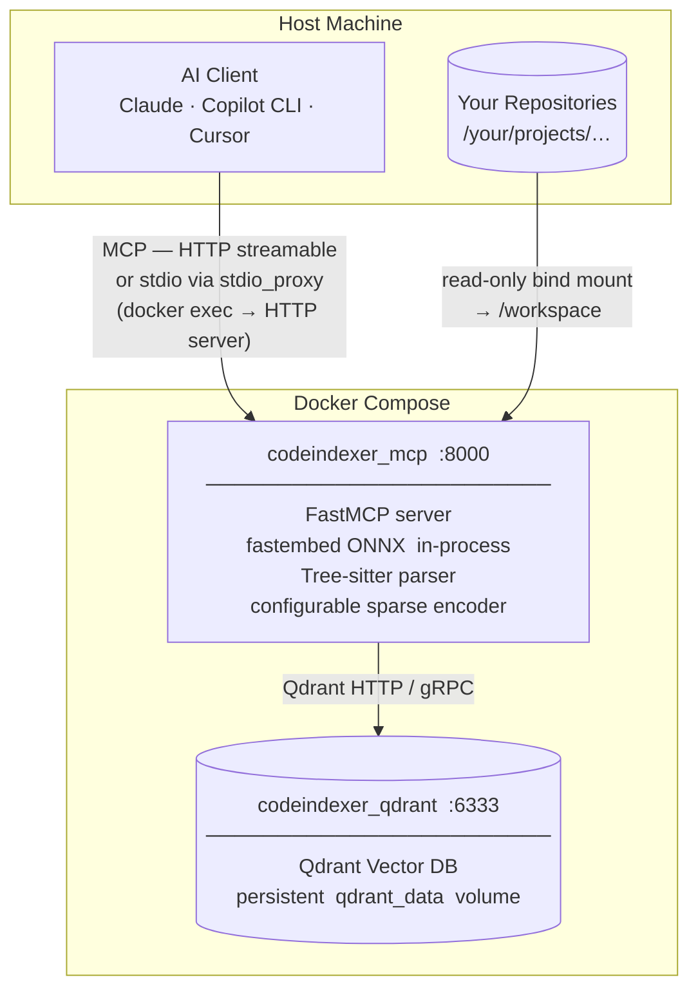
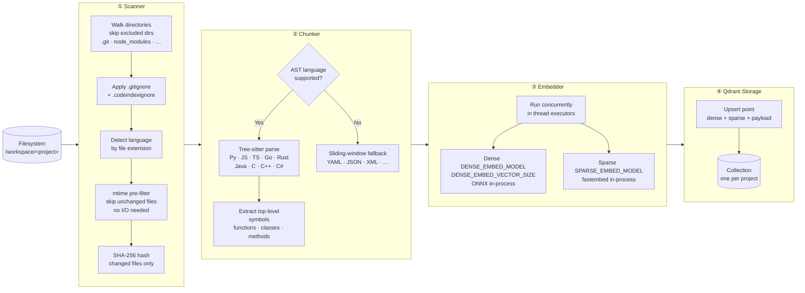
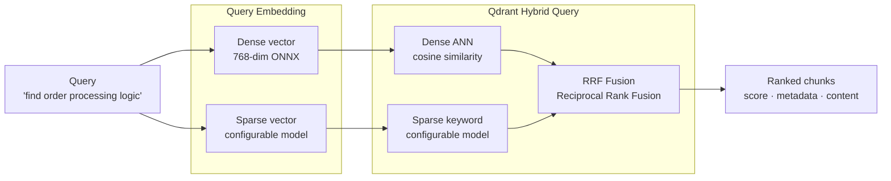

# Local Codebase Indexer MCP Server

A fully self-hosted, Docker-based MCP server that indexes your codebase into a local vector database using fastembed ONNX embeddings, then exposes semantic search tools to AI agents — minimising token consumption.

## Features

- **100% Local** — Zero external API calls; all processing stays on your machine
- **Semantic Code Search** — Tree-sitter AST-based chunking with configurable fastembed ONNX dense + sparse embeddings (in-process — no external model server)
- **Incremental Indexing** — Only re-indexes changed files (SHA-256 hash comparison)
- **Multi-Language** — Python, JavaScript, TypeScript, Go, Rust, Java, C, C++, C#
- **Token Efficient** — Returns only relevant code chunks, not full files. Three dedicated low-cost orientation tools (`get_collection_summary`, `search_symbols`, `get_file_outline`) eliminate exploratory searches entirely.
- **MCP Compatible** — Works with Claude Desktop, Copilot CLI, Cursor, and more

## System Architecture



Each direct subdirectory of `/workspace` becomes one **collection** (one indexed project), named after the folder basename.

## Quick Start

```bash
# 1. Copy and edit .env
cp .env.example .env
# Set WORKSPACE_ROOT to the *parent* directory that contains all your repos.
# Every direct subdirectory becomes a separate indexed collection.
# Example: WORKSPACE_ROOT=C:\Users\me\repos  (not a single project folder)

# 2. Start all services (from your project directory)
docker compose up -d --build

# 3. Confirm all services are healthy
docker compose ps

# 4. Stream server logs (indexing progress, errors)
docker logs -f codeindexer_mcp

# 5. Add MCP client config (see below)
```

## MCP Client Configuration

### Copilot CLI (stdio via Docker)

```json
{
  "mcpServers": {
    "codebase-indexer": {
      "type": "stdio",
      "command": "docker",
      "args": ["exec", "-i", "codeindexer_mcp", "uv", "run", "python", "-m", "codebase_indexer.stdio_proxy"]
    }
  }
}
```

> **Why the stdio proxy?**
> - **Corporate proxies** (e.g. McAfee Web Gateway) often intercept `localhost` HTTP traffic, returning 502 errors the MCP SDK misreports as `MCPOAuthError`. `docker exec` stdio bypasses HTTP entirely.
> - **`stdio_proxy` vs `main`** — the proxy is a thin shim that forwards JSON-RPC to the already-running HTTP server inside the container. No embedding models are reloaded on each session start. Indexing and search logs are routed through the HTTP server and visible in `docker logs codeindexer_mcp`.

### HTTP Transport (Claude Desktop)

```json
{
  "mcpServers": {
    "codebase-indexer": {
      "url": "http://localhost:8000/mcp",
      "transport": "streamable-http"
    }
  }
}
```

### stdio Transport (Cursor / Windsurf)

```json
{
  "mcpServers": {
    "codebase-indexer": {
      "command": "docker",
      "args": ["exec", "-i", "codeindexer_mcp", "uv", "run", "python", "-m", "codebase_indexer.stdio_proxy"]
    }
  }
}
```

## MCP Tools

### Indexing

| Tool | Description |
|------|-------------|
| `index_codebase` | Index a project. Blocks until done by default (`wait=True`); returns final stats in one call — no polling needed. Use `wait=False` for fire-and-forget background mode. |
| `index_status` | Check indexing progress. Only needed when `index_codebase` was called with `wait=False`. |
| `index_all` | Re-index all existing collections sequentially. Discovers collections in Qdrant and re-indexes them one at a time (memory-safe). Same params as `index_codebase` minus `path`/`collection`. |
| `stop_indexing` | Gracefully cancel a running indexing job |

### Token-Efficient Orientation

These tools use **zero embedding cost** (Qdrant payload scroll only). Use them first to orient yourself in an unfamiliar codebase and save tokens before running heavier semantic searches.

| Tool | Description | Token saving |
|------|-------------|-------------|
| `get_collection_summary` | File counts by language, directory tree (depth 2), symbol breakdown, top-chunked files, and `build_dependencies` (which other indexed collections are depended on via Maven/NuGet/npm/etc). Single call to understand a project. | Replaces 3–5 exploratory searches |
| `search_symbols` | Same hybrid search as `search_codebase` but returns **only** symbol locations — no code content. | ~90% vs `search_codebase` |
| `get_file_outline` | All symbols in a specific file (name, type, line numbers) — no code content, no embedding. | Replaces reading full file chunks |

### Semantic Search

| Tool | Description |
|------|-------------|
| `search_codebase` | Hybrid semantic + keyword search. Returns code chunks. Use `max_content_chars` to truncate content and call `get_chunk` only for results you need in full. |
| `get_chunk` | Retrieve a specific chunk by ID from a prior search result |
| `find_cross_references` | Discover symbol/endpoint links across multiple collections. Reference types: `definition`, `import`, `usage`, `endpoint_definition`, `http_call`, `service_config`, `build_dependency` |
| `map_service_dependencies` | Build a full microservice dependency graph across collections. Detects HTTP/REST call chains **and** build-level dependencies (Maven, NuGet, npm, Gradle, Go, Cargo, Python). Returns `build_dependency` edges alongside `http_call`/`config_reference` edges. |

### Collections

| Tool | Description |
|------|-------------|
| `list_collections` | List all indexed collections with statistics |

## How Indexing Works

Indexing transforms raw source files into searchable vector chunks stored in Qdrant. Running `index_codebase` triggers a four-stage pipeline:

### Pipeline Overview



### Chunk Schema

Every chunk stored in Qdrant carries both vectors and rich metadata payload:

```
Chunk (Qdrant point)
├── chunk_id      sha256("{rel_path}:{start_line}")   ← deterministic & stable
├── content       raw source code text  (≤ 150 lines by default)
│
├── rel_path      "src/services/OrderService.java"
├── language      "java"
├── start_line    42
├── end_line      78
├── symbol_name   "processOrder"                      ← null for sliding-window chunks
├── symbol_type   "method"                            ← function | class | method | other
│
├── file_sha256   "a3f8b2…"                           ← used for incremental re-indexing
├── file_mtime    1748876400.0                        ← fast mtime pre-filter key
│
├── dense_vector  [0.021, −0.134, …]  (768 floats)   ← cosine similarity search
└── sparse_vector {indices: [42, 891, …],            ← sparse keyword search
                   values:  [ 0.6,  0.3, …]}
```

> **Verbose/markup languages** (YAML, JSON, XML, Markdown, SQL) use a smaller cap of 60 lines per chunk to stay within embedding token limits.

### Incremental Indexing

Re-running `index_codebase` on an already-indexed project is fast — unchanged files are skipped at two checkpoints before any expensive work happens:

```
For each file on disk:
  1. mtime unchanged?    → skip immediately  (no file read, no hash)
  2. SHA-256 unchanged?  → skip              (file was read but content identical)
  3. File changed?       → delete old chunks from Qdrant, re-chunk & re-embed
  4. File deleted?       → stale chunks batched and purged after full scan
```

Only modified and new files are re-chunked, re-embedded, and upserted.

### Double-Buffered Flushing

The pipeline overlaps CPU-bound embedding with I/O-bound Qdrant upserts for ~30–40% higher throughput:

```
Time ──────────────────────────────────────────────────────────────►

Batch N:    │ embed (CPU) │──────────────────────────────────────────
Batch N+1:               │ upsert (I/O) │ embed (CPU) │─────────────
Batch N+2:                                            │ upsert (I/O) │
```

While Qdrant ingests batch N over the network, the CPU is already computing embeddings for batch N+1. At most two batches are held in memory at once (flushed every `FLUSH_EVERY` chunks, default 1 500). Dense vectors are held as compact numpy arrays to keep that peak small.

## How Search Works

### Hybrid Search — Dense + Sparse → RRF

Every `search_codebase` call runs two parallel queries and fuses the results using Reciprocal Rank Fusion:



**Why hybrid?** Dense vectors capture *semantic similarity* ("find all payment handlers") while sparse vectors capture *exact keyword matches* (`processOrder`, `OrderID`). RRF merges both ranked lists so results benefit from both signals simultaneously.

## Copilot CLI Skill

A ready-made skill is provided in [`skill/SKILL.md`](skill/SKILL.md) for GitHub Copilot CLI users. Install it once and the agent automatically follows the token-efficient tool ladder on every code navigation task.

### Installing

```bash
# Copy to your user skills folder
cp skill/SKILL.md ~/.agents/skills/codebase-indexer/SKILL.md
```

Or via `/skills` inside Copilot CLI → **Install from file**.

### What the skill does

- **Auto-indexes on load** — when you invoke the skill, it checks whether the current repository is indexed. If not, it calls `index_codebase` immediately without you having to ask.
- **Enforces the tool ladder** — the agent always starts with the cheapest tool and stops as soon as it has enough information, avoiding expensive full-content searches.

### Performance impact

Measured against ad-hoc `search_codebase` calls without the skill:

| Workflow | Without skill | With skill | Saving |
|---|---|---|---|
| "Where is `X` defined?" | `search_codebase` (full content) | `search_symbols` only | **~90% fewer tokens** |
| Project orientation | 3–5 exploratory searches | 1× `get_collection_summary` | **Replaces 3–5 searches** |
| File inspection | Read 1–3 full chunks | `get_file_outline` (no embed) | **Zero embedding cost** |
| Targeted read | Full chunk per candidate | Truncated preview → 1 `get_chunk` | **Up to 80% fewer tokens** |

Steps 1–3 of the tool ladder (`get_collection_summary`, `search_symbols`, `get_file_outline`) use **zero embedding compute** — they are pure Qdrant payload scrolls.

## Token Efficiency Tips

The biggest token cost in daily AI work is **search results returning full chunk content** you don't need. Follow this workflow:

```
1. get_collection_summary("my-project")   # Orient — free, no embedding
2. search_symbols("OrderService")         # Locate — no code content
3. get_file_outline("src/OrderService.java", "my-project")  # Inspect — no code content
4. search_codebase("...", max_content_chars=300)  # Search — previews only
5. get_chunk("<chunk_id>", "my-project")  # Fetch — only what you need
```

Steps 1–3 use **zero embedding compute** (payload scroll only). Step 4 caps response size. Step 5 fetches full content only for the one or two chunks that matter.

## Configuration

Settings are environment-variable driven. **Required variables** (no Python defaults) must be set in `.env` — see the REQUIRED section in `.env.example`. Docker Compose fails fast if any are missing. Optional knobs keep defaults in `config.py` only.

### Required (`.env` / Docker Compose)

| Variable | Description |
|----------|-------------|
| `WORKSPACE_ROOT` | **Host path** mounted as `/workspace` inside the container. Set to the *parent* directory of all your repos so each subdirectory becomes a separate collection. |
| `MCP_MEM_LIMIT` | Hard memory cap for the MCP server container |
| `QDRANT_MEM_LIMIT` | Hard memory cap for the Qdrant container |
| `MCP_CPUS` | CPU cap for the MCP server container |
| `QDRANT_CPUS` | CPU cap for the Qdrant container |
| `OMP_NUM_THREADS` | ONNX/BLAS threads (also sets `OPENBLAS`/`MKL`). Keep at/below physical cores. |
| `DENSE_EMBED_MODEL` | fastembed ONNX dense embedding model (example: `nomic-ai/nomic-embed-text-v1.5`) |
| `SPARSE_EMBED_MODEL` | fastembed sparse embedding model (example: `Qdrant/bm25`; alt: `prithivida/Splade_PP_en_v1`) |
| `DENSE_EMBED_VECTOR_SIZE` | Dense embedding dimensions; must match `DENSE_EMBED_MODEL` for known models (768 for nomic v1.5, 768 for bge-base, 384 for bge-small) |
| `SPARSE_THREADS` | ONNX threads for `SPARSE_EMBED_MODEL` (e.g. `2` for `Qdrant/bm25`, `4+` for `prithivida/Splade_PP_en_v1`) |

### Optional application settings

| Variable | Default | Description |
|----------|---------|-------------|
| `QDRANT_COLLECTION` | `codebase` | Default collection name |
| `MAX_CHUNK_LINES` | `150` | Maximum lines per chunk |
| `LOG_LEVEL` | `INFO` | Logging level (output visible via `docker logs codeindexer_mcp`) |

> **Important**: `MCP_MEM_LIMIT + QDRANT_MEM_LIMIT` must leave at least 2–3 GiB for the Linux kernel, Docker daemon, and WSL2 overhead. Over-allocating causes silent OOM kills — the container restarts with no error message. Example for 16 GB Docker: MCP `9g` + Qdrant `5g` = 14g leaves 2 GB for the VM kernel and page cache.

### Throughput / CPU

| Variable | Default | Description |
|----------|---------|-------------|
| `DENSE_THREADS` | `0` (auto) | Override dense-encoder threads. `0` = `OMP_NUM_THREADS` if set, else ~75% of CPU cores. |
| `BATCH_SIZE` | `32` | Embedding batch size (larger = faster, more RAM). Automatically halved for long chunks and under memory pressure. |
| `FLUSH_EVERY` | `1500` | Chunks per embed+upsert flush. Peak RAM ≈ 2× this. |
| `UPSERT_BATCH` | `500` | Points per Qdrant upsert sub-batch |
| `READAHEAD_BUFFER` | `100` | Files queued ahead of the consumer during scan |
| `MAX_DENSE_EMBED_CHARS` | `4096` | Char cap fed to the dense encoder (bounds attention memory). `MAX_EMBED_CHARS` is deprecated but still accepted. |
| `MAX_SPARSE_EMBED_CHARS` | `0` (no limit) | Char cap fed to the sparse encoder. Use `0` for `Qdrant/bm25`; set ~`2000` for SPLADE (512-token model). |

### Memory tuning

| Variable | Default | Description |
|----------|---------|-------------|
| `MALLOC_ARENA_MAX` | `2` | Caps glibc per-thread malloc arenas — big RSS reduction under threaded ONNX |
| `MALLOC_TRIM_THRESHOLD_` | `131072` | Returns freed native memory to the OS sooner |
| `MEMORY_PRESSURE_WARN_PCT` | `70` | At this cgroup memory usage %, batch size is halved and dense/sparse run sequentially |
| `MEMORY_PRESSURE_HALT_PCT` | `85` | At this %, embedding is aborted with a clear error instead of being OOM-killed |
| `VECTORS_ON_DISK` | `true` | Memory-map dense vectors instead of holding them RAM-resident |
| `SPARSE_ON_DISK` | `true` | Store the sparse index on disk |
| `QUANTIZATION` | `true` | int8 scalar quantization of dense vectors (~4× less vector RAM; rescored, so search quality is preserved) |
| `MEMMAP_THRESHOLD_KB` | `20000` | Segments above this size are memory-mapped rather than kept in RAM |
| `RELEASE_MODELS_AFTER_INDEX` | `true` | Release ONNX models after indexing completes to reclaim ~300-500 MB. Models reload in ~1.5s from the cache volume on the next search query. Set to `false` only if you need sub-second first-search latency after indexing. |
| `MODEL_IDLE_TIMEOUT` | `300` | Seconds of embed inactivity before ONNX models are automatically released. Covers the case where models were loaded for search but the server goes idle. `0` disables the idle timer. |

> Qdrant storage settings (`VECTORS_ON_DISK`, `SPARSE_ON_DISK`, `QUANTIZATION`, `MEMMAP_THRESHOLD_KB`) apply when a collection is created, so they take effect on the next (re-)index of each project.

### Tuning for different hardware

The same image scales by editing `.env` only — see the **TUNING PRESETS** section at the bottom of `.env.example` for ready-to-paste blocks:

- **More RAM** → raise `MCP_MEM_LIMIT`/`QDRANT_MEM_LIMIT`, raise `FLUSH_EVERY` and `BATCH_SIZE`, and optionally set `VECTORS_ON_DISK=false` / `QUANTIZATION=false` to keep vectors in RAM for faster search.
- **More CPU** → raise `OMP_NUM_THREADS` (or `DENSE_THREADS`) and `BATCH_SIZE`, keeping a few cores reserved for Qdrant via `QDRANT_CPUS`.
- **Smaller machine** → lower `MCP_MEM_LIMIT`, `FLUSH_EVERY`, `BATCH_SIZE`, and `OMP_NUM_THREADS`; keep on-disk storage and quantization enabled.

### How indexing stays within budget

- Dense vectors are kept as compact numpy arrays through the pipeline and only converted to plain lists per upsert sub-batch.
- `malloc_trim` runs after every upsert completes so long jobs return freed native memory to the OS instead of accumulating RSS (current RSS is logged per batch as `rss_mb`).
- **Adaptive batch sizing**: ONNX attention is O(seq_len² × batch_size). Batches containing long chunks (>1000 chars) automatically use a smaller batch size, preventing memory spikes on the last (longest) batches.
- **Cgroup-aware memory guard**: before each embedding batch, the pipeline checks `/sys/fs/cgroup/memory.current` against the container's memory limit. At 70% usage, batch sizes are halved and dense/sparse encoding runs sequentially. At 85%, embedding is aborted with a clear error instead of being silently OOM-killed.
- **Post-indexing memory reclamation**: after every indexing job, the pipeline releases all transient allocations (`gc.collect()` + `malloc_trim(0)`) and logs RSS before/after so you can verify the memory was freed.
- **Model release after indexing** (`RELEASE_MODELS_AFTER_INDEX=true` default): ONNX models are dropped after each index job, returning ~300-500 MB of native memory immediately. Models reload in ~1.5s from the cache volume on the next search query.
- **Idle-timeout model release** (`MODEL_IDLE_TIMEOUT=300` default): if the server has not run an embed in N seconds, ONNX models are automatically released. This reclaims memory when the server is idle after search queries, not just after indexing.
- **OOM-restart detection**: on startup, the server checks for a clean-shutdown marker. If absent, it logs a warning that the previous instance may have been OOM-killed.
- Metadata dicts from incremental indexing are released after the scan phase to free memory before the heaviest embedding batches.
- Qdrant HNSW indexing is deferred during bulk upload (`indexing_threshold` is set to 0, then restored) so index construction doesn't compete with embedding for CPU.
- Tree-sitter parsing runs in a thread executor so it never blocks the event loop, letting scan, embed, and upsert overlap.

## Architecture Summary

- **Qdrant** — Vector database for storing and searching embeddings
- **MCP Server** — FastMCP-based server exposing tools over HTTP/stdio; fastembed ONNX models run in-process (no separate model server required)

All services run in Docker with persistent volumes. See [System Architecture](#system-architecture) and [How Indexing Works](#how-indexing-works) above for detailed diagrams.
