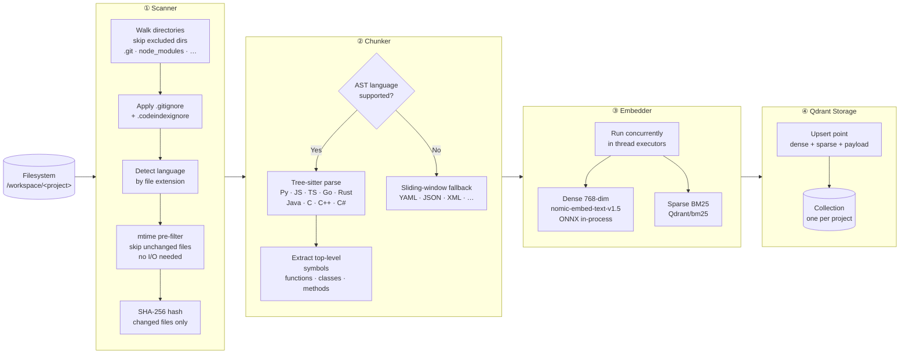
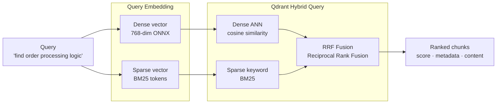

# Local Codebase Indexer MCP Server

A fully self-hosted, Docker-based MCP server that indexes your codebase into a local vector database using fastembed ONNX embeddings, then exposes semantic search tools to AI agents — minimising token consumption.

## Features

- **100% Local** — Zero external API calls; all processing stays on your machine
- **Semantic Code Search** — Tree-sitter AST-based chunking with fastembed ONNX embeddings (nomic-embed-text-v1.5, runs in-process — no external model server)
- **Incremental Indexing** — Only re-indexes changed files (SHA-256 hash comparison)
- **Multi-Language** — Python, JavaScript, TypeScript, Go, Rust, Java, C, C++, C#
- **Token Efficient** — Returns only relevant code chunks, not full files. Three dedicated low-cost orientation tools (`get_collection_summary`, `search_symbols`, `get_file_outline`) eliminate exploratory searches entirely.
- **MCP Compatible** — Works with Claude Desktop, Copilot CLI, Cursor, and more

## System Architecture


Each direct subdirectory of `/workspace` becomes one **collection** (one indexed project), named after the folder basename.

## Quick Start

```bash
# 1. Copy and edit .env
cp .env.example .env
# Set WORKSPACE_ROOT to the *parent* directory that contains all your repos.
# Every direct subdirectory becomes a separate indexed collection.
# Example: WORKSPACE_ROOT=C:\Users\me\repos  (not a single project folder)

# 2. Start all services (from your project directory)
docker compose up -d --build

# 3. Confirm all services are healthy
docker compose ps

# 4. Stream server logs (indexing progress, errors)
docker logs -f codeindexer_mcp

# 5. Add MCP client config (see below)
```

## MCP Client Configuration

### Copilot CLI (stdio via Docker)

```json
{
  "mcpServers": {
    "codebase-indexer": {
      "type": "stdio",
      "command": "docker",
      "args": ["exec", "-i", "codeindexer_mcp", "uv", "run", "python", "-m", "codebase_indexer.stdio_proxy"]
    }
  }
}
```

> **Why the stdio proxy?**
> - **Corporate proxies** (e.g. McAfee Web Gateway) often intercept `localhost` HTTP traffic, returning 502 errors the MCP SDK misreports as `MCPOAuthError`. `docker exec` stdio bypasses HTTP entirely.
> - **`stdio_proxy` vs `main`** — the proxy is a thin shim that forwards JSON-RPC to the already-running HTTP server inside the container. No embedding models are reloaded on each session start. Indexing and search logs are routed through the HTTP server and visible in `docker logs codeindexer_mcp`.

### HTTP Transport (Claude Desktop)

```json
{
  "mcpServers": {
    "codebase-indexer": {
      "url": "http://localhost:8000/mcp",
      "transport": "streamable-http"
    }
  }
}
```

### stdio Transport (Cursor / Windsurf)

```json
{
  "mcpServers": {
    "codebase-indexer": {
      "command": "docker",
      "args": ["exec", "-i", "codeindexer_mcp", "uv", "run", "python", "-m", "codebase_indexer.stdio_proxy"]
    }
  }
}
```

## MCP Tools

### Indexing

| Tool | Description |
|------|-------------|
| `index_codebase` | Index a project into the vector database (incremental) |
| `index_status` | Check the status of a background indexing job |
| `stop_indexing` | Gracefully cancel a running indexing job |

### Token-Efficient Orientation

These tools use **zero embedding cost** (Qdrant payload scroll only). Use them first to orient yourself in an unfamiliar codebase and save tokens before running heavier semantic searches.

| Tool | Description | Token saving |
|------|-------------|-------------|
| `get_collection_summary` | File counts by language, directory tree (depth 2), symbol breakdown, top-chunked files. Single call to understand a project. | Replaces 3–5 exploratory searches |
| `search_symbols` | Same hybrid search as `search_codebase` but returns **only** symbol locations — no code content. | ~90% vs `search_codebase` |
| `get_file_outline` | All symbols in a specific file (name, type, line numbers) — no code content, no embedding. | Replaces reading full file chunks |

### Semantic Search

| Tool | Description |
|------|-------------|
| `search_codebase` | Hybrid semantic + keyword search. Returns code chunks. Use `max_content_chars` to truncate content and call `get_chunk` only for results you need in full. |
| `get_chunk` | Retrieve a specific chunk by ID from a prior search result |
| `find_cross_references` | Discover symbol/endpoint links across multiple collections |
| `map_service_dependencies` | Build a full microservice dependency graph across collections |

### Collections

| Tool | Description |
|------|-------------|
| `list_collections` | List all indexed collections with statistics |

## How Indexing Works

Indexing transforms raw source files into searchable vector chunks stored in Qdrant. Running `index_codebase` triggers a four-stage pipeline:

### Pipeline Overview



### Chunk Schema

Every chunk stored in Qdrant carries both vectors and rich metadata payload:

```
Chunk (Qdrant point)
├── chunk_id      sha256("{rel_path}:{start_line}")   ← deterministic & stable
├── content       raw source code text  (≤ 150 lines by default)
│
├── rel_path      "src/services/OrderService.java"
├── language      "java"
├── start_line    42
├── end_line      78
├── symbol_name   "processOrder"                      ← null for sliding-window chunks
├── symbol_type   "method"                            ← function | class | method | other
│
├── file_sha256   "a3f8b2…"                           ← used for incremental re-indexing
├── file_mtime    1748876400.0                        ← fast mtime pre-filter key
│
├── dense_vector  [0.021, −0.134, …]  (768 floats)   ← cosine similarity search
└── sparse_vector {indices: [42, 891, …],            ← BM25 keyword search
                   values:  [ 0.6,  0.3, …]}
```

> **Verbose/markup languages** (YAML, JSON, XML, Markdown, SQL) use a smaller cap of 60 lines per chunk to stay within embedding token limits.

### Incremental Indexing

Re-running `index_codebase` on an already-indexed project is fast — unchanged files are skipped at two checkpoints before any expensive work happens:

```
For each file on disk:
  1. mtime unchanged?    → skip immediately  (no file read, no hash)
  2. SHA-256 unchanged?  → skip              (file was read but content identical)
  3. File changed?       → delete old chunks from Qdrant, re-chunk & re-embed
  4. File deleted?       → stale chunks batched and purged after full scan
```

Only modified and new files are re-chunked, re-embedded, and upserted.

### Double-Buffered Flushing

The pipeline overlaps CPU-bound embedding with I/O-bound Qdrant upserts for ~30–40% higher throughput:

```
Time ──────────────────────────────────────────────────────────────►

Batch N:    │ embed (CPU) │──────────────────────────────────────────
Batch N+1:               │ upsert (I/O) │ embed (CPU) │─────────────
Batch N+2:                                            │ upsert (I/O) │
```

While Qdrant ingests batch N over the network, the CPU is already computing embeddings for batch N+1. At most two batches are held in memory at once (flushed every 2 000 chunks ≈ 8 MB).

## How Search Works

### Hybrid Search — Dense + Sparse → RRF

Every `search_codebase` call runs two parallel queries and fuses the results using Reciprocal Rank Fusion:



**Why hybrid?** Dense vectors capture *semantic similarity* ("find all payment handlers") while sparse BM25 captures *exact keyword matches* (`processOrder`, `OrderID`). RRF merges both ranked lists so results benefit from both signals simultaneously.

## Copilot CLI Skill

A ready-made skill is provided in [`skill/SKILL.md`](skill/SKILL.md) for GitHub Copilot CLI users. Install it once and the agent automatically follows the token-efficient tool ladder on every code navigation task.

### Installing

```bash
# Copy to your user skills folder
cp skill/SKILL.md ~/.agents/skills/codebase-indexer/SKILL.md
```

Or via `/skills` inside Copilot CLI → **Install from file**.

### What the skill does

- **Auto-indexes on load** — when you invoke the skill, it checks whether the current repository is indexed. If not, it calls `index_codebase` immediately without you having to ask.
- **Enforces the tool ladder** — the agent always starts with the cheapest tool and stops as soon as it has enough information, avoiding expensive full-content searches.

### Performance impact

Measured against ad-hoc `search_codebase` calls without the skill:

| Workflow | Without skill | With skill | Saving |
|---|---|---|---|
| "Where is `X` defined?" | `search_codebase` (full content) | `search_symbols` only | **~90% fewer tokens** |
| Project orientation | 3–5 exploratory searches | 1× `get_collection_summary` | **Replaces 3–5 searches** |
| File inspection | Read 1–3 full chunks | `get_file_outline` (no embed) | **Zero embedding cost** |
| Targeted read | Full chunk per candidate | Truncated preview → 1 `get_chunk` | **Up to 80% fewer tokens** |

Steps 1–3 of the tool ladder (`get_collection_summary`, `search_symbols`, `get_file_outline`) use **zero embedding compute** — they are pure Qdrant payload scrolls.

## Token Efficiency Tips

The biggest token cost in daily AI work is **search results returning full chunk content** you don't need. Follow this workflow:

```
1. get_collection_summary("my-project")   # Orient — free, no embedding
2. search_symbols("OrderService")         # Locate — no code content
3. get_file_outline("src/OrderService.java", "my-project")  # Inspect — no code content
4. search_codebase("...", max_content_chars=300)  # Search — previews only
5. get_chunk("<chunk_id>", "my-project")  # Fetch — only what you need
```

Steps 1–3 use **zero embedding compute** (payload scroll only). Step 4 caps response size. Step 5 fetches full content only for the one or two chunks that matter.

## Configuration

All settings are environment-variable driven. See `.env.example` for all options.

| Variable | Default | Description |
|----------|---------|-------------|
| `WORKSPACE_ROOT` | `.` (current dir) | **Host path** mounted as `/workspace` inside the container. Set to the *parent* directory of all your repos so each subdirectory becomes a separate collection. Only used by Docker Compose for the bind mount — not passed into the container. |
| `EMBED_MODEL` | `nomic-ai/nomic-embed-text-v1.5` | fastembed ONNX embedding model |
| `VECTOR_SIZE` | `768` | Embedding vector dimensions |
| `QDRANT_COLLECTION` | `codebase` | Default collection name |
| `MAX_CHUNK_LINES` | `150` | Maximum lines per chunk |
| `BATCH_SIZE` | `32` | Embedding batch size |
| `LOG_LEVEL` | `INFO` | Logging level (output visible via `docker logs codeindexer_mcp`) |

## Architecture Summary

- **Qdrant** — Vector database for storing and searching embeddings
- **MCP Server** — FastMCP-based server exposing tools over HTTP/stdio; fastembed ONNX models run in-process (no separate model server required)

All services run in Docker with persistent volumes. See [System Architecture](#system-architecture) and [How Indexing Works](#how-indexing-works) above for detailed diagrams.
