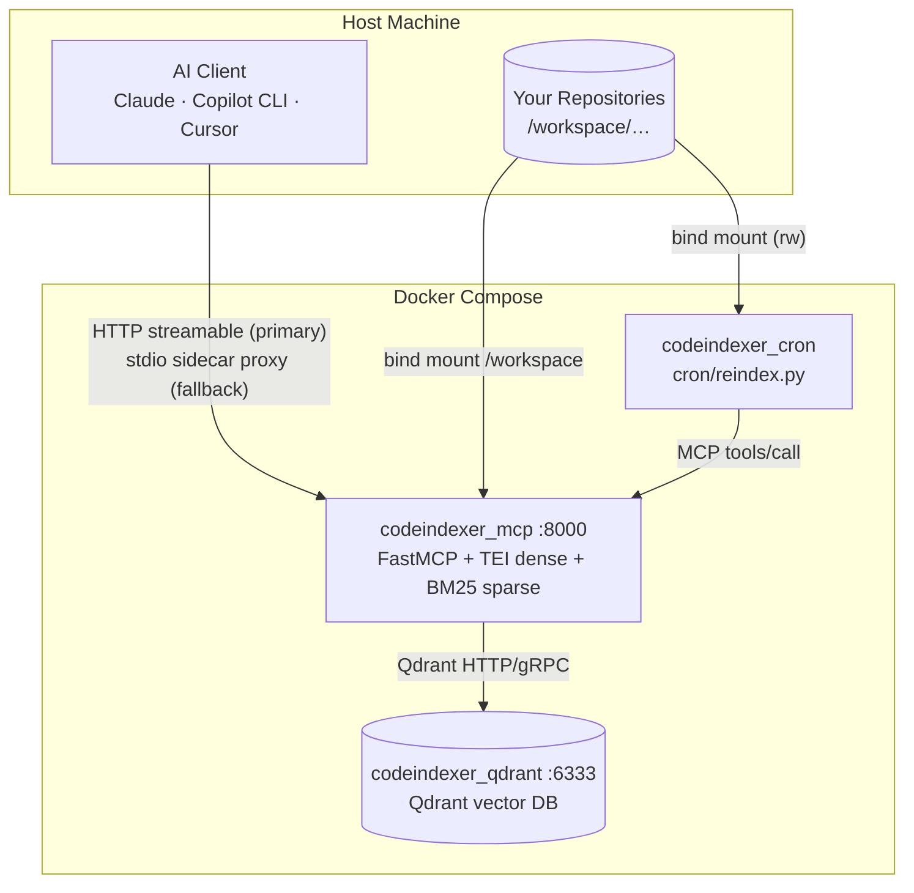
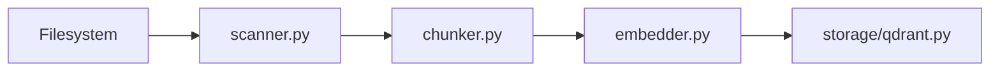

# Architecture

This document expands the [system diagram in README.md](../README.md#system-architecture) into per-component responsibilities with real module paths.

## Overview



Each direct subdirectory of `/workspace` is one **collection** (indexed project), named after the folder basename. See [ADR 0004](adr/0004-collection-per-project-isolation.md) for why we use collection-per-project instead of Qdrant payload multitenancy.

## Entry points

| Component | Path | Role |
|-----------|------|------|
| HTTP server (Python — production default) | `mcp_server/src/codebase_indexer/main.py` | FastMCP app factory (`create_app`), registers all MCP tools, optional bearer auth middleware, `/health` endpoint |
| HTTP server (.NET — ADR 0030 Phase 1–3) | `src/CodebaseIndexer.Host/Program.cs` | `WebApplication.CreateSlimBuilder`; MCP at `/mcp`; `/health` via `AddHealthChecks()` + `McpHostHealthCheck`; Phase 3 core search tools (`search_codebase`, `search_symbols`, `get_chunk`, `get_file_outline`, `get_collection_summary`, `list_collections`) on Aspire stack; split `appsettings` sections + FluentValidation; **do not edit** `CodebaseIndexer.ServiceDefaults` (Aspire template) |
| Aspire AppHost (.NET) | `src/CodebaseIndexer.AppHost/AppHost.cs` | Local dev orchestration: Qdrant (REST `:6333` + gRPC `:6334`) + TEI + MCP host; `docker-compose.aspire.yml` for CPU Aspire stack |
| stdio proxy | `mcp_server/src/codebase_indexer/stdio_proxy.py` | Optional fallback: runs in a separate `codeindexer_proxy` sidecar; forwards JSON-RPC from stdin/stdout to the HTTP server — no model reload per session. Primary clients (e.g. Cursor) connect via HTTP URL instead. |
| Cron job | `cron/reindex.py` | Daily git pull + incremental `index_codebase` for changed repos |
| Benchmark | `mcp_server/benchmarks/bench.py` | Async harness for indexing/search latency and payload-index A/B comparison |
| Stack tuner *(proposed)* | `scripts/tune_stack.py` ([ADR 0024](adr/0024-resource-aware-stack-tuner.md)) | Allocates compose RSS/CPU from host budget and searches pipeline knobs for best index/search speed |

## Configuration

`mcp_server/src/codebase_indexer/config.py` defines `Settings` (pydantic-settings). Environment variables map case-insensitively to fields. Shared constants (`DEFAULT_SERVICE_URL_KEYWORDS`, embedding model dimension tables) live in the same module.

Docker Compose passes every `Settings` field from the repo-root `.env` into `mcp_server` via explicit `${VAR:-default}` entries in `docker-compose.yml` — see [DEPLOYMENT.md](DEPLOYMENT.md#docker-compose-env-passthrough). Restart `mcp_server` after env-only changes.

**.NET MCP host (ADR 0030 Phase 1+):** `src/CodebaseIndexer.Host/appsettings.json` uses split sections (`Qdrant`, `Tei`, `Embedding`, `Workspace`, `Chunking`, `Indexing`) — not `.env`. Container overrides use ASP.NET Core env syntax (`Qdrant__Url`, `Embedding__DenseModel`, etc.) in `docker-compose.aspire.yml`. **`Qdrant__Url` must target gRPC port 6334** (`Qdrant.Client`); REST `:6333` is published for health/metrics only (Python clients still use REST). Required fields are enforced by FluentValidation at startup (`ValidateOnStart`). See [ADR 0030](adr/0030-migrate-mcp-server-to-dotnet10.md).

`mcp_server/src/codebase_indexer/context.py` builds `AppContext`: wires `Settings`, `QdrantStorage`, `Embedder`, `UrlExtractors`, and `IndexJobTracker` once per process.

## Indexing pipeline

Triggered by `index_codebase` / `index_all` (`mcp_server/src/codebase_indexer/tools/index.py` → `mcp_server/src/codebase_indexer/indexer/pipeline.py`).



### 1. Scanner (`indexer/scanner.py`)

- Walks `WORKSPACE_PATH` (default `/workspace/<project>`)
- Skips directories in `EXCLUDED_DIRS`
- Honors `.gitignore` and `.codeindexignore`
- Detects language by extension (`indexer/languages.py`)
- mtime pre-filter, then SHA-256 for changed files only

### 2. Chunker (`indexer/chunker.py`)

- Tree-sitter AST for supported languages; extracts top-level symbols
- Sliding-window fallback for YAML, JSON, XML, Markdown, SQL, etc.
- SQL T-SQL procedures via regex when grammar lacks `create_procedure`
- Prepends relevant import/using lines to chunks for cross-reference signal
- Chunk IDs: `sha256("{rel_path}:{start_line}")`

### 3. Embedder (`indexer/embedder.py`)

- **Dense**: TEI HTTP (`DENSE_EMBED_MODEL`, `TEI_URL`)
- **Sparse**: fastembed BM25 (`SPARSE_EMBED_MODEL`) on CPU
- **ColBERT** (optional): multivector late-interaction when `RERANK_ENABLED=true` — **remote GPU sidecar by default** (`colbert_remote.py`, [ADR 0015](adr/0015-colbert-http-sidecar.md), [ADR 0022](adr/0022-gpu-default-cpu-fallback.md)); in-process ONNX (`colbert_onnx.py`) only under `ACCELERATOR=cpu` with explicit `COLBERT_EMBED_BACKEND=onnx`
- Sparse model singleton; `release_models_after_index` and `model_idle_timeout` reclaim RAM
- Cgroup memory guard (`memory.py`) for indexing pressure

### 4. Pipeline (`indexer/pipeline.py`)

- Double-buffered flush every `FLUSH_EVERY` chunks
- Sub-batch upserts of size `UPSERT_BATCH`
- Defers HNSW build during bulk upload (`QdrantStorage.set_indexing`)
- Post-job `gc.collect()` + `malloc_trim`

## Embedding layer

| Layer | Module | Notes |
|-------|--------|-------|
| Dense TEI | `indexer/backends/tei_dense.py` | OpenAI `/v1/embeddings`; MRL `dimensions` for Qwen3 when below native size; orchestrated by `Embedder` facade |
| Sparse BM25 | `indexer/backends/onnx_sparse.py` | In-process CPU; `SPARSE_THREADS` required in `.env` |
| ColBERT (opt-in) | `indexer/backends/colbert_remote.py`, `colbert_onnx.py` | Multivector at index time when `RERANK_ENABLED=true`; remote GPU sidecar default; in-process ONNX for `ACCELERATOR=cpu` only |
| Truncation | `indexer/truncation.py`, `indexer/tokenizer_loader.py` | Dense: model tokenizer from `DENSE_EMBED_MODEL` via `tokenizers` (TEI path); sparse/ColBERT: FastEmbed cache tokenizer; caps via `MAX_DENSE_EMBED_TOKENS` / `MAX_SPARSE_EMBED_TOKENS` |

Dense embedding is TEI-only ([ADR 0025](adr/0025-huggingface-tei-dense-embedding.md), supersedes [ADR 0011](adr/0011-ollama-only-dense-embedding.md)). Default dense model is **Jina Embeddings v2 base code** at 768 dimensions ([ADR 0021](adr/0021-revert-jina-production-default-retire-qwen3.md)); Qwen3 remains an optional experimental preset ([ADR 0016](adr/0016-qwen3-embedding-default-dense-model.md)). **GPU-default compose** ([ADR 0022](adr/0022-gpu-default-cpu-fallback.md)): bundled TEI and ColBERT sidecar use NVIDIA GPU by default via `scripts/compose_files.py`; sparse BM25 stays **CPU in-process** for all accelerator modes. **Apple Silicon** ([ADR 0028](adr/0028-apple-silicon-arm64-cpu-deployment.md)): operators set `ACCELERATOR=cpu` with native `cpu-arm64-latest` TEI; optional host Metal TEI ([ADR 0029](adr/0029-macos-host-native-tei-metal-acceleration.md)) — see [DEPLOYMENT.md § Apple Silicon](DEPLOYMENT.md#apple-silicon-arm64-cpu).

| Backend | Module | When |
|---------|--------|------|
| TEI | `indexer/backends/tei_dense.py` | Always (dense); bundled service via `COMPOSE_PROFILES=bundled-tei`; GPU override merged by default (`ACCELERATOR=gpu`) |
| Sparse ONNX | `indexer/backends/onnx_sparse.py` | Always (BM25 hybrid search) |

The `Embedder` facade in `indexer/embedder.py` orchestrates backends; factory wiring lives in `indexer/backends/factory.py`.

## Qdrant storage

`mcp_server/src/codebase_indexer/storage/qdrant.py` — `QdrantStorage` class.

- **Collections**: one per project folder; hybrid dense + sparse vectors when `HYBRID_SEARCH=true`; optional `colbert` multivector when `RERANK_ENABLED=true`
- **Payload**: `chunk_id`, `rel_path`, `content`, `symbol_name`, `symbol_type`, `language`, line range, `file_sha256`, `file_mtime`, `callees` (omitted when graph indexing is active — see GraphRAG below), `graph_node_ids` (neighbor Neo4j node keys, present only when `GRAPH_ENABLED=true` — see GraphRAG below)
- **Collection metadata**: `graph_call_sites: true` stamped on collections indexed with `GRAPH_ENABLED=true` ([ADR 0023](adr/0023-neo4j-primary-call-site-lookup.md) Phase 2); drives per-collection Path D routing in `find_cross_references`. `graph_enabled: true` stamped on collections whose chunks carry `graph_node_ids` ([ADR 0002](adr/0002-graphrag-neo4j-qdrant.md) Phase 2)
- **Indexes**: optional keyword payload indexes (`PAYLOAD_INDEXES`) on `rel_path`, `chunk_id`, `symbol_name`, `language`, `callees`
- **Tuning**: `VECTORS_ON_DISK`, `SPARSE_ON_DISK`, `QUANTIZATION`, `MEMMAP_THRESHOLD_KB`
- **Search**: hybrid RRF via `query_points` + `Fusion.RRF`, or dense-only when hybrid disabled; optional ColBERT MAX_SIM rerank over prefetch pool ([ADR 0008](adr/0008-optional-colbert-reranking.md))
- **Recommendation**: dense-only Qdrant Recommendation API (`RecommendStrategy.AVERAGE_VECTOR`) via `QdrantStorage.recommend` ([ADR 0014](adr/0014-vector-discovery-and-ops-automation.md))
- **Outlier discovery**: dense-only `RecommendStrategy.BEST_SCORE` negative-only + centroid cosine filter via `QdrantStorage.find_outlier_chunks` ([ADR 0014](adr/0014-vector-discovery-and-ops-automation.md))

## Hybrid search

See [ADR 0003](adr/0003-hybrid-search-rrf-default.md) (Qdrant [Hybrid Search on PDF Manuals](https://qdrant.tech/documentation/examples/hybrid-search-llamaindex-jinaai/) pattern).

`mcp_server/src/codebase_indexer/tools/search_common.py` orchestrates query embedding and `QdrantStorage.search`.

When `HYBRID_SEARCH=true` (default):

1. Embed query → dense vector + sparse vector
2. Parallel prefetch on dense and sparse channels (`top_k * prefetch_multiplier`, default **5**)
3. RRF fusion → final `top_k` results
4. `min_score` is **not** applied (RRF scores ≠ cosine scale)

When `HYBRID_SEARCH=false`:

- Dense cosine search only; `min_score` filters by similarity threshold

See [SEARCH_BEHAVIOR.md](SEARCH_BEHAVIOR.md) for tool-level caps and `min_score` semantics.

**Implemented** opt-in ColBERT rerank ([ADR 0008](adr/0008-optional-colbert-reranking.md), [ADR 0015](adr/0015-colbert-http-sidecar.md)): set `RERANK_ENABLED=true` and re-index; hybrid prefetch → RRF → MAX_SIM rerank on `search_codebase`, `search_symbols`, `find_cross_references`, and `map_service_dependencies`. **Vector discovery** Phase 1–2 shipped: `recommend_code` and `find_outlier_chunks` via Qdrant Recommendation API ([ADR 0014](adr/0014-vector-discovery-and-ops-automation.md), [SEARCH_BEHAVIOR.md](SEARCH_BEHAVIOR.md#recommend_code)). Remaining Improve Search work: ADR 0008 Phase 2 track 2 (adaptive rerank skip / per-tool overrides), Track B n8n compose (ADR 0014), multi-hop client patterns ([ADR 0009](adr/0009-multi-hop-retrieval-strategies.md), [SEARCH_BEHAVIOR.md](SEARCH_BEHAVIOR.md#multi-hop-retrieval)). Golden-set retrieval evaluation is implemented ([ADR 0007](adr/0007-ranx-retrieval-evaluation.md)). Full prototype map: [adr/README.md](adr/README.md#qdrant-build-prototypes--improve-search-map).

### Retrieval evaluation (ADR 0007)

Optional offline harness in `mcp_server/benchmarks/eval_retrieval.py` measures `recall@10`, `MRR`, and `NDCG@10` against `benchmarks/fixtures/golden_queries.jsonl` using the same `run_search` path as MCP tools. Requires optional `benchmark` extra (`ranx`); not part of the MCP runtime image.

```bash
cd mcp_server
uv sync --extra dev --extra benchmark
uv run python -m benchmarks.eval_retrieval --output eval-results.json
uv run python -m benchmarks.eval_retrieval --no-hybrid --output eval-dense-only.json
uv run python -m benchmarks.eval_retrieval --validate-labels
uv run python -m benchmarks.eval_retrieval --rerank --output eval-rerank.json
uv run python -m benchmarks.suggest_labels "class Embedder embedder.py"
uv run python -m benchmarks.eval_multihop --output eval-multihop.json
uv run python -m benchmarks.eval_multihop --compare benchmarks/fixtures/eval_baseline.json
```

Reports include **`metrics_by_tag`** (`symbol`, `conceptual`, `config`, `cross_file`, `multi_hop`) for slice-level tuning. Baseline: `benchmarks/fixtures/eval_baseline.json`. For the `multi_hop` slice, use `eval_multihop.py` to compare single-pass vs two-hop RRF fusion ([ADR 0009](adr/0009-multi-hop-retrieval-strategies.md)).

Client-side pipeline eval (Ragas faithfulness / context precision on the same golden set) is documented in [DEPLOYMENT.md](DEPLOYMENT.md#pipeline-output-quality-client-side-ragas) ([ADR 0010](adr/0010-defer-ragas-to-client.md)).

## RAG and agent integration

The MCP server implements the **retrieval half** of Qdrant’s RAG tutorials (TEI dense + BM25 sparse → Qdrant → ranked context). Connected AI clients perform metaprompt assembly and LLM generation. External orchestrators (Cursor agents, CrewAI, etc.) call MCP tools instead of embedding CrewAI/CAMEL in the server. See [ADR 0012](adr/0012-retrieval-only-rag-split.md) and [ADR 0013](adr/0013-external-agent-knowledge-base.md).

Vector discovery Phase 1–2 is shipped: `recommend_code` and `find_outlier_chunks` (Qdrant Recommendation API, dense-only) per [ADR 0014](adr/0014-vector-discovery-and-ops-automation.md). Track B (optional n8n compose) remains deferred, inspired by [Qdrant’s n8n tutorial](https://qdrant.tech/documentation/tutorials-build-essentials/qdrant-n8n/).

## GraphRAG (optional, Phase 2 shipped)

Optional Neo4j-backed code graph linked to Qdrant chunk IDs for vector→graph retrieval. **Disabled by default** (`GRAPH_ENABLED=false`); no Neo4j driver init or index-time graph I/O unless enabled. See [ADR 0002](adr/0002-graphrag-neo4j-qdrant.md).

**Phase 1 (shipped):** index-time graph writer — `storage/neo4j.py`, `indexer/graph_writer.py`, pipeline hooks mirroring Qdrant flush/delete cadence. Ontology: `Collection`, `File`, `Chunk`, `Symbol`, `Endpoint`, `Artifact` with relationships `IN_COLLECTION`, `IN_FILE`, `DEFINES`, `IMPORTS`, `CALLS`, `DECLARES_ENDPOINT`, `HTTP_CALLS`, `CONFIGURES`, `BUILD_DEPENDS`, `RESOLVES_TO`. Shared link: Qdrant payload `chunk_id` = Neo4j `Chunk.chunk_id`. ADR 0023 Phase 1 adds `call_token` on `CALLS` edges, symbol unification with `DEFINES`, and Neo4j-backed Path D call-site lookup in `find_cross_references` when `GRAPH_ENABLED=true`. Re-index after graph writer changes.

**ADR 0023 Phase 2 (shipped):** when `GRAPH_ENABLED=true`, indexing omits `callees` from Qdrant payloads (Neo4j `CALLS` is authoritative) and stamps collection metadata `graph_call_sites: true`. Full re-index required when enabling graph on existing collections or toggling graph mode.

**ADR 0002 Phase 2 (shipped):** when `GRAPH_ENABLED=true`, each upserted Qdrant chunk carries `graph_node_ids: list[str]` — the neighbor Neo4j node keys reachable from that chunk (Symbol `qualified_name` from `DEFINES`/`CALLS`, file-level import `qualified_name`, and `Endpoint` keys `{collection}:{path}` from `DECLARES_ENDPOINT`/`HTTP_CALLS`/`CONFIGURES`); the chunk's own `Chunk`/`File` keys are excluded. The graph batch is built once per flush **before** the Qdrant upsert and reused for the Neo4j write (no double extraction). Collections are stamped `graph_enabled: true`. Search logs `graph_linkage_missing` once per collection that lacks the linkage — re-index those collections to populate `graph_node_ids`.

**Path D (call-site lookup):** When `member` is set, `find_cross_references` routes per collection: Neo4j `CALLS.call_token` Cypher for collections with `graph_call_sites` metadata; Qdrant keyword scroll on `callees` for Qdrant-only collections or when `GRAPH_ENABLED=false`. Mixed batches partition engines; graph-enabled deployments log a warning and fall back to Qdrant scroll for collections not yet re-indexed with graph ([ADR 0023](adr/0023-neo4j-primary-call-site-lookup.md)).

**Deploy with Neo4j:**

```bash
docker compose -f docker-compose.yml -f docker-compose.neo4j.yml up -d --build
```

Set `GRAPH_ENABLED=true`, `NEO4J_PASSWORD`, and re-index collections when enabling graph on existing data.

**Phase 3 (shipped):** `expand_search_context` MCP tool (gated by `GRAPH_ENABLED`, backed by `Neo4jStorage.expand_subgraph`) — see the Graph retrieval entry in the MCP tools table below.

**Deferred:** Phase 4 Neo4j-backed cross-project queries.

Based on [Qdrant’s GraphRAG + Neo4j pattern](https://qdrant.tech/documentation/examples/graphrag-qdrant-neo4j/#build-a-graphrag-agent-with-neo4j-and-qdrant), adapted to deterministic AST/extractor ingestion (no LLM ontology).

## MCP tools

Retrieval-only surface — no in-server LLM generation ([ADR 0005](adr/0005-mcp-retrieval-connector.md), Qdrant [Cohere RAG connector](https://qdrant.tech/documentation/examples/cohere-rag-connector/) pattern).

All tools register via `register_*_tool(mcp, ctx)` in `main.py`:

| Category | Module |
|----------|--------|
| Indexing | `tools/index.py` |
| Search | `tools/search.py`, `tools/symbols.py`, `tools/search_common.py` |
| Discovery | `tools/recommend.py` (`recommend_code`; gated by `RECOMMEND_ENABLED`) |
| Discovery | `tools/outliers.py` (`find_outlier_chunks`; gated by `RECOMMEND_ENABLED`) |
| Orientation | `tools/summary.py`, `tools/outline.py` |
| Retrieval | `tools/chunk.py`, `tools/collections.py` |
| Cross-project | `tools/cross_references.py`, `tools/service_map.py`, `tools/build_deps.py` |
| Graph retrieval | `tools/graph_search.py` (`expand_search_context`; gated by `GRAPH_ENABLED`, uses `Neo4jStorage.expand_subgraph`) |

`tools/cross_references.py` provides `UrlExtractors` (keyword-driven URL/route extraction from `SERVICE_URL_KEYWORDS`).

## Cron reindex

`cron/reindex.py`:

1. `list_collections` via minimal MCP HTTP client
2. For each collection name, locate `/workspace/<name>` git repo
3. `git fetch` + `git pull --ff-only` on default branch when clean
4. `index_codebase(path=name, force=False, wait=True)` with `INDEX_TIMEOUT`

Timeouts: `INDEX_TIMEOUT` (per index job), `MCP_HTTP_TIMEOUT` (per JSON-RPC call), `GIT_TIMEOUT` (subprocess).

## Job tracking

`mcp_server/src/codebase_indexer/index_jobs.py` — `IndexJobTracker` holds in-memory job state for `index_codebase` / `index_status` / `stop_indexing`.
