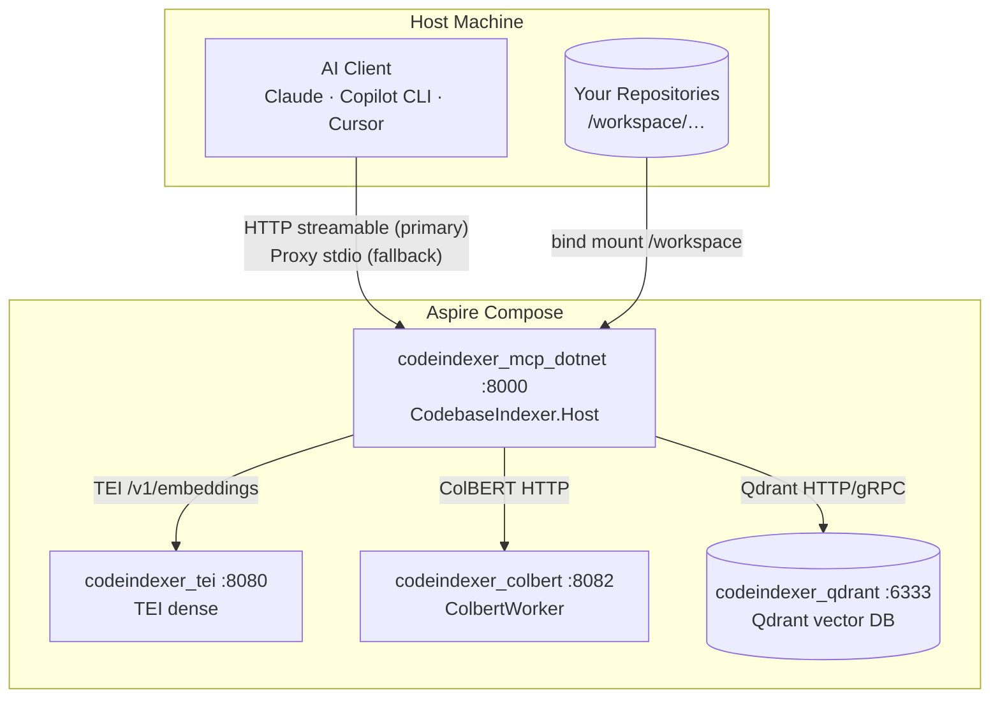
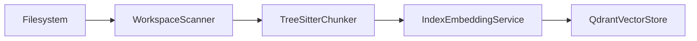

# Architecture

This document expands the [system diagram in README.md](../README.md#system-architecture) into per-component responsibilities with real module paths.

## Overview



Each direct subdirectory of `/workspace` is one **collection** (indexed project), named after the folder basename. See [ADR 0004](adr/0004-collection-per-project-isolation.md).

## Entry points

| Component | Path | Role |
|-----------|------|------|
| HTTP server (.NET — production) | `src/CodebaseIndexer.Host/Program.cs` | MCP at `/mcp`; `/health`; tools under `Tools/`; `appsettings` + FluentValidation |
| Aspire AppHost | `src/CodebaseIndexer.AppHost/AppHost.cs` | Local orchestration; checked-in `docker-compose.aspire.yml` is the deploy surface |
| ColBERT worker | `src/CodebaseIndexer.ColbertWorker` | Late-interaction / rerank sidecar |
| stdio proxy | `src/CodebaseIndexer.Proxy` | Optional stdio → HTTP forwarder |
| Eval / golden-set | `benchmarks/benchmarks/eval_retrieval.py` | Dev tooling — MCP HTTP (`--mcp-url`) + ranx; not MCP runtime |
| .NET microbench | `src/CodebaseIndexer.Benchmarks` | Latency/throughput benches |
| Stack tuner | `scripts/tune_stack.py` | Compose RSS/CPU allocation ([ADR 0024](adr/0024-resource-aware-stack-tuner.md)) |
| Integration harness | `scripts/run_compose_integration.py` | Aspire-default deploy + quality validation |

Clean Architecture layers: `Domain` → `Application` → `Infrastructure` → `Host` / `ColbertWorker` / `Proxy`.

## Configuration

`src/CodebaseIndexer.Host/appsettings.json` and FluentValidation option types under `src/CodebaseIndexer.Application/Options/` / `src/CodebaseIndexer.Infrastructure/Configuration/` define runtime settings. Environment overrides use ASP.NET Core `Section__Property` syntax (`Qdrant__Url`, `Embedding__DenseModel`, `Tei__Url`, etc.).

Aspire Compose injects those into the `mcp` service via `docker-compose.aspire.yml` — see [DEPLOYMENT.md](DEPLOYMENT.md#docker-compose-env-passthrough). Restart `mcp` after env-only changes. Flat names in `.env` (`DENSE_EMBED_MODEL`, `TEI_URL`, `RERANK_ENABLED`, …) remain for harness/compose convenience and map to `Embedding__*` / `Tei__*` / `Embedding__RerankEnabled`.

**`Qdrant__Url` must target gRPC port 6334** (`Qdrant.Client`); REST `:6333` is published for health/metrics only. Required fields are enforced by FluentValidation at startup (`ValidateOnStart`). See [ADR 0030](adr/0030-migrate-mcp-server-to-dotnet10.md).

DI wiring lives in `src/CodebaseIndexer.Application/DependencyInjection.cs` and `src/CodebaseIndexer.Host/HostApplicationBuilderExtensions.cs`: `IQdrantVectorStore`, dense/sparse/ColBERT embedders, `IIndexJobService`, `ISearchService`, optional `IGraphStore`.

## Indexing pipeline

Triggered by `index_codebase` / `index_all` (`src/CodebaseIndexer.Host/Tools/IndexTools.cs` → `src/CodebaseIndexer.Application/Services/IndexCodebaseService.cs`).



### 1. Scanner (`Infrastructure/Indexing/WorkspaceScanner.cs`)

- Walks `Workspace:Path` (default `/workspace/<project>`)
- Skips directories in excluded-dir options
- Honors `.gitignore` and `.codeindexignore` (`GitIgnoreMatcher`)
- Detects language by extension (`LanguageRegistry`)
- mtime pre-filter, then SHA-256 for changed files only

### 2. Chunker (`Infrastructure/Indexing/TreeSitterChunker.cs`, `ChunkerCore.cs`)

- Tree-sitter AST for supported languages; extracts top-level symbols
- Sliding-window fallback for YAML, JSON, XML, Markdown, SQL, etc.
- SQL T-SQL procedures via regex when grammar lacks `create_procedure`
- Prepends relevant import/using lines to chunks for cross-reference signal
- Chunk IDs: `sha256("{rel_path}:{start_line}")`

### 3. Embedder (`Application/Services/IndexEmbeddingService.cs`)

- **Dense**: TEI HTTP (`Embedding:DenseModel`, `Tei:Url`) via `Infrastructure/Tei/TeiDenseEmbedder.cs`
- **Sparse**: ONNX BM25 (`Embedding:SparseModel`) on CPU via `Infrastructure/Embedding/OnnxSparseEmbedder.cs`
- **ColBERT** (optional): multivector late-interaction when `Embedding:RerankEnabled=true` — **remote GPU sidecar by default** (`ColbertRemoteEmbedder`, [ADR 0015](adr/0015-colbert-http-sidecar.md), [ADR 0022](adr/0022-gpu-default-cpu-fallback.md)); in-process ONNX (`ColbertOnnxEmbedder`) only under `ACCELERATOR=cpu` with explicit `Colbert:Backend=onnx`
- Sparse model cache; release-after-index / idle-timeout reclaim RAM
- Cgroup memory guard (`Infrastructure/Memory/CgroupMemoryGuard.cs`) for indexing pressure

### 4. Pipeline (`IndexCodebaseService` / `IIndexPipeline`)

- Double-buffered flush every `Indexing:FlushEvery` chunks
- Sub-batch upserts of size `Indexing:UpsertBatch`
- Defers HNSW build during bulk upload
- Post-job GC / native trim where applicable

## Embedding layer

| Layer | Module | Notes |
|-------|--------|-------|
| Dense TEI | `Infrastructure/Tei/TeiDenseEmbedder.cs` | OpenAI `/v1/embeddings`; MRL `dimensions` for Qwen3 when below native size |
| Sparse BM25 | `Infrastructure/Embedding/OnnxSparseEmbedder.cs` | In-process CPU; `SPARSE_THREADS` / sparse thread options |
| ColBERT (opt-in) | `Infrastructure/Colbert/ColbertRemoteEmbedder.cs`, `ColbertOnnxEmbedder.cs` | Multivector at index time when rerank on; remote GPU sidecar default; in-process ONNX for `ACCELERATOR=cpu` only |
| Truncation | `Infrastructure/Embedding/EmbeddingTruncation.cs`, `DenseTokenizerLoader.cs` | Dense: model tokenizer from dense model id; caps via `MAX_DENSE_EMBED_TOKENS` / sparse token caps |

Dense embedding is TEI-only ([ADR 0025](adr/0025-huggingface-tei-dense-embedding.md), supersedes [ADR 0011](adr/0011-ollama-only-dense-embedding.md)). Default dense model is **Jina Embeddings v2 base code** at 768 dimensions ([ADR 0021](adr/0021-revert-jina-production-default-retire-qwen3.md)); Qwen3 remains an optional experimental preset ([ADR 0016](adr/0016-qwen3-embedding-default-dense-model.md)). **GPU-default compose** ([ADR 0022](adr/0022-gpu-default-cpu-fallback.md)): Aspire TEI and ColBERT sidecar use NVIDIA GPU by default via `scripts/aspire_compose.py`; sparse BM25 stays **CPU in-process** for all accelerator modes. **Apple Silicon** ([ADR 0028](adr/0028-apple-silicon-arm64-cpu-deployment.md)): operators set `ACCELERATOR=cpu` with native `cpu-arm64-latest` TEI; optional host Metal TEI ([ADR 0029](adr/0029-macos-host-native-tei-metal-acceleration.md)) — see [DEPLOYMENT.md § Apple Silicon](DEPLOYMENT.md#apple-silicon-arm64-cpu).

| Backend | Module | When |
|---------|--------|------|
| TEI | `Infrastructure/Tei/TeiDenseEmbedder.cs` | Always (dense); bundled in `docker-compose.aspire.yml`; GPU when `ACCELERATOR=gpu` |
| Sparse ONNX | `Infrastructure/Embedding/OnnxSparseEmbedder.cs` | Always (BM25 hybrid search) |

`IndexEmbeddingService` orchestrates backends; ColBERT backend selection is post-configured via `ColbertBackendPostConfigure`.

## Qdrant storage

`src/CodebaseIndexer.Infrastructure/Qdrant/QdrantVectorStore.cs` — gRPC client wrapper.

- **Collections**: one per project folder; hybrid dense + sparse vectors when hybrid search is on; optional `colbert` multivector when rerank is on
- **Payload**: `chunk_id`, `rel_path`, `content`, `symbol_name`, `symbol_type`, `language`, line range, `file_sha256`, `file_mtime`, `callees` (omitted when graph indexing is active — see GraphRAG below), `graph_node_ids` (neighbor Neo4j node keys, present only when `Graph:Enabled=true` — see GraphRAG below)
- **Collection metadata**: `graph_call_sites: true` stamped on collections indexed with graph enabled ([ADR 0023](adr/0023-neo4j-primary-call-site-lookup.md) Phase 2); drives per-collection Path D routing in `find_cross_references`. `graph_enabled: true` stamped on collections whose chunks carry `graph_node_ids` ([ADR 0002](adr/0002-graphrag-neo4j-qdrant.md) Phase 2)
- **Indexes**: optional keyword payload indexes on `rel_path`, `chunk_id`, `symbol_name`, `language`, `callees`
- **Tuning**: `VECTORS_ON_DISK`, `SPARSE_ON_DISK`, `QUANTIZATION`, `MEMMAP_THRESHOLD_KB`
- **Search**: hybrid RRF via `query_points` + RRF fusion, or dense-only when hybrid disabled; optional ColBERT MAX_SIM rerank over prefetch pool ([ADR 0008](adr/0008-optional-colbert-reranking.md))
- **Recommendation**: dense-only Qdrant Recommendation API via recommend APIs ([ADR 0014](adr/0014-vector-discovery-and-ops-automation.md))
- **Outlier discovery**: dense-only negative-only + centroid cosine filter ([ADR 0014](adr/0014-vector-discovery-and-ops-automation.md))

## Hybrid search

See [ADR 0003](adr/0003-hybrid-search-rrf-default.md) (Qdrant [Hybrid Search on PDF Manuals](https://qdrant.tech/documentation/examples/hybrid-search-llamaindex-jinaai/) pattern).

`src/CodebaseIndexer.Application/Services/SearchService.cs` orchestrates query embedding and `QdrantVectorStore` search.

When hybrid search is on (default):

1. Embed query → dense vector + sparse vector
2. Parallel prefetch on dense and sparse channels (`top_k * prefetch_multiplier`, default **5**)
3. RRF fusion → final `top_k` results
4. `min_score` is **not** applied (RRF scores ≠ cosine scale)

When hybrid is off:

- Dense cosine search only; `min_score` filters by similarity threshold

See [SEARCH_BEHAVIOR.md](SEARCH_BEHAVIOR.md) for tool-level caps and `min_score` semantics.

**Implemented** opt-in ColBERT rerank ([ADR 0008](adr/0008-optional-colbert-reranking.md), [ADR 0015](adr/0015-colbert-http-sidecar.md)): set `Embedding:RerankEnabled=true` and re-index; hybrid prefetch → RRF → MAX_SIM rerank on `search_codebase`, `search_symbols`, `find_cross_references`, and `map_service_dependencies`. **Vector discovery** Phase 1–2 shipped: `recommend_code` and `find_outlier_chunks` via Qdrant Recommendation API ([ADR 0014](adr/0014-vector-discovery-and-ops-automation.md), [SEARCH_BEHAVIOR.md](SEARCH_BEHAVIOR.md#recommend_code)). Remaining Improve Search work: ADR 0008 Phase 2 track 2 (adaptive rerank skip / per-tool overrides), Track B n8n compose (ADR 0014), multi-hop client patterns ([ADR 0009](adr/0009-multi-hop-retrieval-strategies.md), [SEARCH_BEHAVIOR.md](SEARCH_BEHAVIOR.md#multi-hop-retrieval)). Golden-set retrieval evaluation is implemented ([ADR 0007](adr/0007-ranx-retrieval-evaluation.md)). Full prototype map: [adr/README.md](adr/README.md#qdrant-build-prototypes--improve-search-map).

### Retrieval evaluation (ADR 0007)

Optional offline harness in `benchmarks/benchmarks/eval_retrieval.py` measures `recall@10`, `MRR`, and `NDCG@10` against `benchmarks/fixtures/golden_queries.jsonl` by calling Aspire MCP HTTP (`--mcp-url`). Requires optional `benchmark` extra (`ranx`); not part of the MCP runtime image.

```bash
cd benchmarks
uv sync --extra dev --extra benchmark
uv run python -m benchmarks.eval_retrieval --mcp-url http://127.0.0.1:8000/mcp --output eval-results.json
uv run python -m benchmarks.eval_retrieval --mcp-url http://127.0.0.1:8000/mcp --no-hybrid --output eval-dense-only.json
uv run python -m benchmarks.eval_retrieval --validate-labels
uv run python -m benchmarks.eval_retrieval --mcp-url http://127.0.0.1:8000/mcp --rerank --output eval-rerank.json
uv run python -m benchmarks.suggest_labels "class Embedder embedder.py"
uv run python -m benchmarks.eval_multihop --mcp-url http://127.0.0.1:8000/mcp --output eval-multihop.json
uv run python -m benchmarks.eval_multihop --mcp-url http://127.0.0.1:8000/mcp --compare benchmarks/fixtures/eval_baseline.json
```

Reports include **`metrics_by_tag`** (`symbol`, `conceptual`, `config`, `cross_file`, `multi_hop`) for slice-level tuning. Baseline: `benchmarks/fixtures/eval_baseline.json`. For the `multi_hop` slice, use `eval_multihop.py` to compare single-pass vs two-hop RRF fusion ([ADR 0009](adr/0009-multi-hop-retrieval-strategies.md)).

Client-side pipeline eval (Ragas faithfulness / context precision on the same golden set) is documented in [DEPLOYMENT.md](DEPLOYMENT.md#pipeline-output-quality-client-side-ragas) ([ADR 0010](adr/0010-defer-ragas-to-client.md)).

## RAG and agent integration

The MCP server implements the **retrieval half** of Qdrant’s RAG tutorials (TEI dense + BM25 sparse → Qdrant → ranked context). Connected AI clients perform metaprompt assembly and LLM generation. External orchestrators (Cursor agents, CrewAI, etc.) call MCP tools instead of embedding CrewAI/CAMEL in the server. See [ADR 0012](adr/0012-retrieval-only-rag-split.md) and [ADR 0013](adr/0013-external-agent-knowledge-base.md).

Vector discovery Phase 1–2 is shipped: `recommend_code` and `find_outlier_chunks` (Qdrant Recommendation API, dense-only) per [ADR 0014](adr/0014-vector-discovery-and-ops-automation.md). Track B (optional n8n compose) remains deferred, inspired by [Qdrant’s n8n tutorial](https://qdrant.tech/documentation/tutorials-build-essentials/qdrant-n8n/).

## GraphRAG (optional, Phase 2 shipped)

Optional Neo4j-backed code graph linked to Qdrant chunk IDs for vector→graph retrieval. **Disabled by default** (`GRAPH_ENABLED=false`); no Neo4j driver init or index-time graph I/O unless enabled. See [ADR 0002](adr/0002-graphrag-neo4j-qdrant.md).

**Phase 1 (shipped):** index-time graph writer — `Application/Graph/GraphWriter.cs`, `Infrastructure/Neo4j/Neo4jGraphStore.cs`, pipeline hooks mirroring Qdrant flush/delete cadence. Ontology: `Collection`, `File`, `Chunk`, `Symbol`, `Endpoint`, `Artifact` with relationships `IN_COLLECTION`, `IN_FILE`, `DEFINES`, `IMPORTS`, `CALLS`, `DECLARES_ENDPOINT`, `HTTP_CALLS`, `CONFIGURES`, `BUILD_DEPENDS`, `RESOLVES_TO`. Shared link: Qdrant payload `chunk_id` = Neo4j `Chunk.chunk_id`. ADR 0023 Phase 1 adds `call_token` on `CALLS` edges, symbol unification with `DEFINES`, and Neo4j-backed Path D call-site lookup in `find_cross_references` when `Graph:Enabled=true`. Re-index after graph writer changes.

**ADR 0023 Phase 2 (shipped):** when `GRAPH_ENABLED=true`, indexing omits `callees` from Qdrant payloads (Neo4j `CALLS` is authoritative) and stamps collection metadata `graph_call_sites: true`. Full re-index required when enabling graph on existing collections or toggling graph mode.

**ADR 0002 Phase 2 (shipped):** when `GRAPH_ENABLED=true`, each upserted Qdrant chunk carries `graph_node_ids: list[str]` — the neighbor Neo4j node keys reachable from that chunk (Symbol `qualified_name` from `DEFINES`/`CALLS`, file-level import `qualified_name`, and `Endpoint` keys `{collection}:{path}` from `DECLARES_ENDPOINT`/`HTTP_CALLS`/`CONFIGURES`); the chunk's own `Chunk`/`File` keys are excluded. The graph batch is built once per flush **before** the Qdrant upsert and reused for the Neo4j write (no double extraction). Collections are stamped `graph_enabled: true`. Search logs `graph_linkage_missing` once per collection that lacks the linkage — re-index those collections to populate `graph_node_ids`.

**Path D (call-site lookup):** When `member` is set, `find_cross_references` routes per collection: Neo4j `CALLS.call_token` Cypher for collections with `graph_call_sites` metadata; Qdrant keyword scroll on `callees` for Qdrant-only collections or when `GRAPH_ENABLED=false`. Mixed batches partition engines; graph-enabled deployments log a warning and fall back to Qdrant scroll for collections not yet re-indexed with graph ([ADR 0023](adr/0023-neo4j-primary-call-site-lookup.md)).

**Deploy with Neo4j:**

```bash
docker compose $(python scripts/aspire_compose.py --neo4j) up -d --build
```

Set `GRAPH_ENABLED=true` / `Graph__Enabled=true`, `NEO4J_PASSWORD`, and re-index collections when enabling graph on existing data.

**Phase 3 (shipped):** `expand_search_context` MCP tool (gated by `Graph:Enabled`, backed by `Neo4jGraphStore` expand APIs) — see the Graph retrieval entry in the MCP tools table below.

**Deferred:** Phase 4 Neo4j-backed cross-project queries.

Based on [Qdrant’s GraphRAG + Neo4j pattern](https://qdrant.tech/documentation/examples/graphrag-qdrant-neo4j/#build-a-graphrag-agent-with-neo4j-and-qdrant), adapted to deterministic AST/extractor ingestion (no LLM ontology).

## MCP tools

Retrieval-only surface — no in-server LLM generation ([ADR 0005](adr/0005-mcp-retrieval-connector.md), Qdrant [Cohere RAG connector](https://qdrant.tech/documentation/examples/cohere-rag-connector/) pattern).

Tools register from `src/CodebaseIndexer.Host/Tools/`:

| Category | Module |
|----------|--------|
| Indexing | `Tools/IndexTools.cs` |
| Search | `Tools/SearchTools.cs` |
| Discovery | `Tools/RecommendTools.cs` (`recommend_code`; gated by recommend options) |
| Discovery | `Tools/OutlierTools.cs` (`find_outlier_chunks`; gated by recommend options) |
| Orientation | `Tools/SummaryTools.cs`, `Tools/OutlineTools.cs` |
| Retrieval | `Tools/ChunkTools.cs`, `Tools/CollectionsTools.cs` |
| Cross-project | `Tools/CrossReferenceTools.cs`, `Tools/ServiceMapTools.cs` |
| Graph retrieval | `Tools/ExpandSearchContextTools.cs` (`expand_search_context`; gated by `Graph:Enabled`) |

`Application/Search/UrlExtractors.cs` provides keyword-driven URL/route extraction from service-url keywords.

## Scheduled reindex (in-process)

`Application/Services/ScheduledReindexRunner.cs` (replaces deleted `cron/` sidecar):

1. List indexed collections
2. For each collection name, locate `/workspace/<name>` git repo (LibGit2Sharp)
3. Fetch + fast-forward when `Reindex:GitPull=true`
4. Call `IIndexJobService` directly (no MCP HTTP loopback)

Timeouts: `Reindex:IndexTimeoutSeconds`, `Reindex:GitTimeoutSeconds`. Schedule via `Reindex:Cron` or `Reindex:Interval`.

## Job tracking

`Application/Services/IndexJobService.cs` — in-memory job state for `index_codebase` / `index_status` / `stop_indexing`.
