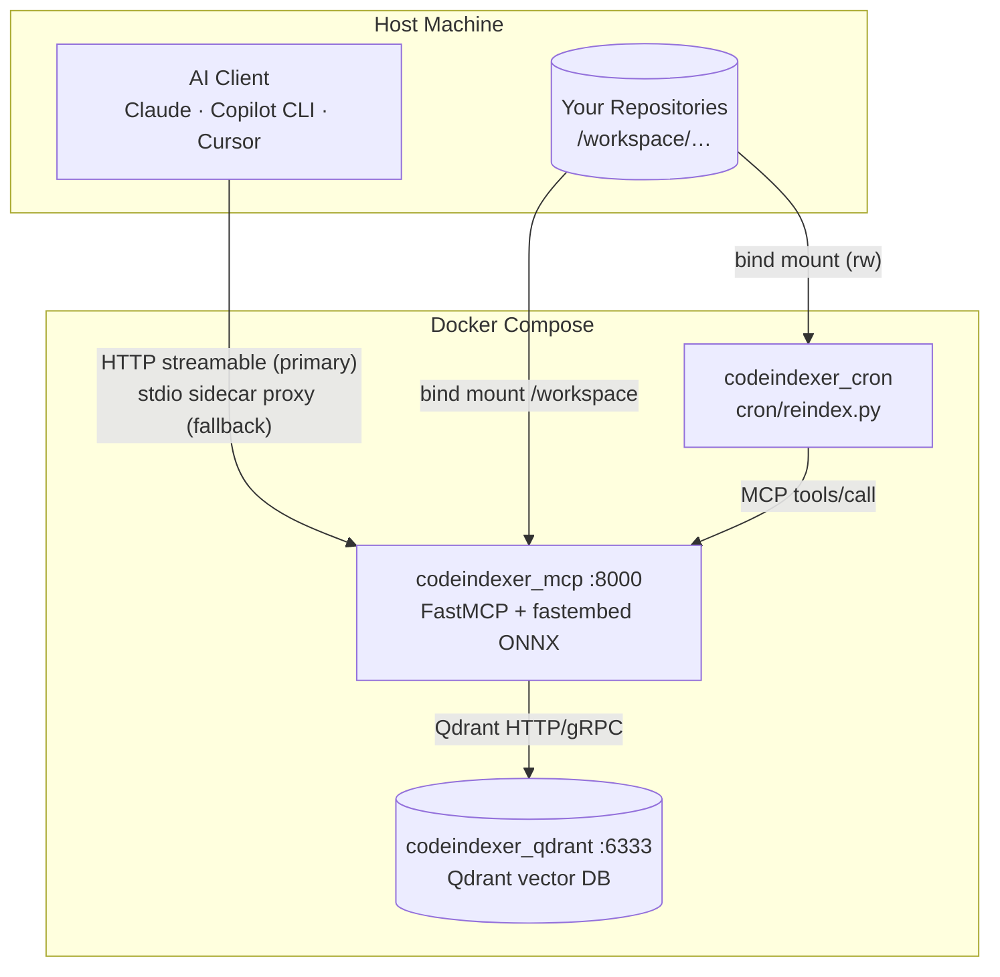
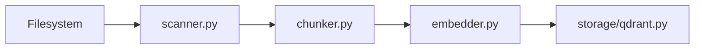

# Architecture

This document expands the [system diagram in README.md](../README.md#system-architecture) into per-component responsibilities with real module paths.

## Overview

Each direct subdirectory of `/workspace` is one **collection** (indexed project), named after the folder basename.

## Entry points

| Component | Path | Role |
|-----------|------|------|
| HTTP server | `mcp_server/src/codebase_indexer/main.py` | FastMCP app factory (`create_app`), registers all MCP tools, optional bearer auth middleware, `/health` endpoint |
| stdio proxy | `mcp_server/src/codebase_indexer/stdio_proxy.py` | Optional fallback: runs in a separate `codeindexer_proxy` sidecar; forwards JSON-RPC from stdin/stdout to the HTTP server — no model reload per session. Primary clients (e.g. Cursor) connect via HTTP URL instead. |
| Cron job | `cron/reindex.py` | Daily git pull + incremental `index_codebase` for changed repos |
| Benchmark | `mcp_server/benchmarks/bench.py` | Async harness for indexing/search latency and payload-index A/B comparison |

## Configuration

`mcp_server/src/codebase_indexer/config.py` defines `Settings` (pydantic-settings). Environment variables map case-insensitively to fields. Shared constants (`DEFAULT_SERVICE_URL_KEYWORDS`, embedding model dimension tables) live in the same module.

`mcp_server/src/codebase_indexer/context.py` builds `AppContext`: wires `Settings`, `QdrantStorage`, `Embedder`, `UrlExtractors`, and `IndexJobTracker` once per process.

## Indexing pipeline

Triggered by `index_codebase` / `index_all` (`mcp_server/src/codebase_indexer/tools/index.py` → `mcp_server/src/codebase_indexer/indexer/pipeline.py`).

### 1. Scanner (`indexer/scanner.py`)

- Walks `WORKSPACE_PATH` (default `/workspace/<project>`)
- Skips directories in `EXCLUDED_DIRS`
- Honors `.gitignore` and `.codeindexignore`
- Detects language by extension (`indexer/languages.py`)
- mtime pre-filter, then SHA-256 for changed files only

### 2. Chunker (`indexer/chunker.py`)

- Tree-sitter AST for supported languages; extracts top-level symbols
- Sliding-window fallback for YAML, JSON, XML, Markdown, SQL, etc.
- SQL T-SQL procedures via regex when grammar lacks `create_procedure`
- Prepends relevant import/using lines to chunks for cross-reference signal
- Chunk IDs: `sha256("{rel_path}:{start_line}")`

### 3. Embedder (`indexer/embedder.py`)

- **Dense**: fastembed ONNX (`DENSE_EMBED_MODEL`) on CPU, CUDA, or ROCm per `EMBED_DEVICE`
- **Sparse**: fastembed sparse (`SPARSE_EMBED_MODEL`, default BM25 lexical) on CPU
- Class-level singleton models; `release_models_after_index` and `model_idle_timeout` reclaim RAM
- Adaptive batch sizing and cgroup memory guard (`memory.py`)

### 4. Pipeline (`indexer/pipeline.py`)

- Double-buffered flush every `FLUSH_EVERY` chunks
- Sub-batch upserts of size `UPSERT_BATCH`
- Defers HNSW build during bulk upload (`QdrantStorage.set_indexing`)
- Post-job `gc.collect()` + `malloc_trim`

## Embedding layer

| Layer | Module | Notes |
|-------|--------|-------|
| Dense ONNX | `indexer/embedder.py` | `Embedder.embed_chunks`, `embed_queries`; numpy arrays held until upsert |
| Sparse | `indexer/embedder.py` | Always CPU; `SPARSE_THREADS` required in `.env` |
| Truncation | `indexer/truncation.py` | Token caps via `MAX_DENSE_EMBED_TOKENS` / `MAX_SPARSE_EMBED_TOKENS` |
| Device selection | `config.py` + Dockerfile | `EMBED_DEVICE=cpu|cuda|rocm`; GPU images swap `fastembed` → `fastembed-gpu` |

## Qdrant storage

`mcp_server/src/codebase_indexer/storage/qdrant.py` — `QdrantStorage` class.

- **Collections**: one per project folder; hybrid dense + sparse vectors when `HYBRID_SEARCH=true`
- **Payload**: `chunk_id`, `rel_path`, `content`, `symbol_name`, `symbol_type`, `language`, line range, `file_sha256`, `file_mtime`
- **Indexes**: optional keyword payload indexes (`PAYLOAD_INDEXES`) on `rel_path`, `chunk_id`, `symbol_name`, `language`
- **Tuning**: `VECTORS_ON_DISK`, `SPARSE_ON_DISK`, `QUANTIZATION`, `MEMMAP_THRESHOLD_KB`
- **Search**: hybrid RRF via `query_points` + `Fusion.RRF`, or dense-only when hybrid disabled

## Hybrid search

`mcp_server/src/codebase_indexer/tools/search_common.py` orchestrates query embedding and `QdrantStorage.search`.

When `HYBRID_SEARCH=true` (default):

1. Embed query → dense vector + sparse vector
2. Parallel prefetch on dense and sparse channels (`top_k * 3` each)
3. RRF fusion → final `top_k` results
4. `min_score` is **not** applied (RRF scores ≠ cosine scale)

When `HYBRID_SEARCH=false`:

- Dense cosine search only; `min_score` filters by similarity threshold

See [SEARCH_BEHAVIOR.md](SEARCH_BEHAVIOR.md) for tool-level caps and `min_score` semantics.

## MCP tools

All tools register via `register_*_tool(mcp, ctx)` in `main.py`:

| Category | Module |
|----------|--------|
| Indexing | `tools/index.py` |
| Search | `tools/search.py`, `tools/symbols.py`, `tools/search_common.py` |
| Orientation | `tools/summary.py`, `tools/outline.py` |
| Retrieval | `tools/chunk.py`, `tools/collections.py` |
| Cross-project | `tools/cross_references.py`, `tools/service_map.py`, `tools/build_deps.py` |

`tools/cross_references.py` provides `UrlExtractors` (keyword-driven URL/route extraction from `SERVICE_URL_KEYWORDS`).

## Cron reindex

`cron/reindex.py`:

1. `list_collections` via minimal MCP HTTP client
2. For each collection name, locate `/workspace/<name>` git repo
3. `git fetch` + `git pull --ff-only` on default branch when clean
4. `index_codebase(path=name, force=False, wait=True)` with `INDEX_TIMEOUT`

Timeouts: `INDEX_TIMEOUT` (per index job), `MCP_HTTP_TIMEOUT` (per JSON-RPC call), `GIT_TIMEOUT` (subprocess).

## Job tracking

`mcp_server/src/codebase_indexer/index_jobs.py` — `IndexJobTracker` holds in-memory job state for `index_codebase` / `index_status` / `stop_indexing`.
