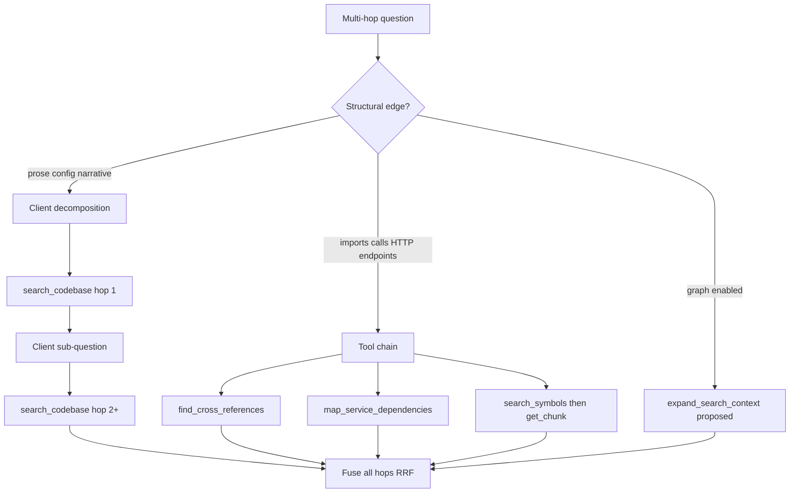

# Search Behavior

**Summary:** `search_codebase` caps `top_k` at **20**; `search_symbols` caps `top_k` at **30**. When `HYBRID_SEARCH` is enabled (default), results are ranked by reciprocal rank fusion (RRF) of dense and sparse lists — `min_score` is ignored because RRF scores are not on the cosine [0,1] scale. When `HYBRID_SEARCH` is disabled, only dense cosine search runs and `min_score` filters results by similarity threshold.

## `search_codebase`

| Parameter | Default | Cap / behavior |
|-----------|---------|----------------|
| `top_k` | `5` | Silently capped at **20** (`tools/search.py`) |
| `min_score` | `0.5` | Applied only when `HYBRID_SEARCH=false` |
| `max_content_chars` | `None` | Truncates chunk `content` in results; use `get_chunk` for full text |
| `language` | `None` | Optional Qdrant payload filter |
| `collection` / `collections` | default collection | Multi-collection search merges via global RRF re-fusion (rank-based, not raw score) |

Implementation path: `tools/search.py` → `tools/search_common.run_search` → `storage/qdrant.py` `QdrantStorage.search` → `_search_single`.

### Hybrid mode (`HYBRID_SEARCH=true`)

1. Query embedded to dense + sparse vectors
2. Qdrant prefetches `top_k * prefetch_multiplier` candidates on each channel (default multiplier **5**)
3. Dense prefetch applies `hnsw_ef` and, when `QUANTIZATION=true`, int8 rescoring with `quant_oversampling`
4. `Fusion.RRF` merges ranked lists within the collection
5. Multi-collection queries re-fuse per-collection ranked lists with global RRF (`rrf_k`, default **60**)
6. `score_threshold` forced to `0.0` — see `qdrant.py` `_search_single` comment on RRF vs cosine scales

### Dense-only mode (`HYBRID_SEARCH=false`)

- Single dense ANN query with cosine distance
- Query uses `hnsw_ef`; when `QUANTIZATION=true`, int8 rescoring with `quant_oversampling` is applied
- Results below `min_score` are dropped

## `search_symbols`

Same search backend as `search_codebase` but returns metadata only (no `content` field).

| Parameter | Default | Cap / behavior |
|-----------|---------|----------------|
| `top_k` | `10` | Silently capped at **30** (`tools/symbols.py`) |
| `min_score` | `0.4` | Applied only when `HYBRID_SEARCH=false` |

## Related tools

| Tool | Embedding cost | Notes |
|------|----------------|-------|
| `get_collection_summary` | Zero | Payload scroll only |
| `get_file_outline` | Zero | Payload scroll by `rel_path` |
| `get_chunk` | Zero | Lookup by `chunk_id` |
| `find_cross_references` | Per internal search | Participates in ColBERT rerank when `RERANK_ENABLED=true`; internal `min_score=0.3` ignored on hybrid/rerank paths |
| `map_service_dependencies` | Batched query embed | Participates in ColBERT rerank when `RERANK_ENABLED=true`; internal `min_score=0.25` ignored on hybrid/rerank paths |
| `recommend_code` | Per positive/negative text query | Dense-only Qdrant Recommendation API; single collection; see below |

## `recommend_code`

Find chunks **similar to positive examples** and **dissimilar from negative examples** using Qdrant's Recommendation API on the **dense** vector only (`RecommendStrategy.AVERAGE_VECTOR`).

| Parameter | Default | Cap / behavior |
|-----------|---------|----------------|
| `collection` | *(required)* | Single collection only — multi-collection deferred |
| `positive_chunk_ids` | `None` | Resolved to point IDs; missing IDs fail fast with explicit error |
| `positive_query` | `None` | Free-text embedded via Ollama dense path |
| `negative_chunk_ids` | `None` | Same resolution/validation as positives |
| `negative_query` | `None` | Free-text embedded via Ollama dense path |
| `limit` | `5` | Silently capped at **20** |
| `language` | `None` | Qdrant payload filter (indexed field) |
| `path_glob` | `None` | Post-filter via `fnmatch` on `rel_path`; over-fetches `limit * 3` |
| `max_content_chars` | `None` | Truncates chunk `content`; use `get_chunk` for full text |

At least one positive example (`positive_chunk_ids` and/or `positive_query`) is required. Total example count (positive + negative, chunk IDs + text queries) is capped by `RECOMMEND_MAX_EXAMPLES` (default **10**).

Implementation path: `tools/recommend.py` → `storage/qdrant.py` `QdrantStorage.recommend` → `query_points` with `RecommendQuery` on `using=dense`.

| Variable | Default | Effect |
|----------|---------|--------|
| `RECOMMEND_ENABLED` | `true` | Master switch; when `false`, tool is not registered |
| `RECOMMEND_MAX_EXAMPLES` | `10` | Cap on positive + negative examples per request |

## Configuration

| Variable | Default | Effect |
|----------|---------|--------|
| `HYBRID_SEARCH` | `true` | Enables sparse channel + RRF fusion |
| `DENSE_EMBED_MODEL` | *(required)* | Dense query embedding model |
| `SPARSE_EMBED_MODEL` | *(required)* | Sparse query embedding model |
| `PREFETCH_MULTIPLIER` | `5` | Hybrid prefetch limit = `top_k * multiplier` per channel |
| `QUANT_OVERSAMPLING` | `2.0` | Quantized dense search oversampling (when `QUANTIZATION=true`) |
| `HNSW_EF` | `64` | Query-time HNSW search breadth |
| `RRF_K` | `60` | RRF constant for multi-collection re-fusion |

Disabling hybrid requires re-creating collections whose sparse configuration no longer matches — `QdrantStorage.ensure_collection` detects hybrid mismatch and recreates when needed.

## Optional ColBERT reranking (`RERANK_ENABLED=true`)

When enabled (default **off**), search runs a three-stage pipeline per collection:

1. Hybrid prefetch on dense + sparse channels (`RERANK_PREFETCH` candidates each, default **100**)
2. ColBERT **MAX_SIM** rerank over the merged candidate pool (`using=colbert`)
3. Multi-collection queries re-fuse per-collection ranked lists with global RRF (`rrf_k`)

Index-time: a third multivector field `colbert` is stored on each point (HNSW disabled, rerank-only). Enabling rerank on an existing collection **requires a full re-index** — `ensure_collection` recreates when the colbert vector config is missing or mismatched.

| Variable | Default | Effect |
|----------|---------|--------|
| `RERANK_ENABLED` | `false` | Master switch (requires `HYBRID_SEARCH=true`) |
| `COLBERT_EMBED_MODEL` | `colbert-ir/colbertv2.0` | fastembed ColBERT model for index + query |
| `RERANK_PREFETCH` | `100` | Hybrid candidate pool before ColBERT rerank |
| `RERANK_MAX_QUERY_TOKENS` | `0` | Query truncation; `0` = registry default |
| `RERANK_ADAPTIVE_ENABLED` | `true` | Probe hybrid RRF scores before ColBERT (when rerank on) |
| `RERANK_ADAPTIVE_GAP` | `0.02` | Skip ColBERT when rank-1 minus rank-2 RRF gap ≥ threshold |
| `COLBERT_EMBED_BACKEND` | `onnx` | `onnx` (in MCP) or `remote` (HTTP sidecar) |
| `COLBERT_URL` | `http://colbert_worker:8082` | Sidecar base URL when `remote` |
| `COLBERT_TIMEOUT` | `300` | Per-request HTTP timeout (seconds) |
| `COLBERT_EMBED_BATCH_SIZE` | `16` | MCP → sidecar batch size |

When `COLBERT_EMBED_BACKEND=remote`, ColBERT model weights and inference run in the `colbert_worker` container (see `docker-compose.colbert-worker.yml`). MCP still holds returned multivectors per flush batch until upsert — the sidecar removes ColBERT **model and compute** RAM from MCP, not the upsert payload. Switching `onnx` ↔ `remote` with the same `COLBERT_EMBED_MODEL` does **not** require re-index.

### Index-time tuning (upsert batch size)

ColBERT multivectors make each Qdrant point much larger than dense+sparse alone. If `UPSERT_BATCH` is too high, upserts fail with connection errors (often logged as empty `Upsert error:` strings). Lower **`UPSERT_BATCH`** to **`10`–`25`** when rerank is enabled; see [DEPLOYMENT.md](DEPLOYMENT.md#colbert-rerank-qdrant-upsert-batching) for symptoms, cause, and presets.

| Variable | Default (no rerank) | With rerank |
|----------|---------------------|-------------|
| `UPSERT_BATCH` | `500` | **`10`–`25`** recommended |
| `FLUSH_EVERY` | `1500` | **`64`–`128`** typical |

`min_score` remains disabled on hybrid and rerank paths (scores are not cosine-scale). This applies to `search_codebase`, `search_symbols`, `find_cross_references`, and `map_service_dependencies`.

### Adaptive ColBERT skip (`RERANK_ADAPTIVE_ENABLED=true`)

When rerank is enabled and adaptive skip is on (default **on**), each per-collection search first runs the same hybrid prefetch + RRF fusion used for non-rerank hybrid search (probe limit `max(top_k, 2)`, prefetch pool `RERANK_PREFETCH`). If at least two candidates are returned and the RRF score gap between rank 1 and rank 2 is at or above `RERANK_ADAPTIVE_GAP` (default **0.02**), ColBERT MAX_SIM rerank is skipped and hybrid RRF results are returned (trimmed to `top_k`). Otherwise the full ColBERT rerank query runs unchanged.

- Gap is measured on **per-collection** hybrid RRF scores before ColBERT, matching Qdrant's confident-winner pattern.
- Multi-collection searches apply adaptive logic independently in each `_search_single` call, then existing global `fuse_cross_collection_rrf` merges per-collection lists.
- Fewer than two probe hits always runs ColBERT (no skip).
- ColBERT **query embedding** in `Embedder.embed_query` still runs when rerank is on unless the caller passes **`rerank=false`** on a search tool (see below).
- `QdrantStorage.adaptive_rerank_stats` exposes skip/rerank counters for `bench.py` and `eval_retrieval.py`.

Tune `RERANK_ADAPTIVE_GAP` upward to skip more often (lower latency, possible quality loss); downward to rerank more often. Validate with `eval_retrieval --rerank` on your golden set.

### Per-tool rerank override (`rerank=false`)

When `RERANK_ENABLED=true`, these tools accept an optional **`rerank: bool | None = None`** parameter:

| Tool | Effect of `rerank=false` |
|------|-------------------------|
| `search_codebase` | Skips ColBERT query embed and MAX_SIM; hybrid RRF only |
| `search_symbols` | Same |
| `find_cross_references` | Applies to semantic and import-phrased `run_search` paths only (exact symbol / call_site paths unchanged) |
| `map_service_dependencies` | Skips ColBERT on batched discovery query embed |

- **`rerank=None`** (default): follow global `RERANK_ENABLED` behavior.
- **`rerank=false`**: skip ColBERT query embed and Qdrant MAX_SIM for that call (`colbert_vector=None`).
- **`rerank=true`**: does **not** enable ColBERT when `RERANK_ENABLED=false`; cannot bypass adaptive skip logic when effective rerank is on.

Use `rerank=false` on orientation hops (`search_symbols`, wide `top_k` probes) or latency-sensitive multi-hop loops where hybrid RRF quality is sufficient.

## Multi-hop retrieval

Many code questions need evidence from **more than one chunk or file**. The server does **not** run an in-server decomposition loop ([decision 0009](adr/0009-multi-hop-retrieval-strategies.md)); the **MCP client** orchestrates hops. Reference: [Qdrant query decomposition](https://qdrant.tech/documentation/improve-search/query-decomposition/).

### Choose a strategy



| Strategy | When to use | Typical tools | Embedding cost |
|----------|-------------|---------------|----------------|
| **Tool chaining** | Known relation types (symbol, xref, service map) | `search_symbols` → `get_chunk`; `find_cross_references`; `map_service_dependencies` | 0–1 embed per hop |
| **Query decomposition** | Facts not linked in graph (config prose, comments, docs) | Repeated `search_codebase` with client-drafted sub-questions | 1 embed per `search_codebase` hop |
| **Graph expansion** | Call/import/HTTP paths when graph layer enabled ([0002](adr/0002-graphrag-neo4j-qdrant.md)) | `expand_search_context` (proposed) | One search + graph query |

Reranking or a wider single-pass `top_k` **cannot recover evidence that was never retrieved** — add hops when bridging chunks are missing from hop 1.

### Client decomposition loop

1. `search_codebase` with the user question (`top_k` 10–20).
2. Client LLM reads returned chunks (use `max_content_chars` + `get_chunk` for full text).
3. If evidence is incomplete, emit a **sub-question** targeting the missing hop (or `DONE`).
4. `search_codebase` again (or `search_symbols` / `find_cross_references` when the hop is structural).
5. Repeat until `DONE` or a hop budget (typically 2–4 searches).
6. **Fuse every hop** before synthesis — not only the last result list.

### Client-side RRF merge (chunk_ids)

Use rank-based RRF on `chunk_id` across hops (same idea as server `rrf_k`, default 60):

```
fused[chunk_id] += 1 / (rrf_k + rank_in_hop)
```

Keep the best rank per `chunk_id` per hop, sort fused scores descending, then `get_chunk` the top entries for the answer step. Stable `chunk_id` keys are `sha256("{rel_path}:{start_line}")` in payloads.

### Token-efficient hops

| Step | Tool | Embed cost |
|------|------|------------|
| Locate symbol | `search_symbols` | yes |
| File structure | `get_file_outline` | no |
| Full chunk text | `get_chunk` | no |
| Cross-project edge | `find_cross_references` | internal search |
| Service graph | `map_service_dependencies` | batched embed |

### Evaluation

Multi-hop queries in `mcp_server/benchmarks/fixtures/golden_queries.jsonl` are tagged `multi_hop`. Single-pass `search_codebase` often scores lower on those queries by design; compare against a 2-hop client script using [eval_retrieval](ARCHITECTURE.md#retrieval-evaluation-adr-0007).
