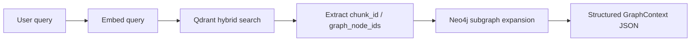

# 0002. Add optional GraphRAG with Neo4j and Qdrant

- **Status:** Accepted (phase 1 — Neo4j storage + index-time graph writer)
- **Date:** 2026-07-02
- **Deciders:** Maintainers
- **Related:** [Qdrant GraphRAG tutorial](https://qdrant.tech/documentation/examples/graphrag-qdrant-neo4j/#build-a-graphrag-agent-with-neo4j-and-qdrant), [ADR 0001](0001-pluggable-embed-backends.md)

## Context

The MCP server today combines **Qdrant hybrid search** (dense + sparse RRF) with **on-demand cross-project heuristics** (`find_cross_references`, `map_service_dependencies`). Vectors answer “what code is semantically similar to this query?”; regex, payload filters, and manifest parsing answer “where is this symbol referenced?” or “which services call which endpoints?”.

That split works for single-hop lookups but struggles with **multi-hop, relationship-centric questions** that GraphRAG is designed for, for example:

- “How does `OrderService` in repo A reach the billing API in repo C?”
- “What is the shortest path from this controller endpoint to the database migration that owns the table?”
- “Which services transitively depend on this shared library **and** call it at runtime?”

Answering these today requires the AI client to chain several MCP tools, re-scan Qdrant payloads, and infer paths that are never materialized as a graph.

[Qdrant’s Neo4j + Qdrant GraphRAG pattern](https://qdrant.tech/documentation/examples/graphrag-qdrant-neo4j/#build-a-graphrag-agent-with-neo4j-and-qdrant) addresses this by:

1. **Ingestion:** store entities and relationships in a graph DB; store semantic vectors in Qdrant; **link both with shared IDs**
2. **Retrieval:** vector-search in Qdrant → extract linked IDs → expand neighborhood in the graph → return structured context to the caller

The tutorial builds a **generic document KG with LLM entity extraction and OpenAI embeddings**. This project already has:

- Deterministic code entities (symbols, files, endpoints, collections) from tree-sitter and existing extractors
- Self-hosted embeddings and Qdrant collections per workspace folder
- Cross-reference types: `definition`, `import`, `usage`, `call_site`, `http_call`, `endpoint_definition`, `service_config`, `build_dependency`

We need an ADR that adapts GraphRAG to **code intelligence** without introducing LLM-based ontology construction, external embedding APIs, or answer generation inside the MCP server.

### Constraints

- Default deployment must remain **Qdrant-only** (single compose, no new mandatory service)
- No OpenAI / cloud LLM dependency for graph construction or retrieval
- MCP tools return **structured context**; the connected AI client performs reasoning and natural-language answers
- Reuse existing indexing signals where possible; avoid duplicating logic diverging from `cross_references.py` / `build_deps.py`
- Self-hosted Docker topology consistent with current Qdrant sidecar model

## Decision

We will add an **optional GraphRAG layer**: Neo4j stores a **code knowledge graph** per indexed collection; Qdrant remains the semantic entry point; shared IDs connect chunk/symbol nodes across both stores. Graph ingestion runs as part of the existing index pipeline; graph-augmented retrieval is exposed via new MCP tools. The feature is **opt-in** via configuration and an optional compose override.

Deliver in **four phases**. Phases 1–2 establish data; Phase 3 exposes retrieval; Phase 4 optimizes existing cross-project tools.

### Graph model (code ontology)

One Neo4j database (or labeled subgraph per collection). Node labels and relationship types are **fixed by schema**, not LLM-inferred.

| Label | Key properties | Source |
|-------|----------------|--------|
| `Collection` | `name` | workspace folder basename |
| `File` | `rel_path`, `language`, `sha256` | scanner / chunker |
| `Chunk` | `chunk_id`, `start_line`, `end_line` | chunker; **primary Qdrant link** |
| `Symbol` | `name`, `kind`, `qualified_name` | tree-sitter chunk metadata |
| `Endpoint` | `path`, `method` | route extractors in `cross_references.py` |
| `Artifact` | `name`, `group`, `ecosystem` | `build_deps.py` |

| Relationship | Example | Source |
|--------------|---------|--------|
| `IN_COLLECTION` | `(File)-[:IN_COLLECTION]->(Collection)` | pipeline |
| `IN_FILE` | `(Chunk)-[:IN_FILE]->(File)` | pipeline |
| `DEFINES` | `(Chunk)-[:DEFINES]->(Symbol)` | chunk `symbol_name` |
| `IMPORTS` | `(File)-[:IMPORTS]->(Symbol\|File)` | chunk import lines |
| `CALLS` | `(Chunk)-[:CALLS]->(Symbol)` | chunk `callees` |
| `DECLARES_ENDPOINT` | `(Chunk)-[:DECLARES_ENDPOINT]->(Endpoint)` | route extractors |
| `HTTP_CALLS` | `(Chunk)-[:HTTP_CALLS]->(Endpoint)` | URL extractors |
| `CONFIGURES` | `(Chunk)-[:CONFIGURES]->(Endpoint)` | service config extractors |
| `BUILD_DEPENDS` | `(Collection)-[:BUILD_DEPENDS]->(Artifact)` | build manifests |
| `RESOLVES_TO` | `(Artifact)-[:RESOLVES_TO]->(Collection)` | artifact name ↔ folder match (best-effort) |

Cross-collection edges use the same types; `Collection.name` disambiguates endpoints.

### ID linking (Qdrant ↔ Neo4j)

Follow the tutorial’s **shared external ID** pattern, adapted to existing payload fields:

| Store | ID field | Value |
|-------|----------|-------|
| Qdrant payload | `chunk_id` (existing) | `sha256("{rel_path}:{start_line}")` |
| Neo4j `Chunk` | `chunk_id` | same value |
| Neo4j `Symbol` | `qualified_name` or stable hash | `{collection}:{rel_path}::{symbol_name}` |
| Qdrant payload (new, Phase 2) | `graph_node_ids` | list of linked Neo4j node keys for expansion |

Qdrant point IDs remain UUIDv5-derived from `chunk_id` (unchanged). Graph expansion keys off **payload `chunk_id` / `graph_node_ids`**, not Qdrant point UUIDs.

Retrieval flow (Phase 3):



The MCP returns `GraphContext` (nodes, edges, related chunks)—**not** an LLM-generated answer. This differs from the tutorial’s `graphRAG_run` step, which we deliberately omit.

### Phase 1 — Neo4j storage + index-time graph writer

- Add `storage/neo4j.py` with async-friendly wrapper around the official `neo4j` driver
- Add `indexer/graph_writer.py` invoked from `pipeline.py` after chunk flush (same cadence as Qdrant upsert)
- Graph writer reuses extractors from `chunker`, `cross_references`, and `build_deps` (shared functions, not copy-paste)
- Incremental updates: on file re-index, delete stale `File`/`Chunk` subgraph by `rel_path` before re-insert
- `GRAPH_ENABLED=false` (default): skip all Neo4j I/O; zero behavior change

### Phase 2 — Qdrant payload linking

- Extend upsert payload with optional `graph_node_ids: list[str]`
- Collection metadata records `graph_enabled: bool` and graph schema version
- Warn when searching a collection indexed without graph linkage while `GRAPH_ENABLED=true`

### Phase 3 — Graph-augmented MCP retrieval

- New tool: `expand_search_context` (name TBD) — inputs: `query`, `collections`, `top_k`, `graph_hops` (default 2)
- Implementation: hybrid search via existing `search_common.py` → collect seed IDs → Cypher neighborhood query (1–2 hops, bounded node/edge counts) → attach matching chunk payloads
- Optional internal helper inspired by `neo4j_graphrag.retrievers.QdrantNeo4jRetriever`, but wired to **local `Embedder`**, not OpenAI
- Do **not** add `neo4j-graphrag` as a hard dependency if its retriever cannot be decoupled from OpenAI; prefer a thin in-repo retriever (~100 lines)

Example Cypher seed (equivalent to tutorial’s `fetch_related_graph`):

```cypher
MATCH (c:Chunk)-[r*1..2]-(n)
WHERE c.chunk_id IN $chunk_ids
RETURN c, r, n
LIMIT $max_nodes
```

### Phase 4 — Neo4j-backed cross-project queries (optional)

- Add `find_graph_path` or extend `map_service_dependencies` with `engine=neo4j` when graph is enabled
- Replace repeated Qdrant scroll + regex passes with Cypher for multi-hop service/HTTP/build paths
- Keep regex-based path as fallback when `GRAPH_ENABLED=false`

### Configuration

| Variable | Phase | Default | Purpose |
|----------|-------|---------|---------|
| `GRAPH_ENABLED` | 1 | `false` | Master switch |
| `NEO4J_URI` | 1 | `bolt://neo4j:7687` | Bolt URI |
| `NEO4J_USER` | 1 | `neo4j` | Auth user |
| `NEO4J_PASSWORD` | 1 | *(required when enabled)* | Auth password |
| `NEO4J_DATABASE` | 1 | `neo4j` | Target database |
| `GRAPH_MAX_HOPS` | 3 | `2` | Default expansion depth |
| `GRAPH_MAX_NODES` | 3 | `200` | Cap subgraph size per query |
| `GRAPH_WRITER_BATCH` | 1 | `500` | Neo4j transaction batch size |

Deployment: optional `docker-compose.neo4j.yml` adding a `neo4j` service (Community edition, persistent volume, healthcheck). MCP `depends_on` neo4j only when compose override is used.

### Cross-phase invariants

1. Default `GRAPH_ENABLED=false`; existing compose and tools unchanged
2. No LLM calls in graph ingestion or retrieval paths
3. Graph schema version stored in collection metadata; full graph rebuild on schema bump
4. Full re-index + graph rebuild when enabling graph on an existing collection
5. MCP tool contracts for existing search/cross-ref tools remain backward compatible

### Delivery order

Ship Phase 1 alone behind `GRAPH_ENABLED`. Phases 2–3 follow as separate PRs. Phase 4 is optional and may be split per tool.

## Alternatives considered

| Option | Pros | Cons |
|--------|------|------|
| **Optional Neo4j GraphRAG (chosen)** | Matches Qdrant’s proven vector→graph pattern; multi-hop queries; reuses existing extractors; opt-in | Extra service, ops, and disk; index-time write amplification; schema maintenance |
| **Qdrant-only (status quo)** | Simplest topology; no new dependency | Multi-hop path queries stay expensive; cross-ref tools scan payloads repeatedly |
| **LLM-built KG (tutorial default)** | Flexible for unstructured prose | Conflicts with self-hosted goal; inconsistent ontology; cost at index and query time; wrong fit for AST-backed code |
| **Graph in Qdrant payloads only** | No Neo4j | No native multi-hop traversal; large payloads; poor path algorithms |
| **Memgraph / FalkorDB instead of Neo4j** | Faster for some graph workloads | Ecosystem mismatch with Qdrant tutorial and `neo4j-graphrag` examples; team familiarity |
| **Replace Qdrant with graph-only search** | Single store | Loses hybrid semantic retrieval—the primary product strength |

## Consequences

### Positive

- Single MCP call can return semantically relevant seeds **plus** structured relationship context
- Multi-hop service, call-chain, and dependency questions become first-class
- Aligns with Qdrant’s documented GraphRAG architecture while staying code-specific and LLM-free
- Cross-project analysis can move from ad hoc Qdrant scrolls to indexed graph traversals (Phase 4)
- AI clients get richer context without the MCP owning model API keys for generation

### Negative / trade-offs

- Neo4j adds RAM, disk, backup, and upgrade surface (fourth stateful service alongside Qdrant)
- Index jobs write to two stores; partial failures require reconciliation or re-index
- `RESOLVES_TO` and cross-repo symbol linking remain heuristic; graph completeness depends on extractor coverage
- Bounded subgraph expansion may truncate long paths; clients must handle incomplete graphs
- Community Neo4j clustering not in scope; large monorepos may need tuning (`GRAPH_MAX_NODES`, indexes)

### Neutral / follow-ups

- Community detection / GraphRAG “semantic clusters” (Microsoft GraphRAG paper) deferred—vector search covers local relevance
- GraphQL or Cypher exposure directly to MCP clients deferred (security)
- Automatic graph repair cron job deferred; re-index remains the recovery path
- Evaluate `neo4j-graphrag` adoption once local-embedder integration is confirmed

## Implementation notes

### Affected paths

- `mcp_server/src/codebase_indexer/storage/neo4j.py` — new graph storage client
- `mcp_server/src/codebase_indexer/indexer/graph_writer.py` — index-time ingestion
- `mcp_server/src/codebase_indexer/indexer/pipeline.py` — invoke graph writer on flush
- `mcp_server/src/codebase_indexer/storage/qdrant.py` — optional `graph_node_ids` payload; metadata
- `mcp_server/src/codebase_indexer/config.py` — graph settings
- `mcp_server/src/codebase_indexer/context.py` — optional `Neo4jStorage` wiring
- `mcp_server/src/codebase_indexer/tools/graph_search.py` — Phase 3 retrieval tool
- `mcp_server/src/codebase_indexer/tools/cross_references.py` — Phase 4 optional Cypher backend
- `docker-compose.neo4j.yml`, `.env.example`, `README.md`, `docs/ARCHITECTURE.md`

### Neo4j indexes (Phase 1)

Create constraints/indexes idempotently at startup:

- `Chunk(chunk_id)` unique
- `File(collection, rel_path)` unique
- `Symbol(qualified_name)` unique
- `Endpoint(collection, path)` index
- `Collection(name)` unique

### Rollout

- Phase 1–3: opt-in via `GRAPH_ENABLED=true` + `docker compose -f docker-compose.yml -f docker-compose.neo4j.yml up`
- Default unchanged for existing users

### Re-index

**Yes** — required when enabling graph on an existing collection, changing graph schema version, or recovering from Neo4j/Qdrant drift.

## Validation

| Phase | Checks |
|-------|--------|
| 1 | Unit tests for graph writer with Testcontainers Neo4j or bolt mock; incremental file update deletes stale nodes; `GRAPH_ENABLED=false` skips driver init |
| 2 | Payload round-trip: every upserted chunk has `graph_node_ids`; metadata flags graph version |
| 3 | Integration test: query → Qdrant hits → Cypher expansion returns expected `CALLS` / `HTTP_CALLS` edges on a fixture multi-file repo |
| 4 | Parity test: `map_service_dependencies` edges match Neo4j path query on sample microservice fixtures |

Success criteria:

- With `GRAPH_ENABLED=false`, zero regression in index duration, search latency, and existing tool outputs
- With graph enabled, `expand_search_context` returns strictly more relationship data than `search_codebase` alone for multi-hop fixture queries
- No new runtime dependency on external LLM or embedding APIs
- Subgraph responses respect `GRAPH_MAX_NODES` and complete within MCP HTTP timeout budgets
