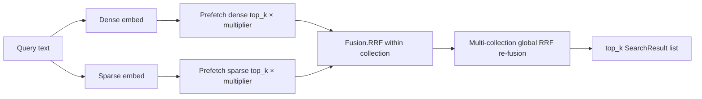

# 0003. Default hybrid search with prefetch and RRF fusion

- **Status:** Accepted

- **Date:** 2026-07-02

- **Deciders:** Maintainers

- **Related:** [Qdrant hybrid search docs](https://qdrant.tech/documentation/search/text-search/hybrid-search/), [Hybrid Search on PDF Manuals](https://qdrant.tech/documentation/examples/hybrid-search-llamaindex-jinaai/)

## Context

Code search queries mix two retrieval modes:

- **Semantic** — “how does authentication work?”, “retry logic for failed API calls”

- **Lexical / identifier** — exact symbol names (`IndexJobTracker`), file paths, error strings, config keys

Dense embeddings alone miss exact token matches; BM25-style sparse vectors alone miss paraphrases and conceptual similarity. Qdrant’s [Hybrid Search on PDF Manuals](https://qdrant.tech/documentation/examples/hybrid-search-llamaindex-jinaai/) tutorial and [hybrid search guide](https://qdrant.tech/documentation/search/text-search/hybrid-search/) demonstrate the recommended pattern: store dense and sparse vectors on the same point, prefetch both channels, then fuse with **Reciprocal Rank Fusion (RRF)**.

The LlamaIndex example exposes `similarity_top_k` (final fused count) and `sparse_top_k` (per-channel prefetch depth). Our MCP tools cap `top_k` at 20/30 and must behave predictably across single- and multi-collection queries.

Constraints:

- Self-hosted hybrid search: Ollama dense + in-process BM25 sparse (see [ADR 0011](0011-ollama-only-dense-embedding.md))

- Hybrid must be configurable at collection creation time (`enable_hybrid` equivalent — sparse vector config is immutable per collection)

- RRF scores are not cosine-normalized; tool-level `min_score` must not silently drop hybrid hits

## Decision

We will enable **hybrid search by default** (`HYBRID_SEARCH=true`) using Qdrant’s **prefetch + `Fusion.RRF`** query API. Each indexed chunk stores named `dense` and `sparse` vectors; query time embeds the user string through both channels, prefetches `top_k * PREFETCH_MULTIPLIER` candidates per channel, fuses within the collection, and re-fuses across collections with rank-based global RRF.

### Query flow

### Defaults and knobs

| Setting | Default | Role |

|---------|---------|------|

| `HYBRID_SEARCH` | `true` | Master switch; `false` → dense-only cosine |

| `PREFETCH_MULTIPLIER` | `5` | Per-channel prefetch = `top_k × multiplier` (LlamaIndex `sparse_top_k` analogue) |

| `RRF_K` | `60` | Constant for cross-collection re-fusion (`fuse_cross_collection_rrf`) |

| `SPARSE_EMBED_MODEL` | BM25 fastembed | Lexical channel |

| `min_score` (tools) | 0.4–0.5 | **Ignored when hybrid enabled**; applied only on dense-only path |

### Collection schema

Hybrid collections are created with named dense + sparse vector configs in `QdrantStorage.ensure_collection`. Disabling hybrid or changing vector dimensions triggers collection recreation — same constraint as the LlamaIndex `enable_hybrid=True` requirement at index time.

## Alternatives considered

| Option | Pros | Cons |

|--------|------|------|

| **Prefetch + RRF hybrid (chosen)** | Matches Qdrant documented pattern; strong on symbols + semantics; single query round-trip | RRF scores incomparable to cosine; more vectors per point; sparse always CPU |

| **Dense-only semantic search** | Simpler; `min_score` works; lower index size | Poor exact-match recall for identifiers, paths, error codes |

| **Sparse-only (BM25) search** | Fast lexical match | No paraphrase / concept retrieval |

| **Weighted score fusion (manual α·dense + β·sparse)** | Tunable blend | Score scales differ; harder to tune per model; not Qdrant’s default fusion |

| **Post-retrieval reranker (cross-encoder)** | Higher precision | Extra model latency and RAM; out of scope for MCP tool budget |

| **Separate sparse and dense tool calls** | Client controls fusion | Doubles embedding cost and MCP round-trips |

## Consequences

### Positive

- Identifier-heavy queries (`class FooBar`, `docker-compose.ollama.yml`) rank well via sparse channel

- Conceptual queries still benefit from dense embeddings

- Aligns with Qdrant’s primary hybrid-search documentation and PDF-manuals tutorial

- Single `search_codebase` call replaces client-side fusion logic

### Negative / trade-offs

- `min_score` cannot filter hybrid results — callers rely on `top_k` and ranking only

- Every point stores two vectors → higher disk/RAM vs dense-only

- Sparse embedding stays in-process ONNX BM25; dense uses Ollama HTTP ([ADR 0011](0011-ollama-only-dense-embedding.md))

- Prefetch multiplier adds latency vs bare `top_k` dense query

### Neutral / follow-ups

- Per-query dense/sparse prefetch tuning (LlamaIndex-style separate `sparse_top_k`) deferred — single multiplier keeps config simple

- Late-interaction / ColBERT-style reranking deferred

- Optional `score_threshold` on dense prefetch only (Qdrant hybrid guide pattern) not exposed — may reduce false positives on semantic-only queries in future

## Implementation notes

### Affected paths

- `mcp_server/src/codebase_indexer/storage/qdrant.py` — `_search_single`, `ensure_collection`, `fuse_cross_collection_rrf`

- `mcp_server/src/codebase_indexer/indexer/embedder.py` — dual-channel query embedding

- `mcp_server/src/codebase_indexer/tools/search_common.py` — orchestration

- `docs/SEARCH_BEHAVIOR.md` — tool caps and `min_score` semantics

### Rollout

Default unchanged for existing deployments already on hybrid collections.

### Re-index

**Yes** — required when toggling `HYBRID_SEARCH` on an existing collection (sparse vector config mismatch).

## Validation

- `test_storage_integration.py` — hybrid search returns hits; `min_score` does not filter RRF results

- `test_qdrant_search.py` — cross-collection RRF rank ordering

- `benchmarks/bench.py` — hybrid vs payload-index A/B comparisons

Success criteria:

- Symbol-name queries retrieve defining chunk in top-3 on fixture repos

- Paraphrase queries outperform dense-only baseline in manual spot checks

- Hybrid path completes within MCP HTTP timeout for `top_k ≤ 20`

