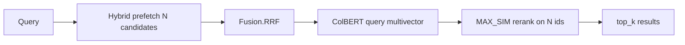

# 0008. Optional ColBERT late-interaction reranking

- **Status:** Accepted (phase 1 — optional ColBERT multivector reranking)
- **Date:** 2026-07-02
- **Deciders:** Maintainers
- **Related:** [Hybrid Search with Reranking](https://qdrant.tech/documentation/tutorials-basics/reranking-hybrid-search/), [Qdrant Essentials final project](https://qdrant.tech/course/essentials/day-6/final-project/), [ADR 0003](0003-hybrid-search-rrf-default.md), [ADR 0015](0015-colbert-http-sidecar.md) (optional ColBERT sidecar deployment)

## Context

[ADR 0003](0003-hybrid-search-rrf-default.md) adopted **prefetch + RRF hybrid search** as the default retrieval path and explicitly **deferred late-interaction / ColBERT reranking**. Qdrant’s [Hybrid Search with Reranking](https://qdrant.tech/documentation/tutorials-basics/reranking-hybrid-search/) tutorial and the [Essentials course final project](https://qdrant.tech/course/essentials/day-6/final-project/) describe a stronger three-stage pattern:

1. **Stage 1 — Hybrid retrieval:** dense + sparse prefetch, fused with RRF (or DBSF); retrieve 50–200 candidates for recall
2. **Stage 2 — Late-interaction rerank:** ColBERT multivector **MAX_SIM** scoring on the candidate set only
3. **Evaluate:** `recall@10`, MRR, P50/P95 latency

Code search suffers from **near-duplicate chunks** (similar function names, boilerplate, repeated imports) where single-vector cosine and RRF rank the wrong sibling highly. ColBERT-style token-level matching helps distinguish “the `Embedder.release_models` implementation” from “a test that mentions `release_models`”.

### Applicability to our context

| Factor | Fit |
|--------|-----|
| Hybrid already implemented | Stage 1 exists ([ADR 0003](0003-hybrid-search-rrf-default.md)) |
| MCP `top_k` caps (20–30) | Reranking over prefetch pool (e.g. 100) then trim to `top_k` improves precision within cap |
| Self-hosted goal | fastembed / ONNX ColBERT models exist; no Qdrant Cloud Inference required |
| Index size / RAM | Multivectors per chunk increase storage and index-time embed cost significantly |
| Query latency budget | Second-stage MAX_SIM on 50–100 candidates adds tens–hundreds of ms |

We need a decision before adding a third vector type to every chunk.

## Decision

We will add **optional ColBERT multivector reranking** as an **opt-in query-time stage**, not a default. When enabled, search runs hybrid prefetch → RRF candidate pool → ColBERT MAX_SIM rerank → return top `top_k`.

### Index-time (when `RERANK_ENABLED=true`)

- Store a third named vector `colbert` on each point as **multivector** config with `HnswConfigDiff(m=0)` — rerank-only, not ANN-indexed at the multivector level (Qdrant reranking pattern; see `storage/qdrant.py`). The upstream tutorial sometimes shows `m=768`; we disable HNSW on the ColBERT vector because candidates come from hybrid prefetch, not ANN search on `colbert`.
- Embed via a ColBERT-capable backend (e.g. fastembed `colbert-…` ONNX) in the indexing pipeline, batched like dense/sparse
- Collection metadata records `rerank_enabled` and model id; mismatch triggers recreate warning (same pattern as hybrid toggle)

### Query-time

- Default `RERANK_PREFETCH=100` (candidate pool size before rerank)
- Qdrant query uses prefetch hybrid + **rerank query** with `using=colbert` and `limit=top_k` per tutorial (not fusing ColBERT via RRF)
- `min_score` remains disabled on hybrid+rerank paths ([ADR 0003](0003-hybrid-search-rrf-default.md))

### Configuration

| Variable | Default | Purpose |
|----------|---------|---------|
| `RERANK_ENABLED` | `false` | Master switch |
| `COLBERT_EMBED_MODEL` | `colbert-ir/colbertv2.0` | Late-interaction model |
| `RERANK_PREFETCH` | `100` | Hybrid candidate pool size |
| `RERANK_MAX_QUERY_TOKENS` | model default | Truncate long code queries |

### Scope limits

- **In scope:** `search_codebase`, `search_symbols` (when vector-backed), `find_cross_references`, `map_service_dependencies` (Phase 2 track 1), internal `QdrantStorage.search`
- **Out of scope:** reranking in `get_file_outline` / payload-only lookups; Qdrant Cloud Inference path
- **Phase 1:** query-time rerank with multivectors stored at index time; no separate rerank worker in scope ([ADR 0011](0011-ollama-only-dense-embedding.md))

## Alternatives considered

| Option | Pros | Cons |
|--------|------|------|
| **Optional ColBERT stage (chosen)** | Matches Qdrant production doc search pattern; precision win on ambiguous code | 3× embed at index; latency; model RAM |
| **RRF-only hybrid (status quo)** | Fast; simpler ops | Weaker on near-duplicate chunks |
| **Cross-encoder reranker (single pair scoring)** | Strong relevance | O(N) full transformer passes; slower than ColBERT MAX_SIM at N≈100 |
| **Client-side rerank** | Zero server cost | Duplicated logic across MCP clients; inconsistent |
| **DBSF instead of RRF for stage 1** | Score-scale fusion | Still no token-level precision; deferred in [ADR 0003](0003-hybrid-search-rrf-default.md) |
| **Qdrant Cloud Inference** | No local ColBERT RAM | Conflicts with self-hosted default |

## Consequences

### Positive

- Aligns with Qdrant’s recommended two-stage hybrid + rerank architecture
- Improves top-1/top-3 precision for symbol-heavy and near-duplicate queries without raising MCP `top_k` caps
- Measurable via [ADR 0007](0007-ranx-retrieval-evaluation.md) golden set (`MRR`, `NDCG@10`)
- ColBERT vectors not HNSW-indexed — no ANN graph cost for multivectors

### Negative / trade-offs

- Full re-index required to enable on existing collections
- Index job duration and disk increase (third embedding pass per chunk)
- Query latency increases; may exceed comfortable MCP HTTP budgets unless `RERANK_PREFETCH` tuned down
- Another model to preload/release alongside dense/sparse ([ADR 0001](0001-pluggable-embed-backends.md))
- Ollama/remote dense backends still need local or worker ColBERT for rerank unless remote worker extended

### Neutral / follow-ups

- Adaptive rerank: skip ColBERT when hybrid top-1 score gap is large (Qdrant “predicting weak retrieval” article pattern)
- Expose `rerank=false` per tool call for latency-sensitive clients
- Benchmark P50/P95 in `bench.py` with and without rerank

## Implementation notes

### Affected paths

- `mcp_server/src/codebase_indexer/indexer/backends/` — ColBERT embed backend
- `mcp_server/src/codebase_indexer/storage/qdrant.py` — multivector schema, rerank query path
- `mcp_server/src/codebase_indexer/config.py` — rerank settings
- `mcp_server/src/codebase_indexer/indexer/pipeline.py` — optional third embed pass
- `mcp_server/benchmarks/eval_retrieval.py` — quality delta measurement ([ADR 0007](0007-ranx-retrieval-evaluation.md))

### Rollout

Opt-in via `RERANK_ENABLED=true`. Default unchanged.

### Re-index

**Yes** — required when enabling rerank on an existing collection.

## Validation

- Storage integration test: hybrid prefetch → ColBERT rerank returns reordered hits vs RRF-only
- Golden set ([ADR 0007](0007-ranx-retrieval-evaluation.md)): `MRR` improves on symbol-disambiguation queries with rerank enabled
- Latency: P95 search with `RERANK_PREFETCH=100` documented in `bench.py` output
- `RERANK_ENABLED=false` produces identical results to current [ADR 0003](0003-hybrid-search-rrf-default.md) path

Success criteria:

- Optional rerank improves `MRR` on golden set without collapsing `recall@10`
- Default deployment behavior unchanged when flag is off
