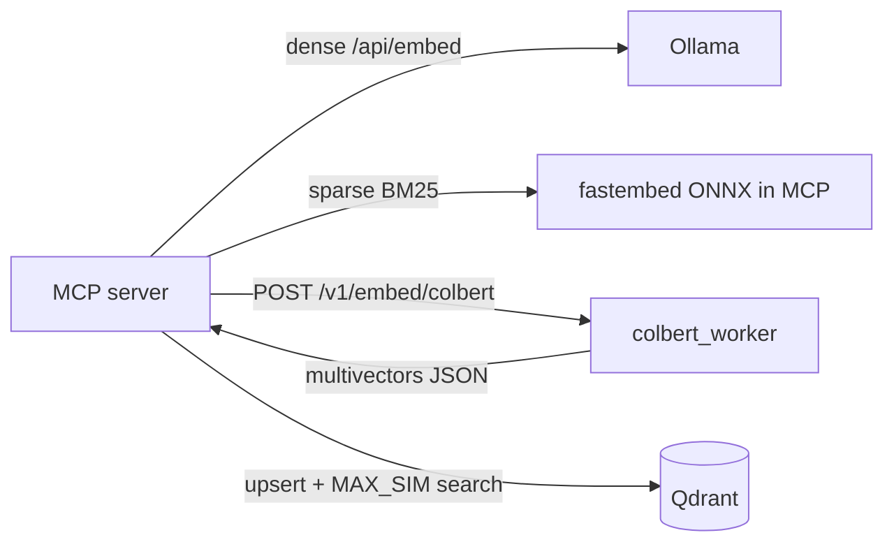

# 0015. ColBERT HTTP sidecar

- **Status:** Accepted
- **Date:** 2026-07-03
- **Deciders:** Maintainers
- **Related:** [0008](0008-optional-colbert-reranking.md), [0011](0011-ollama-only-dense-embedding.md), [0001](0001-pluggable-embed-backends.md), [0022](0022-gpu-default-cpu-fallback.md) — GPU remote sidecar default when rerank on (supersedes in-process ONNX as default)
- **Supersedes:** *(none — extends ADR 0008 deployment topology; Qdrant schema and rerank query path unchanged)*

## Context

[ADR 0008](0008-optional-colbert-reranking.md) phase 1 embeds ColBERT multivectors **in-process** in MCP via fastembed ONNX (`ColbertOnnxBackend`). Operational experience with `RERANK_ENABLED=true` showed:

- **MCP RAM pressure** — ColBERT is a third sequential embed pass; each flush batch holds dense + sparse + returned ColBERT multivectors in MCP until upsert completes. ColBERT **model weights and forward-pass activations** also live in the MCP cgroup. Small repos can hit memory halt (>85%) at default `FLUSH_EVERY` even with `MCP_MEM_LIMIT=8g`.
- **GPU split already exists for dense** — [ADR 0011](0011-ollama-only-dense-embedding.md) moved dense to Ollama GPU; ColBERT stayed CPU ONNX in MCP because Ollama `/api/embed` returns a single dense vector, not token-level multivectors ([ollama/ollama#6230](https://github.com/ollama/ollama/issues/6230)).
- **Deferred follow-up** — ADR 0008 noted “Ollama/remote dense backends still need local or worker ColBERT for rerank unless remote worker extended.”

### Why now

ColBERT rerank is merged (ADR 0008 phase 1) and enabled in production-like deployments. Re-index failures are **operational blockers**, not quality experiments. A sidecar mirrors the proven Ollama dense separation pattern without waiting on upstream Ollama multivector APIs or a breaking unified-model migration (e.g. BGE-M3).

We need a path that:

1. **Offloads ColBERT inference RAM** from MCP (model + compute peak in a separate cgroup)
2. **Preserves ADR 0008 semantics** — same multivector schema, MAX_SIM rerank, `colbert-ir/colbertv2.0` default
3. **Stays opt-in for rerank** — `RERANK_ENABLED=false` by default; when rerank is on, **`COLBERT_EMBED_BACKEND=remote`** + GPU sidecar is the default ([ADR 0022](0022-gpu-default-cpu-fallback.md) phase 2 supersedes in-process ONNX default)
4. **Does not wait on Ollama multivector API** — HTTP sidecar with fastembed ONNX today; GPU sidecar optional later

### Evaluation stack

| Layer | In scope? | Notes |
|-------|-----------|-------|
| Index-time multivector correctness | yes | Sidecar must produce compatible multivectors for same model (parity smoke; not bit-identical floats) |
| MCP memory during re-index | yes | Primary motivation — ColBERT model leaves MCP |
| Query-time rerank latency | partial | One extra HTTP hop for query ColBERT embed |
| End-user search quality | no | Same stored vectors → same MAX_SIM rerank behavior |

## Decision

We will add an **optional ColBERT HTTP sidecar** (`colbert_worker`) and a **`ColbertRemoteBackend`** in MCP, selected via `COLBERT_EMBED_BACKEND=remote`.

### Architecture



- **Sidecar** runs `ColbertOnnxBackend` (same fastembed `LateInteractionTextEmbedding` as MCP) in its own container with its own memory limit (`COLBERT_MEM_LIMIT`).
- **MCP** calls the sidecar over HTTP for index-time and query-time ColBERT embeds when `RERANK_ENABLED=true` and `COLBERT_EMBED_BACKEND=remote`.
- **Default when rerank on:** `COLBERT_EMBED_BACKEND=remote` + GPU sidecar via `compose_files.py` ([ADR 0022](0022-gpu-default-cpu-fallback.md)); in-process `ColbertOnnxBackend` only with explicit `COLBERT_EMBED_BACKEND=onnx` under `ACCELERATOR=cpu`
- **MCP still holds** dense + sparse + returned ColBERT multivectors per flush batch until upsert — the sidecar removes ColBERT **model and compute** RAM from MCP, not the upsert payload itself.

### Sidecar HTTP contract

| Endpoint | Method | Purpose |
|----------|--------|---------|
| `/health` | GET | Liveness; returns `model`, `token_dimension`, `loaded` |
| `/v1/embed/colbert` | POST | Embed one or more texts to ColBERT multivectors |

**Request** (`POST /v1/embed/colbert`):

```json
{ "texts": ["string", "..."] }
```

- `texts` required, non-empty array
- Truncation uses worker env `RERANK_MAX_QUERY_TOKENS` / model registry (same as in-process backend)

**Response**:

```json
{
  "embeddings": [[[0.1, ...], ...], ...],
  "token_dimension": 128
}
```

- One multivector per input text; outer list length equals `len(texts)`
- `token_dimension` must match `KNOWN_COLBERT_TOKEN_DIMENSIONS` for `COLBERT_EMBED_MODEL`
- Errors: HTTP 500 with JSON `detail` on embed failure; MCP maps to `EmbeddingError`

**Client behavior (`ColbertRemoteBackend`)** — mirror [OllamaDenseBackend](../../mcp_server/src/codebase_indexer/indexer/backends/ollama_dense.py):

- Preload: `GET /health` + probe embed of `"."`
- Batch requests with `COLBERT_EMBED_BATCH_SIZE`
- Retries with backoff on HTTP 503
- `COLBERT_TIMEOUT` per request

**Security (phase 1):** sidecar on internal Compose network only (no published ports); no bearer auth — same trust model as Qdrant in this stack.

### In scope

| Component | Outcome |
|-----------|---------|
| `colbert_worker` service | FastAPI app: `GET /health`, `POST /v1/embed/colbert`; reuses `ColbertOnnxBackend` |
| MCP backend | `ColbertRemoteBackend` — httpx client, batching, retries, preload probe |
| Factory | `create_colbert_backend()` selects `onnx` vs `remote` from settings |
| Compose | Optional `docker-compose.colbert-worker.yml` override; shared `fastembed_cache` volume |
| Config | `COLBERT_EMBED_BACKEND`, `COLBERT_URL`, `COLBERT_TIMEOUT`, `COLBERT_EMBED_BATCH_SIZE` |
| Embedder | `release_models` / `any_models_loaded` — no hard dependency on in-process ColBERT singleton when remote |
| Tests | Mocked HTTP unit tests; worker TestClient smoke with mocked backend |
| Docs | `.env.example` sidecar preset, [SEARCH_BEHAVIOR.md](../SEARCH_BEHAVIOR.md) |

### Out of scope

- Ollama native multivector / sparse embed API (track upstream; not a blocker)
- MCP slim image without ColBERT ONNX when remote-only (ADR 0015 phase 3)
- GPU ColBERT sidecar image (ADR 0015 phase 2)
- Adaptive rerank, per-tool overrides ([ADR 0008](0008-optional-colbert-reranking.md) phase 2+ — separate delivery)
- Changing Qdrant multivector schema or MAX_SIM rerank query path
- Unified BGE-M3 or other replacement of Ollama dense + BM25 sparse (would be a new ADR)

### Default behavior and configuration

- **Default:** when `RERANK_ENABLED=true`, `COLBERT_EMBED_BACKEND=remote` + sidecar merged by `compose_files.py` ([ADR 0022](0022-gpu-default-cpu-fallback.md)); in-process ONNX only under `ACCELERATOR=cpu` with explicit `COLBERT_EMBED_BACKEND=onnx`
- **Sidecar compose:** merged automatically when rerank on + remote backend; MCP `depends_on` sidecar health

| Variable | Default | Role |
|----------|---------|------|
| `COLBERT_EMBED_BACKEND` | `remote` when rerank on | `remote` (GPU sidecar default) or `onnx` (in MCP; `ACCELERATOR=cpu` only) |
| `COLBERT_URL` | `http://colbert_worker:8082` | Sidecar base URL when `remote` |
| `COLBERT_TIMEOUT` | `300` | Per-request HTTP timeout (seconds) |
| `COLBERT_EMBED_BATCH_SIZE` | `16` | MCP → sidecar batch size |
| `COLBERT_MEM_LIMIT` | `4g` | Compose memory cap for sidecar (not Python Settings) |
| `COLBERT_CPUS` | `4` | Compose CPU cap for sidecar (not Python Settings) |

Existing ADR 0008 vars apply to both backends: `COLBERT_EMBED_MODEL`, `RERANK_PREFETCH`, `RERANK_MAX_QUERY_TOKENS`, `RERANK_ENABLED`.

**Validation:** when `RERANK_ENABLED=true` and `COLBERT_EMBED_BACKEND=remote`, settings must reject empty `COLBERT_URL`. Preload must fail fast if sidecar is unreachable (same pattern as Ollama dense).

### Phased delivery

| Phase | Scope | ADR status |
|-------|--------|------------|
| **1** | HTTP sidecar + remote backend + compose override + tests + operator docs | **This decision** |
| **2** | Optional GPU worker image; benchmark index throughput vs CPU sidecar | Follow-up |
| **3** | Optional MCP slim stage when `remote`-only (drop ColBERT ONNX from MCP image) | Follow-up |

## Alternatives considered

| Option | Pros | Cons |
|--------|------|------|
| **ColBERT HTTP sidecar (chosen)** | Mirrors Ollama dense split; fixes MCP ColBERT RAM; ship today; no schema change | Extra service; HTTP latency; two containers to tune |
| **ColBERT in Ollama** | Single inference stack | No multivector API; BGE-M3 dense-only in Ollama; blocked upstream |
| **fastembed-gpu in MCP** | No new service | ColBERT RAM still in MCP cgroup; VRAM contention with Ollama on 8 GB GPU |
| **Status quo (in-process ONNX)** | Simplest topology | Re-index memory halt on ColBERT-enabled deployments |
| **Unified BGE-M3 (FlagEmbedding)** | One model, dense+sparse+ColBERT | Not via Ollama; breaks [0011](0011-ollama-only-dense-embedding.md)/[0006](0006-explicit-fastembed-pipeline.md); 1024-d schema; full re-index |

## Consequences

### Positive

- ColBERT model weights and forward-pass peak RAM move out of MCP cgroup
- Independent tuning: `MCP_MEM_LIMIT` vs `COLBERT_MEM_LIMIT`
- Same Qdrant vectors and rerank behavior when `COLBERT_EMBED_MODEL` matches
- Clear extension point for GPU worker without changing MCP search path
- Reuses existing `ColbertOnnxBackend` in sidecar — single embed implementation, two transport modes

### Negative / trade-offs

- Additional container to build, health-check, and monitor
- HTTP overhead on every ColBERT batch (index + query); mitigated by batching
- Two ColBERT transport paths to test (`onnx` + `remote`)
- Phase 1 sidecar is CPU ONNX — does not accelerate ColBERT vs in-process CPU
- MCP still holds dense + sparse + ColBERT **result** multivectors per flush until upsert; `FLUSH_EVERY` tuning may still be required on large collections

### Neutral / follow-ups

- Operator preset in `.env.example` for Ollama GPU + ColBERT sidecar + rerank
- With remote ColBERT, operators may **lower** `MCP_MEM_LIMIT` and sometimes **raise** `FLUSH_EVERY` after validation
- Sidecar and MCP must share the `fastembed_cache` volume to avoid duplicate model downloads
- [ADR 0008](0008-optional-colbert-reranking.md) phase 2+ (adaptive rerank, per-tool overrides) remains on the 0008 tracker — not part of this ADR

### Downstream work

- [SEARCH_BEHAVIOR.md](../SEARCH_BEHAVIOR.md) — document `COLBERT_EMBED_BACKEND=remote`
- [ARCHITECTURE.md](../ARCHITECTURE.md) — add sidecar to deployment diagram when implemented
- [ADR 0008](0008-optional-colbert-reranking.md) — cross-link in Related (optional; no change to 0008 decision text)

## Implementation notes

### New artifacts

- `mcp_server/src/codebase_indexer/colbert_worker/` — sidecar FastAPI app + worker settings
- `colbert_worker/Dockerfile` — worker image (build context: `mcp_server/`)
- `docker-compose.colbert-worker.yml` — optional compose override
- `mcp_server/src/codebase_indexer/indexer/backends/colbert_remote.py` — MCP HTTP client

### Modified artifacts

- `mcp_server/src/codebase_indexer/indexer/backends/factory.py` — backend selection
- `mcp_server/src/codebase_indexer/config.py` — ColBERT backend settings + validation
- `mcp_server/src/codebase_indexer/indexer/embedder.py` — release/idle logic for remote ColBERT
- `docker-compose.yml` — env passthrough for ColBERT backend vars
- `.env.example` — sidecar preset for ColBERT + rerank deployments

### Dependencies

- **Runtime:** sidecar reuses `fastembed` + `ColbertOnnxBackend`; MCP adds httpx calls only when `remote`
- **Compose:** shared `fastembed_cache` volume between `mcp_server` and `colbert_worker`

### Operator rollout (opt-in)

```bash
docker compose -f docker-compose.yml \
  -f docker-compose.ollama.yml \
  -f docker-compose.ollama.gpu.yml \
  -f docker-compose.colbert-worker.yml up -d --build
```

Example `.env` when enabling:

```env
RERANK_ENABLED=true
COLBERT_EMBED_BACKEND=remote
COLBERT_URL=http://colbert_worker:8082
MCP_MEM_LIMIT=4g
COLBERT_MEM_LIMIT=4g
SEQUENTIAL_EMBED=true
```

Re-index **one collection at a time** until sidecar stability is confirmed.

### Rollout

**Non-breaking.** Opt-in via `COLBERT_EMBED_BACKEND=remote` and compose override. Default unchanged.

### Re-index

**No** when switching `onnx` ↔ `remote` with the same `COLBERT_EMBED_MODEL` — stored multivectors are equivalent for rerank purposes. Re-index only when changing model or token dimension (same as ADR 0008).

## Validation

### Automated tests

- `test_colbert_remote_backend.py` — mocked httpx embed, preload, dimension check, 503 retry
- `test_factory.py` — `ColbertRemoteBackend` when `colbert_embed_backend=remote`
- `test_config.py` — backend literal validation; remote requires URL when rerank enabled
- `test_colbert_worker.py` — TestClient `/health` and `/v1/embed/colbert` with mocked backend
- Optional `@pytest.mark.slow`: same input texts through `onnx` vs `remote` — equal token counts per text and stable rerank ordering on synthetic MAX_SIM fixture

### Operational success criteria

1. With sidecar running, `index_codebase(..., force=True)` on `codebase-indexer-mcp` completes without MCP memory halt at settings that previously failed with in-process ColBERT
2. `COLBERT_EMBED_BACKEND=onnx` (default) behavior unchanged — no sidecar required
3. Sidecar unhealthy → MCP preload surfaces clear `EmbeddingError` (fail fast at startup when remote + rerank)

### Success criteria

- ColBERT inference RAM isolated from MCP when `remote`
- Hybrid + ColBERT rerank search path unchanged ([ADR 0008](0008-optional-colbert-reranking.md))
- Default deployment (`onnx`, `RERANK_ENABLED=false`) unchanged
