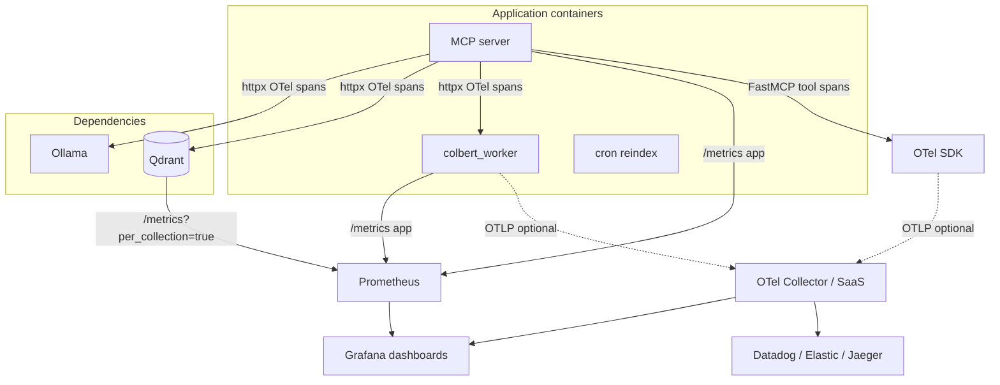

# 0018. Adopt OpenTelemetry instrumentation with Prometheus metrics and optional OTLP export

- **Status:** Accepted (phase 1 — Application Prometheus metrics (MCP + ColBERT worker))
- **Date:** 2026-07-03
- **Deciders:** Maintainers
- **Related:** [FastMCP OpenTelemetry](https://gofastmcp.com/servers/telemetry), [Qdrant observability](https://qdrant.tech/documentation/observability/), [0014](0014-vector-discovery-and-ops-automation.md) (Track B n8n ops hooks), [0015](0015-colbert-http-sidecar.md) (multi-container topology), [0017](0017-model-tokenizer-ollama-dense-truncation.md) (Phase 2 truncation observability), [0004](0004-collection-per-project-isolation.md) (collection-per-project ↔ Qdrant per-collection metrics), [0007](0007-ranx-retrieval-evaluation.md) (offline retrieval quality — out of scope here)
- **Supersedes:** *(none)*

## Context

The codebase-indexer is a **self-hosted, Docker Compose–first** retrieval platform: MCP server (FastMCP / Starlette), Qdrant, optional Ollama, optional ColBERT sidecar, optional Neo4j, and a cron reindex sidecar. Operators debug production-like issues that logs alone do not surface cleanly:

| Symptom | Today | Gap |
|---------|-------|-----|
| Index OOM / silent restart | structlog `possible_oom_restart`, cgroup diagnostics in `memory.py` | No time-series of memory pressure, flush duration, or index job outcomes |
| Slow search / rerank | Ad-hoc `LOG_LEVEL=DEBUG`; offline `bench.py` | No per-tool latency histograms or dependency breakdown (Ollama vs Qdrant vs ColBERT) |
| Qdrant / Ollama timeouts | Exception strings in logs | No error-rate counters by dependency; no trace linking MCP → upstream HTTP |
| Cron reindex failures | cron container stdout | No shared correlation id across cron → MCP tool calls |
| Truncation quality drift | Planned in [ADR 0017](0017-model-tokenizer-ollama-dense-truncation.md) Phase 2 | No standard metric namespace yet |

### Current observability surface

| Signal | Implementation | Limitation |
|--------|----------------|------------|
| **Logs** | `structlog` → stderr (`main.py`, pipeline, storage, embedder backends) | No centralized aggregation; no trace correlation |
| **Health** | MCP `/health`, ColBERT `/health`, Qdrant `/healthz` | Liveness only — no readiness of embed backends or index job state |
| **Quality metrics** | Offline ranx harness ([ADR 0007](0007-ranx-retrieval-evaluation.md)) | Retrieval relevance, not runtime SLOs |
| **Benchmarks** | `bench.py`, `eval_retrieval.py` | Manual, not continuous |

There is **no** application `/metrics` endpoint, distributed tracing export, or structured log correlation. [ADR 0014](0014-vector-discovery-and-ops-automation.md) Track B deferred optional n8n workflows that could forward alerts to Datadog/Slack — that addresses **automation**, not **instrumentation**.

### Upstream capabilities we should reuse (not reinvent)

| Layer | Built-in today | Implication |
|-------|----------------|-------------|
| **FastMCP ≥ 3.4** ([telemetry docs](https://gofastmcp.com/servers/telemetry)) | Native OTel spans for every MCP tool/resource/prompt via `opentelemetry-api` (no-op without SDK); MCP semantic conventions (`tools/call {name}`, `mcp.method.name`, `gen_ai.tool.name`); W3C trace context in JSON-RPC `_meta` ([SEP-414](https://modelcontextprotocol.org/seps/414-request-meta)); `fastmcp.telemetry.get_tracer()` for child spans | **Do not** wrap MCP tools with custom trace spans — add **Prometheus counters/histograms** only where FastMCP emits traces but not metrics |
| **Qdrant v1.18.2** (pinned in compose) ([observability docs](https://qdrant.tech/documentation/observability/)) | `GET /metrics` (Prometheus/OpenMetrics); `GET /metrics?per_collection=true` for per-collection REST/gRPC latency and error breakdown; `GET /telemetry` / `GET /cluster/telemetry` for JSON cluster state; official Grafana dashboard | **Scrape and document** — no Qdrant code changes; `per_collection=true` aligns with [ADR 0004](0004-collection-per-project-isolation.md) |
| **MCP Python SDK** | Client/server OTel hooks on JSON-RPC (`mcp` dep via FastMCP) | Cron → MCP calls can propagate `traceparent` in `_meta` when SDK configured |

### Hard constraints

1. **Default deployment unchanged** — loopback-bound Compose; no mandatory third-party SaaS
2. **Low overhead** — MCP is latency-sensitive on search; indexing is memory-sensitive; instrumentation must be opt-in or near-zero cost when disabled
3. **Vendor neutrality** — teams may run Prometheus locally, Grafana Cloud, Datadog, or Jaeger; avoid baking in one vendor SDK as the only path
4. **Multi-process** — signals must work across MCP, `colbert_worker`, and optionally cron; Qdrant and Ollama expose their own metrics separately
5. **Security** — `/metrics` and OTLP endpoints must respect the same loopback / bearer-auth posture as MCP HTTP ([`MCP_AUTH_TOKEN`](../../mcp_server/src/codebase_indexer/config.py))

### Requirements and goals

After this decision, operators should be able to:

- Plot **search p95**, **index duration**, **embed error rate**, and **memory pressure events** over time
- Trace a slow `search_codebase` call through **query embed → Qdrant hybrid search → optional ColBERT rerank**
- Scrape **Qdrant** and **MCP** metrics with one Prometheus config
- Optionally forward traces/metrics/logs to **Grafana Cloud, Datadog, or ELK** via OTLP without code changes
- Keep **offline retrieval evaluation** ([ADR 0007](0007-ranx-retrieval-evaluation.md)) separate from runtime telemetry

### Why now

Multi-container topology ([ADR 0015](0015-colbert-http-sidecar.md)) and memory-tuned indexing make cross-service latency and OOM debugging the dominant operational cost. Feature-level metrics (e.g. ADR 0017 truncation rate) need a shared instrumentation layer rather than ad-hoc log lines. Deferring a standard now risks incompatible one-off counters per ADR.

## Decision

We will adopt a **two-signal model**:

1. **Traces** — rely on **FastMCP’s native OpenTelemetry instrumentation** (already active; no-op until an SDK/exporter is configured) plus **custom child spans** via `fastmcp.telemetry.get_tracer()` for index/search/embed internals, and **httpx auto-instrumentation** for Ollama, Qdrant, and ColBERT HTTP.
2. **Metrics** — add **application Prometheus metrics** (`prometheus_client`) on MCP and ColBERT worker, and **scrape Qdrant’s built-in `/metrics`** (with `?per_collection=true`) — FastMCP does not expose Prometheus metrics today.

**OTLP export** to any compatible collector (Grafana Alloy, Datadog Agent, Jaeger, Tempo, etc.) is the standard trace/metric export path when not using direct Prometheus scrape.

**Logging** stays on **structlog** in Phase 1–2, enriched with **trace_id** / **span_id** from the active OTel span; optional OTLP log export is Phase 3.

### Architecture

### In scope

#### Phase 1 — Application Prometheus metrics (MCP + ColBERT worker)

- New module `codebase_indexer/telemetry/metrics.py` — idempotent init guarded by `METRICS_ENABLED` (default `false`)
- **`prometheus_client`** metrics exposed at `GET /metrics` on MCP (and ColBERT worker). When `MCP_AUTH_TOKEN` is set, `/metrics` follows the same bearer-auth rule as other routes (except `/health`) — loopback binding remains the primary guard
- **Why separate from FastMCP traces:** [FastMCP telemetry](https://gofastmcp.com/servers/telemetry) covers **distributed tracing only** (OTel API + spans). Tool latency SLOs and alert rules still need **Prometheus histograms/counters** unless/until we export OTel metrics to Prometheus via a collector
- **Application metrics** (minimal set — **not** duplicating FastMCP span names):

  | Metric | Type | Labels | Source |
  |--------|------|--------|--------|
  | `codeindexer_mcp_tool_requests_total` | Counter | `tool`, `status` | Thin decorator on tool handlers (metrics only; traces from FastMCP) |
  | `codeindexer_mcp_tool_duration_seconds` | Histogram | `tool` | Same decorator |
  | `codeindexer_search_results` | Histogram | `rerank` | `run_search` — **no** `collection` label (cardinality); use Qdrant `per_collection` metrics for per-project SLOs |
  | `codeindexer_index_jobs_total` | Counter | `status` | `IndexJobTracker` / pipeline — collection name in logs, not metric labels |
  | `codeindexer_index_duration_seconds` | Histogram | — | pipeline completion |
  | `codeindexer_index_chunks_total` | Counter | — | pipeline |
  | `codeindexer_embed_requests_total` | Counter | `backend`, `status` | Ollama / sparse / ColBERT backends |
  | `codeindexer_memory_pressure_events_total` | Counter | `severity` | `memory.py` warn/halt |
  | `codeindexer_truncated_chunks_total` | Counter | `backend` | truncation path ([ADR 0017](0017-model-tokenizer-ollama-dense-truncation.md) Phase 2) |

- **Process metrics** — Python `prometheus_client` GC/platform collectors where enabled
- **Qdrant (no code change)** — document in `DEPLOYMENT.md`:
  - Scrape `http://qdrant:6333/metrics?per_collection=true` ([Qdrant observability](https://qdrant.tech/documentation/observability/)) — v1.18 adds `collection` label on `rest_responses_*` / `grpc_responses_*`; matches one collection per project folder ([ADR 0004](0004-collection-per-project-isolation.md))
  - Optional JSON probes: `GET /telemetry`, `GET /cluster/telemetry` for shard/optimizer state (cron/n8n health checks, not Prometheus)
  - Import [Qdrant’s official Grafana dashboard](https://qdrant.tech/documentation/observability/) in Phase 3 compose
- **Config** — `METRICS_ENABLED`, optional `METRICS_PORT` if split from MCP HTTP

#### Phase 2 — OpenTelemetry traces (FastMCP-native + custom spans)

FastMCP **already instruments** all MCP tool calls when an OTel SDK is present. Phase 2 **configures export** and adds **domain spans** — it does **not** re-wrap tools for tracing.

**Enable traces (pick one):**

| Path | When | Notes |
|------|------|-------|
| **`opentelemetry-instrument`** ([FastMCP docs](https://gofastmcp.com/servers/telemetry)) | Recommended for Compose / ops | `opentelemetry-distro` + `opentelemetry-exporter-otlp`; auto-configures SDK + httpx instrumentation; zero MCP code changes for tool spans |
| **Programmatic SDK** | Docker entrypoint control | Configure `TracerProvider` + OTLP exporter in `telemetry/traces.py` **before** `from fastmcp import FastMCP` in `main.py` |
| **Env-only OTLP** | SaaS backends | Standard `OTEL_SERVICE_NAME`, `OTEL_EXPORTER_OTLP_ENDPOINT`, `OTEL_TRACES_SAMPLER*` |

- Dependencies (optional extra `telemetry` in `pyproject.toml`): `opentelemetry-sdk`, `opentelemetry-exporter-otlp-proto-http` (or gRPC), `opentelemetry-instrumentation-httpx`, `opentelemetry-distro` for auto-instrument CLI
- **FastMCP spans (automatic):** `tools/call search_codebase`, `tools/call index_codebase`, etc., with `mcp.method.name`, `gen_ai.tool.name`, `fastmcp.component.*` attributes — use these in Jaeger/Tempo, not custom span names
- **Custom child spans** via `fastmcp.telemetry.get_tracer()` ([custom spans guidance](https://gofastmcp.com/servers/telemetry#custom-spans)):
  - `search.embed`, `search.qdrant`, `search.rerank` inside `run_search` / `search_common.py`
  - `index.scan`, `index.embed`, `index.upsert`, `index.graph_write` in `pipeline.py`
  - Naming: `{domain}.{operation}`; attributes: counts/sizes only — **no** chunk content, queries, or tokens in spans
- **httpx auto-instrumentation** — child spans for Ollama `/api/embed`, Qdrant client, ColBERT sidecar under the active tool span
- **Propagation:**
  - **HTTP transport:** W3C `traceparent` on streamable HTTP (Starlette/FastMCP)
  - **MCP JSON-RPC:** `traceparent` / `tracestate` in request `_meta` ([SEP-414](https://modelcontextprotocol.org/seps/414-request-meta)) — cron reindex should inject via `fastmcp.telemetry.inject_trace_context` or MCP SDK equivalent when calling `index_codebase`
  - **ColBERT sidecar:** continue trace on inbound HTTP (FastAPI OTel middleware or extract from headers)
- Export: OTLP via `OTEL_EXPORTER_OTLP_ENDPOINT`; default **no export** when unset (FastMCP instrumentation remains no-op, same as today)

#### Phase 3 — Optional observability stack + log correlation

- **`docker-compose.observability.yml`** (opt-in): Prometheus, Grafana, optional Grafana Loki + Promtail for container logs
- Example Grafana dashboards: MCP overview, index job panel, search latency, memory pressure, Qdrant scrape
- **structlog** processor to inject `trace_id` / `span_id` from active OTel span
- Document OTLP configs for **Grafana Cloud**, **Datadog Agent** (`OTEL_EXPORTER_OTLP_*`), and **Elastic APM** — no vendor-specific SDKs in application code
- Complements [ADR 0014](0014-vector-discovery-and-ops-automation.md) Track B n8n (alerting/webhooks) — n8n can consume Prometheus alertmanager webhooks or Grafana alerts; not a substitute for Phase 1–2

### Out of scope

- **Sentry** (or similar error SaaS) as a default dependency — uncaught exceptions remain in logs; teams may forward logs to Sentry via external agents
- **Full ELK stack** as the blessed default — too heavy for local quickstart; supported indirectly via OTLP → Elastic APM or log shippers
- **In-server retrieval quality metrics** — recall@k, Ragas, etc. stay in offline harnesses ([ADR 0007](0007-ranx-retrieval-evaluation.md), [ADR 0010](0010-defer-ragas-to-client.md))
- **Client-side MCP consumer telemetry** (Cursor, Copilot) — outside this repository
- **Replacing `/health`** with deep readiness checks — separate follow-up; Phase 1 may add optional `/ready` later
- **Mandatory observability compose profile** in default `docker compose up`

### Default behavior and configuration

| Variable | Phase | Default | Purpose |
|----------|-------|---------|---------|
| `METRICS_ENABLED` | 1 | `false` | Expose application `/metrics` on MCP + ColBERT worker |
| `OTEL_SERVICE_NAME` | 2 | `codeindexer-mcp` / `codeindexer-colbert` | Resource attribute (standard OTel env) |
| `OTEL_EXPORTER_OTLP_ENDPOINT` | 2 | *(empty)* | OTLP endpoint; empty = traces stay no-op (FastMCP API only) |
| `OTEL_TRACES_EXPORTER` | 2 | `otlp` when endpoint set | Standard OTel env |
| `OTEL_TRACES_SAMPLER` | 2 | `parentbased_traceidratio` | Head sampling |
| `OTEL_TRACES_SAMPLER_ARG` | 2 | `0.1` | 10% sample when ratio sampler |
| `OTEL_EXPORTER_OTLP_HEADERS` | 2–3 | *(empty)* | API keys for SaaS collectors |
| `OTEL_RESOURCE_ATTRIBUTES` | 1–2 | *(empty)* | e.g. `deployment.environment=prod` |

- **Default unchanged:** with `METRICS_ENABLED=false` and no OTel SDK/exporter, behavior matches today — FastMCP trace hooks are no-ops; no `/metrics` route; no new mandatory deps
- **Breaking:** none anticipated; new routes `/metrics` (and optional `/ready` later) only when enabled

## Alternatives considered

| Option | Pros | Cons |
|--------|------|------|
| **FastMCP traces + app Prometheus + Qdrant scrape + OTLP optional (chosen)** | Reuses FastMCP + Qdrant built-ins; vendor-neutral; collection-level Qdrant SLOs via `per_collection=true` | App metrics layer still custom; Phase 2 adds optional OTel deps |
| **Custom MCP tool trace wrappers** | Full control | Duplicates FastMCP `tools/call` spans; diverges from MCP semantic conventions |
| **Prometheus only (ignore FastMCP traces)** | Simpler Phase 1 | Wastes free tool-level tracing; no cron→MCP `_meta` propagation story |
| **Datadog / New Relic agent as default** | Turnkey SaaS dashboards | Violates local-first default; cost; agent coupling |
| **Sentry** | Good error grouping | Wrong fit for batch indexing + MCP tool latency; not metrics/traces first |
| **ELK (Elasticsearch + Logstash + Kibana) default** | Powerful log search | Heavy RAM; operational burden for solo self-hosters; overlaps Loki+Grafana at lower cost |
| **structlog → JSON file → external stack only** | Zero new endpoints | No metrics; no standard trace propagation; every operator rolls own parsing |
| **ADR 0014 n8n-only ops** | Visual alerting | Does not instrument MCP; reactive not observable |
| **Status quo (logs + `/health`)** | Zero effort | OOM and latency regressions stay hard to diagnose in multi-container setups |

### Vendor notes (via OTLP, not native SDKs)

| Backend | Integration path | When to use |
|---------|------------------|-------------|
| **Prometheus + Grafana** | Scrape `/metrics`; optional compose override | Default self-hosted |
| **Grafana Cloud** | OTLP + Prometheus remote write | Managed dashboards without running Prometheus |
| **Datadog** | Datadog Agent OTLP ingest | Teams already on Datadog |
| **Elastic (ELK)** | Elastic APM OTLP or Filebeat on container logs | Existing Elastic deployments |
| **Jaeger / Tempo** | OTLP traces | Trace-debugging focused |

## Consequences

### Positive

- **Zero duplicate tool tracing** — FastMCP already emits MCP-convention spans; we add domain spans and Prometheus only where gaps exist
- Unified **application metric names** for index jobs, embed backends, and memory pressure — complements Qdrant’s **`/metrics?per_collection=true`**
- **End-to-end traces:** `tools/call search_codebase` → `search.embed` → httpx Ollama/Qdrant/ColBERT child spans
- **Vendor-neutral** — `opentelemetry-instrument` or OTLP env vars; same paths for Jaeger, Tempo, Datadog, Grafana Cloud
- Per-project **Qdrant latency/error SLOs** without high-cardinality labels on MCP metrics ([ADR 0004](0004-collection-per-project-isolation.md))
- Fulfills [ADR 0017](0017-model-tokenizer-ollama-dense-truncation.md) Phase 2 truncation counter in a consistent namespace
- Enables Grafana alerts / Alertmanager / n8n webhooks on SLO burn (index failure rate, search p95)

### Negative / trade-offs

- Additional Python dependencies when enabled (`prometheus_client`, OTel SDK + instrumentations)
- Histogram cardinality must stay bounded — **no** unbounded `collection` or `rel_path` labels on high-cardinality paths (use logs for per-file detail)
- Sampling required for traces at high MCP tool QPS to control export cost
- `/metrics` exposure must be documented for auth and loopback binding — misconfiguration could leak operational data
- Optional compose stack increases maintenance (Grafana dashboard JSON, Prometheus scrape config)

### Neutral / follow-ups

- Deep **readiness** endpoint (`/ready`: Qdrant ping + Ollama embed probe) — separate small ADR or Phase 4
- **Alert rules** as code in `docs/examples/prometheus/` — not product-critical
- **OpenMetrics** compatibility via `prometheus_client` default exposition format
- Link from [ARCHITECTURE.md](../ARCHITECTURE.md) observability section when Phase 1 ships

### Downstream work

- [0017](0017-model-tokenizer-ollama-dense-truncation.md) Phase 2 — implement `codeindexer_truncated_chunks_total` under this namespace
- [0014](0014-vector-discovery-and-ops-automation.md) Track B — n8n alert examples can reference Prometheus/Grafana instead of only `/health` polling

## Implementation notes

### Affected paths

| Phase | Paths |
|-------|-------|
| 1 | `telemetry/metrics.py`, `main.py` (`/metrics` route), `tools/` (metrics-only decorator), `indexer/pipeline.py`, `memory.py`, `indexer/truncation.py`, `colbert_worker/app.py`, `config.py`, `pyproject.toml` |
| 2 | `telemetry/traces.py` (SDK init before FastMCP import), `docker-entrypoint.sh` or compose `command:` for `opentelemetry-instrument` option, `tools/search_common.py`, `indexer/pipeline.py` (`get_tracer()` spans), `cron/reindex.py` (`_meta` trace inject), `colbert_worker/app.py` |
| 3 | `docker-compose.observability.yml` (Prometheus scrape config incl. Qdrant `per_collection=true`), Qdrant Grafana dashboard import, `docs/DEPLOYMENT.md` |

### Dependencies

- *Runtime metrics (Phase 1):* `prometheus_client>=0.21`
- *Runtime traces (Phase 2, optional extra):* `opentelemetry-sdk`, `opentelemetry-exporter-otlp-proto-http` (or `-grpc`), `opentelemetry-instrumentation-httpx`, `opentelemetry-distro` — `opentelemetry-api` already transitive via FastMCP/`mcp`
- *Optional dev:* Grafana dashboard JSON validation; smoke test that `/metrics` returns `codeindexer_*` series

### Rollout

- Phase 1: opt-in via `METRICS_ENABLED=true`
- Phase 2: opt-in via OTel SDK / `opentelemetry-instrument` / `OTEL_EXPORTER_OTLP_ENDPOINT`
- Phase 3: opt-in compose file only

### Data migration

**No** re-index or vector changes.

## Validation

### Automated tests

- *Unit* — `METRICS_ENABLED=false` → `/metrics` returns 404 or disabled; mock tool call increments counter when enabled
- *Unit* — FastMCP tool call with in-memory `TracerProvider` produces `tools/call {name}` span (per [FastMCP testing docs](https://gofastmcp.com/servers/telemetry#testing-with-telemetry))
- *Unit* — histogram observes synthetic tool duration; labels match allowed set
- *Integration* — Compose with `OTEL_ENABLED=true`: scrape `/metrics` contains `codeindexer_mcp_tool_requests_total`; optional Prometheus container in CI is non-blocking (mirror GPU sidecar CI pattern)

### Success criteria

1. With telemetry enabled, a single `search_codebase` call produces **counter + histogram** samples on `/metrics`
2. Index job completion records **duration** and **chunk count** per collection
3. OTLP trace for `tools/call search_codebase` includes child spans **`search.embed`**, **`search.qdrant`**, and httpx spans for Ollama/Qdrant when exporter configured (Jaeger / `otelcol` / `otel-desktop-viewer`)
4. Default deployment (`METRICS_ENABLED=false`, no OTel exporter) shows **no regression** in test suite runtime or `/health` behavior
5. `DEPLOYMENT.md` documents Prometheus scrape for **MCP `/metrics`**, **ColBERT `/metrics`**, and **Qdrant `/metrics?per_collection=true`** in one example; links [Qdrant observability](https://qdrant.tech/documentation/observability/) and [FastMCP telemetry](https://gofastmcp.com/servers/telemetry)

### CI adoption

- Default CI: unit tests with telemetry mocked/disabled
- Non-blocking job: compose observability smoke (scrape after one tool call) — same tier as ColBERT GPU Dockerfile CI

## Measured outcomes

*(Optional — fill after Phase 1 baseline on representative hardware.)*

### Operational targets (design goals, not CI gates)

| Signal | Target | Rationale |
|--------|--------|-----------|
| Search p95 (hybrid, no rerank) | observable, baseline TBD | Primary user-facing SLO |
| Index job failure rate | \< 1% excluding user cancel | Cron + manual index reliability |
| Memory halt events | trending down after tuning | Validates cgroup guard effectiveness |
| Ollama embed error rate | alert on spike | Upstream dependency health |
