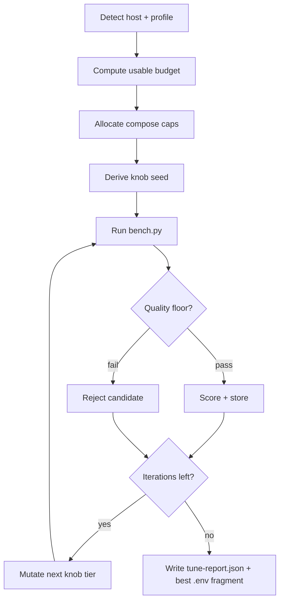

# 0024. Add resource-aware stack tuner for RSS allocation and performance tuning

- **Status:** Accepted
- **Date:** 2026-07-04
- **Deciders:** Maintainers
- **Related:** [Qdrant Improve Search](https://qdrant.tech/documentation/improve-search/), [ADR 0007](0007-ranx-retrieval-evaluation.md), [ADR 0015](0015-colbert-http-sidecar.md), [ADR 0018](0018-telemetry-observability-otel-prometheus.md), [ADR 0022](0022-gpu-default-cpu-fallback.md)
- **Supersedes:** *(none — complements manual `.env.example` presets)*

## Context

Operators must hand-tune **two coupled layers** to get fast indexing and search without OOM kills:

1. **Compose cgroup caps** — `MCP_MEM_LIMIT`, `QDRANT_MEM_LIMIT`, `TEI_MEM_LIMIT`, `COLBERT_MEM_LIMIT`, `NEO4J_MEM_LIMIT`, and matching `*_CPUS` vars (not Python `Settings`; see [DEPLOYMENT.md](../DEPLOYMENT.md)).
2. **Pipeline and storage knobs** — `BATCH_SIZE`, `FLUSH_EVERY`, `UPSERT_BATCH`, `OMP_NUM_THREADS`, `VECTORS_ON_DISK`, `QUANTIZATION`, `HNSW_EF`, `PREFETCH_MULTIPLIER`, ColBERT upsert limits, etc. (`config.py`).

Today this is documented as **static presets** in `.env.example` (8 GB / 16 GB / 32 GB tiers) plus prose rules in `README.md` and `DEPLOYMENT.md` (“more RAM → raise `FLUSH_EVERY`…”). The stack topology varies by profile:

| Profile signal | Extra services | RAM impact |
|----------------|----------------|------------|
| Default | MCP + Qdrant | Baseline |
| `COMPOSE_PROFILES=bundled-tei` | TEI sidecar | +CPU RAM; dense weights on **GPU VRAM** when `ACCELERATOR=gpu` ([ADR 0022](0022-gpu-default-cpu-fallback.md)) |
| `RERANK_ENABLED=true` + remote ColBERT | ColBERT worker | +sidecar cgroup; MCP still holds multivectors per flush ([ADR 0015](0015-colbert-http-sidecar.md)) |
| `GRAPH_ENABLED=true` | Neo4j | +heap + page cache |

### Measurable gap

- **No automated allocator** — operators guess `MCP_MEM_LIMIT + QDRANT_MEM_LIMIT` splits; over-allocation causes silent Docker OOM restarts (documented 2–3 GiB kernel reserve).
- **No closed-loop tuning** — `benchmarks/bench.py` measures throughput and search p50/p95, and `benchmarks/eval_retrieval.py` measures ranking quality ([ADR 0007](0007-ranx-retrieval-evaluation.md)), but nothing ties host budget → compose caps → knob search → best config artifact.
- **Interdependent knobs** — e.g. ColBERT rerank forces `UPSERT_BATCH=10` and low `FLUSH_EVERY` regardless of total RAM; GPU offload lowers MCP dense RAM but not Qdrant vector RAM.
- **Cgroup guard coupling** — `memory.py` halts indexing at `MEMORY_PRESSURE_HALT_PCT` (default 85%); a “fast” config that trips halt is invalid even if bench partially completes.

### Requirements and goals

Given a **declared host budget** (max RAM and CPUs the operator allows the stack to use):

1. **Allocate** cgroup memory and CPU limits across active containers proportionally to their roles.
2. **Derive** initial pipeline knobs from those caps (threads, batch sizes, on-disk vs in-RAM storage).
3. **Search** the knob space in a loop, scoring each candidate with existing benchmarks.
4. **Emit** a reproducible tuned `.env` fragment and JSON report — never silently overwrite the operator’s `.env`.

### Why now

- Multi-container GPU-default topology ([ADR 0022](0022-gpu-default-cpu-fallback.md)) increased the allocation search space (MCP vs TEI vs ColBERT vs Qdrant).
- Verified ColBERT presets (`UPSERT_BATCH=10`, `FLUSH_EVERY=96`, `MCP_MEM_LIMIT=3g`) prove that **hand tuning per topology** is fragile; a script should encode those constraints.
- `bench.py` and `eval_retrieval.py` already provide comparable JSON outputs — the missing piece is orchestration, not new metrics libraries.

### Evaluation stack

| Layer | In scope? | Notes |
|-------|-----------|-------|
| Index throughput (chunks/sec, peak RSS) | yes | Primary objective via `bench.py` |
| Search / filtered-lookup latency p50/p95 | yes | Primary objective via `bench.py` |
| Retrieval relevance (recall@10, MRR) | partial | **Quality floor** only — optional `eval_retrieval` gate; not the primary optimizer target |
| ANN recall / HNSW exact kNN | no | Operational step per [ADR 0007](0007-ranx-retrieval-evaluation.md) |
| GPU VRAM allocation | no | Document manual `TEI_GPU_COUNT` / `COLBERT_DEVICE_IDS`; cgroup RAM ≠ VRAM |
| Business / Ragas outcomes | no | [ADR 0010](0010-defer-ragas-to-client.md) |

## Decision

We will add a **maintainer-facing tuner script** (`scripts/tune_stack.py`) that:

1. Detects host resources and active compose profile.
2. Applies a **RAM/CPU budget** (defaults below) and computes per-container `*_MEM_LIMIT` / `*_CPUS`.
3. Seeds pipeline knobs from allocation + topology rules.
4. Runs an **iterative search loop** (heuristic seed → coordinate refinement) scoring candidates with `bench.py`, with optional retrieval quality floor from `eval_retrieval.py`.
5. Writes `tune-report.json` and an optional `.env.tuned` fragment.

The script is **opt-in**, **offline**, and **non-destructive** (no automatic `docker compose` without explicit flags).

### In scope

- Host detection: total RAM, logical CPU count (Linux `/proc`, Windows `psutil` or WMI fallback).
- Budget CLI: `--max-ram-gib`, `--max-cpus`, `--reserve-gib`.
- **Feature flags:** `--gpu` / `--cpu`, `--colbert` / `--no-colbert`, `--neo4j` / `--no-neo4j` (see **Feature flags**); CLI overrides env for the tune session.
- Profile-aware service set: base MCP+Qdrant; optional TEI, ColBERT sidecar, Neo4j from **resolved feature flags** + `compose_files.py`.
- Per-service RSS and CPU allocation with documented ratio tables and topology overrides.
- Knob search over bounded `Settings` fields and compose-only vars listed in **Tuning dimensions** below.
- Integration with `mcp_server/benchmarks/bench.py` (required) and `eval_retrieval.py` (optional quality floor).
- Hard reject: indexing run reports `memory_pressure_halt` or OOM restart (parse bench logs / MCP metrics when [ADR 0018](0018-telemetry-observability-otel-prometheus.md) enabled).
- Subcommands: `analyze`, `allocate`, `tune`, `report` (see **CLI surface**).

### Out of scope

- Kubernetes / swarm / multi-host scheduling.
- Automatic GPU VRAM sizing or multi-GPU placement (remain manual; script may **warn** when single-GPU VRAM is likely insufficient).
- Replacing `bench.py` or `eval_retrieval.py` implementations.
- Writing directly to operator `.env` without `--write` (default stdout / `.env.tuned`).
- Production auto-tuning in the MCP server runtime or cron loop.
- n8n / webhook automation ([ADR 0014](0014-vector-discovery-and-ops-automation.md) Track B).
- Programmatic ANN recall tuning.

### Default behavior and configuration

| Input | Default | Notes |
|-------|---------|-------|
| `--max-cpus` | Host logical CPU count | “Use all CPUs” |
| `--max-ram-gib` | `floor(host_total_ram_gib / 2)` | “Half machine RAM” |
| `--reserve-gib` | `2.5` | Kernel + Docker + WSL2 headroom ([README.md](../../README.md)) |
| `--objective` | `balanced` | Weighted composite of index + search metrics |
| `--quality-floor` | `off` | When `on`, require recall@10 ≥ 95% of committed baseline |
| `--iterations` | `12` | Coordinate-refinement steps after seed |
| `--gpu` | on when NVIDIA runtime detected; else inherit `ACCELERATOR` from env | Sets `ACCELERATOR=gpu`, merges GPU compose files ([ADR 0022](0022-gpu-default-cpu-fallback.md)) |
| `--cpu` | off | Explicit CPU-only; mutually exclusive with `--gpu` |
| `--colbert` | off | Enables ColBERT remote sidecar + rerank tuning path |
| `--neo4j` | off | Enables Neo4j GraphRAG sidecar + graph allocation slice |
| `ACCELERATOR` | Resolved by `--gpu` / `--cpu`, else env; default `gpu` | Affects TEI/ColBERT RAM weights and compose file list |

**Usable budget:**

```
usable_ram_gib = max_ram_gib - reserve_gib
usable_cpus    = max_cpus
```

Caps are clamped so the sum of active container `*_MEM_LIMIT` ≤ `usable_ram_gib` and per-service minimums are respected (see **Allocation model**).

### Feature flags

Global flags on **all subcommands** (`analyze`, `allocate`, `tune`, `report`). They define the **target topology** for allocation and tuning — not just detection of an already-running stack.

**Precedence:** explicit CLI flag → existing `.env` / process env → script default.

| Flag | Sets / merges | Allocator effect |
|------|---------------|------------------|
| `--gpu` | `ACCELERATOR=gpu`; `compose_files.py` merges `docker-compose.tei.gpu.yml` and `docker-compose.colbert-worker.gpu.yml` when ColBERT active | GPU TEI RAM row (lower MCP dense RAM); fail fast if NVIDIA runtime missing ([ADR 0022](0022-gpu-default-cpu-fallback.md)) |
| `--cpu` | `ACCELERATOR=cpu`; no GPU compose overrides | CPU dense row; in-process ColBERT only if `--colbert` without remote (discouraged — warn and keep remote sidecar CPU image) |
| `--colbert` | `RERANK_ENABLED=true`, `COLBERT_EMBED_BACKEND=remote`; merges `docker-compose.colbert-worker.yml` (+ `.gpu.yml` when `--gpu`) | +ColBERT RSS/CPU slice; tight `UPSERT_BATCH` / `FLUSH_EVERY` bounds; `bench.py --rerank` |
| `--no-colbert` | `RERANK_ENABLED=false` | ColBERT service omitted even if `.env` has rerank on |
| `--neo4j` | `GRAPH_ENABLED=true`; merges `docker-compose.neo4j.yml` | +Neo4j RSS/CPU slice; requires `NEO4J_PASSWORD` in env or `--neo4j-password` |
| `--no-neo4j` | `GRAPH_ENABLED=false` | Neo4j omitted even if `.env` has graph on |

**Bundled TEI** is always assumed for `tune` / `allocate` (bench needs dense embed) — `COMPOSE_PROFILES=bundled-tei` is injected unless `TEI_URL` points at an external host (detected when URL host ≠ `tei` service name). No `--tei` flag in v1; external TEI is opt-out via env only.

**Examples:**

```bash
# Half RAM, all CPUs, production-like GPU + ColBERT rerank
python scripts/tune_stack.py allocate --gpu --colbert

# GraphRAG host: add Neo4j slice on top of GPU stack
python scripts/tune_stack.py tune --gpu --colbert --neo4j --iterations 8

# CI / air-gapped: CPU-only, no optional sidecars
python scripts/tune_stack.py analyze --cpu --no-colbert --no-neo4j

# Override .env: tune without Neo4j even when GRAPH_ENABLED=true
python scripts/tune_stack.py allocate --no-neo4j
```

Mutually exclusive pairs: `--gpu` + `--cpu`, `--colbert` + `--no-colbert`, `--neo4j` + `--no-neo4j`.

Emitted `.env.tuned` fragment includes both **compose caps** and **feature vars** so `docker compose $(python scripts/compose_files.py) up -d` reproduces the tuned topology without re-passing flags.

### Allocation model

**Phase A — resolve active services** (feature flags + env + `scripts/compose_files.py`):

| Service | Active when |
|---------|-------------|
| `mcp_server` | always |
| `qdrant` | always |
| `tei` | bundled profile (default on) or external `TEI_URL` excluded from compose caps |
| `colbert_worker` | `--colbert` (or `RERANK_ENABLED=true` when flag unset) and remote backend |
| `neo4j` | `--neo4j` (or `GRAPH_ENABLED=true` when flag unset) |

**Phase B — RAM share** (percent of `usable_ram_gib`, before rounding to `g`/`m`):

| Topology | MCP | Qdrant | TEI | ColBERT | Neo4j |
|----------|-----|--------|-----|---------|-------|
| CPU dense (no bundled TEI) | 55% | 35% | — | — | 10% if graph |
| GPU TEI, no rerank | 30% | 40% | 15% | — | 15% if graph |
| GPU TEI + ColBERT rerank | 25% | 30% | 15% | 20% | 10% if graph |
| Graph only (external TEI) | 45% | 35% | — | — | 20% |

- **Minimum floors:** MCP ≥ 2g, Qdrant ≥ 1.5g, TEI ≥ 2g, ColBERT ≥ 2g, Neo4j ≥ 1g.
- **ColBERT rerank override:** when active, cap MCP at ≤ 35% regardless of table — multivector flush pressure dominates ([DEPLOYMENT.md](../DEPLOYMENT.md#colbert-rerank-qdrant-upsert-batching)).
- Round to nearest 0.5g; if sum exceeds budget, shrink Qdrant then MCP proportionally (never below floors).

**Phase C — CPU share** (integer cores, sum ≤ `usable_cpus`):

| Service | Default slice | Rationale |
|---------|---------------|-----------|
| Qdrant | `min(4, max(2, usable_cpus // 8))` | Search + upsert; reserve headroom |
| TEI | `min(4, max(2, usable_cpus // 8))` | HTTP batching |
| ColBERT | `min(4, max(2, usable_cpus // 8))` | Sidecar inference |
| Neo4j | `2` when graph | Bolt + import |
| MCP | **remainder** | Sparse BM25 + pipeline (always largest) |

Ensure MCP ≥ 2 CPUs. On hosts with `usable_cpus ≤ 4`, use documented small-machine preset ratios from `.env.example` as hard template.

**Phase D — derived knobs** (initial seed before search):

| Knob | Derivation |
|------|------------|
| `OMP_NUM_THREADS` | `max(2, mcp_cpus - sparse_threads - 1)` |
| `SPARSE_THREADS` | `2` default; `4` when `mcp_cpus ≥ 8` |
| `BATCH_SIZE` | scale with `mcp_cpus` and `mcp_mem` (16 @ ≤8g MCP, 32 @ ≤16g, 64 @ >16g) |
| `FLUSH_EVERY` | inverse to ColBERT + MCP RAM (96–128 rerank; up to 1500 dense-only) |
| `UPSERT_BATCH` | `10–25` rerank; `50–500` dense-only |
| `VECTORS_ON_DISK` / `QUANTIZATION` | `true` when `qdrant_mem < 4g`; `false` when `qdrant_mem ≥ 8g` and objective favors search |
| `SEQUENTIAL_EMBED` | `true` when `mcp_mem < 4g` |
| `MALLOC_ARENA_MAX` | `2` when `mcp_mem < 6g` |

### Tuning dimensions (search loop)

**Tier 1 — compose caps** (re-allocate within ±15% of Phase B shares between MCP and Qdrant when search vs index objective skews).

**Tier 2 — pipeline / storage** (coordinate descent, one knob family per iteration):

- Batching: `BATCH_SIZE`, `FLUSH_EVERY`, `UPSERT_BATCH`, `READAHEAD_BUFFER`, `TEI_EMBED_BATCH_SIZE`, `COLBERT_EMBED_BATCH_SIZE`
- Threads: `OMP_NUM_THREADS`, `SPARSE_THREADS`
- Memory pressure: `SEQUENTIAL_EMBED`, `MAX_DENSE_EMBED_TOKENS`
- Qdrant storage: `VECTORS_ON_DISK`, `SPARSE_ON_DISK`, `QUANTIZATION`, `MEMMAP_THRESHOLD_KB`
- Search: `HNSW_EF`, `PREFETCH_MULTIPLIER` (index build params `HNSW_M`, `HNSW_EF_CONSTRUCT` only when `objective=balanced` and index phase included)

**Forbidden moves** (hard constraints encoded in search bounds):

- `UPSERT_BATCH > 25` when `RERANK_ENABLED=true`
- `FLUSH_EVERY > 256` when `RERANK_ENABLED=true`
- `MCP_MEM_LIMIT + QDRANT_MEM_LIMIT + … > usable_ram_gib`
- Any candidate that triggered cgroup halt in bench index phase

### Objective functions

| `--objective` | Score (higher is better) | Weights |
|---------------|--------------------------|---------|
| `index` | `norm(index_chunks_per_sec) − penalty_peak_rss` | index only |
| `search` | `norm(1/search_p95_ms) + norm(1/filtered_lookup_p95_ms)` | search only |
| `balanced` (default) | `0.45·index + 0.35·search + 0.20·lookup` | composite |

Normalization: divide each metric by the seed config value (unitless ratio). `penalty_peak_rss` subtracts 0.1 per 10% of MCP cgroup limit exceeded during index (from bench `peak_rss_mb` vs `MCP_MEM_LIMIT`).

Optional **`--quality-floor on`**: after each candidate, run `eval_retrieval` (subset or full golden set); reject if `recall@10 < 0.95 × baseline` ([ADR 0007](0007-ranx-retrieval-evaluation.md)).

### CLI surface

```
scripts/tune_stack.py [--gpu | --cpu] [--colbert | --no-colbert] [--neo4j | --no-neo4j]
                      [--max-ram-gib G] [--max-cpus N] [--reserve-gib G]
                      {analyze,allocate,tune,report} ...

scripts/tune_stack.py analyze
scripts/tune_stack.py allocate [--write .env.tuned]
scripts/tune_stack.py tune [--iterations N] [--objective balanced] [--restart-stack]
scripts/tune_stack.py report tune-report.json
```

| Flag | Role |
|------|------|
| `--gpu` / `--cpu` | Target accelerator; drives compose file list and RAM ratio row |
| `--colbert` / `--no-colbert` | Enable or disable ColBERT remote sidecar + rerank bench path |
| `--neo4j` / `--no-neo4j` | Enable or disable Neo4j GraphRAG sidecar + allocation slice |
| `--neo4j-password` | Inline secret for emitted fragment when not in env (never logged) |
| `--restart-stack` | `docker compose $(python scripts/compose_files.py) up -d` between candidates (slow; default uses env injection into bench container only for Tier 2 when safe) |
| `--dry-run` | Print planned matrix; no bench |
| `--write PATH` | Emit env fragment (never default `.env`) |
| `--bench-corpus-files` | Forward to `bench.py --files` (default `BENCH_FILES` or 300) |

**Execution flow (`tune`):**



### Phased delivery

1. **Phase 1 — Analyze + allocate** — host detect, profile-aware RAM/CPU tables, `allocate` subcommand, unit tests for math; no search loop.
2. **Phase 2 — Seed + single bench** — `tune` runs one seed config through `bench.py`, writes report; validates compose restart path.
3. **Phase 3 — Iterative search** — coordinate descent over Tier 2 knobs; optional quality floor; best-config artifact.
4. **Phase 4 — Docs + preset sync** — refresh `.env.example` tier comments from allocator output for 8/16/32 GB; `DEPLOYMENT.md` § “Automated tuning”.

## Alternatives considered

| Option | Pros | Cons |
|--------|------|------|
| **Tuner script + bench/eval integration (chosen)** | Reuses proven harnesses; encodes topology rules; reproducible artifacts | Long wall-clock; needs Docker + TEI + Qdrant locally |
| **Manual presets only (status quo)** | Zero maintenance | Error-prone; stale as profiles grow |
| **Spreadsheet / doc calculator** | Easy to share | No closed loop; no bench validation |
| **Optuna / ML autotuning service** | Strong search | New dependency; overkill for ~15 bounded knobs |
| **Runtime adaptive tuning in MCP** | Always optimal | Violates predictability; fights cgroup limits; out of scope |

## Consequences

### Positive

- Operators get **defensible** compose splits from half-RAM / all-CPU defaults without reading every ADR.
- ColBERT / GPU topology constraints become **executable**, not prose-only.
- Tuning experiments produce **comparable JSON** (`tune-report.json`) alongside `bench.py` baselines.
- Feeds future [ADR 0018](0018-telemetry-observability-otel-prometheus.md) dashboards (memory pressure vs tuned caps).

### Negative / trade-offs

- Full `tune` with `--restart-stack` may take **hours** on large corpora; document `--bench-corpus-files` downsizing for smoke tuning.
- Quality floor adds `eval_retrieval` latency per candidate; default off.
- Windows hosts: cgroup limits apply inside Linux VMs (Docker Desktop/WSL2); host RAM detect must use **VM-visible** memory when bench runs in containers.
- Allocator tables require maintenance when new sidecars ship (e.g. n8n).

### Neutral / follow-ups

- Export best configs as named presets (`tune_stack.py allocate --preset 16gb-balanced`).
- CI: non-blocking weekly tune smoke on maintainer hardware; upload `tune-report.json` artifact.
- Link from [ADR 0018](0018-telemetry-observability-otel-prometheus.md) Grafana: overlay tuned caps vs live RSS.

### Downstream work

- [0018](0018-telemetry-observability-otel-prometheus.md) — correlate `codeindexer_memory_pressure_events_total` with tune candidates
- [0007](0007-ranx-retrieval-evaluation.md) — stricter quality gate once golden set stabilizes
- `docs/DEPLOYMENT.md` — operator guide for tuner

## Implementation notes

### New artifacts

| Path | Role |
|------|------|
| `scripts/tune_stack.py` | CLI entrypoint (analyze / allocate / tune / report) |
| `scripts/tune_alloc.py` | Pure allocation + knob-seed logic (importable, unit-tested) |
| `scripts/tune_search.py` | Coordinate-descent loop + objective scoring |
| `mcp_server/tests/test_tune_alloc.py` | Allocation math tests (no Docker) |

### Modified artifacts

| Path | Change |
|------|--------|
| `.env.example` | Cross-reference tuner; optional refresh of tier blocks from allocator golden outputs |
| `docs/DEPLOYMENT.md` | § Automated stack tuning |
| `docs/adr/README.md` | Index row |
| `mcp_server/benchmarks/bench.py` | Optional: expose `memory_pressure_halt` flag in JSON for tuner rejection |

### Dependencies

- **Runtime:** none (script uses stdlib + existing repo modules).
- **Tune execution:** Docker, Qdrant, TEI per active profile; `uv run` from `mcp_server/` for benchmarks.
- **Optional:** `ranx` benchmark extra for `--quality-floor on`.

### Rollout

- **Opt-in** — no change to default compose or `.env.example` required values until Phase 4 preset sync.
- Operators run manually after hardware changes.

### Data migration

- **No index migration** — tuning only changes env and caps; operators `index_codebase force=True` only if storage knobs (`QUANTIZATION`, `VECTORS_ON_DISK`) change.

## Validation

### Automated tests

- **Unit** — `tune_alloc.py`: RAM/CPU splits for each topology row; sum ≤ budget; floors; ColBERT overrides; knob seed bounds.
- **Unit** — objective scorer: normalization, penalty_peak_rss, quality-floor rejection (mock metrics).
- **Unit** — profile + feature-flag resolution mirrors `compose_files.py` (mock env; `--gpu --colbert --neo4j` combinations).
- **Integration** — optional `scripts/run_compose_integration.py` hook: `tune_stack.py allocate` exits 0 and produces parseable env fragment (skip when Docker unavailable).

### Fixture-based evaluation

- **Not used for allocator** — deterministic math.
- **Optional for tune loop** — golden set quality floor per [ADR 0007](0007-ranx-retrieval-evaluation.md).

### CI adoption

- **Default:** no CI gate.
- **Optional:** scheduled workflow `tune-smoke` (allocate + dry-run only).

### Success criteria

1. On a 16 GB / 16 CPU reference host, `allocate --gpu --colbert` produces caps within ±10% of the verified ColBERT sidecar preset (`MCP_MEM_LIMIT=3g`, `COLBERT_MEM_LIMIT=3g`, `QDRANT_MEM_LIMIT` ≥ 2g) when `max_ram_gib=8` (half RAM).
2. `allocate --gpu --colbert --neo4j` includes `NEO4J_MEM_LIMIT` / `NEO4J_CPUS` and sums ≤ `usable_ram_gib`.
3. `tune --iterations 1` completes and writes `tune-report.json` with bench metrics when Qdrant + TEI are reachable.
4. No accepted candidate exceeds `usable_ram_gib` or violates ColBERT `UPSERT_BATCH` / `FLUSH_EVERY` bounds.
5. `analyze` on Windows and Linux prints consistent `usable_ram_gib` / `usable_cpus` and resolved flags (document VM caveat in output).

## Measured outcomes

*(Fill after Phase 3 on maintainer hardware — delete placeholder when empty.)*

### Baseline summary

| Host | Objective | Index chunks/s | Search p95 ms | MCP/Qdrant split | Notes |
|------|-----------|----------------|---------------|------------------|-------|
| TBD | balanced | | | | |

### Operational notes

- Run tuner on the **same machine** that will host production compose; WSL2 RAM slider affects `host_total_ram_gib`.
- Refresh tune when changing `--gpu`, `--colbert`, or `--neo4j` (or matching env vars).
- Tuned env is a **starting point** — commit only after a full re-index on a real workspace collection.
