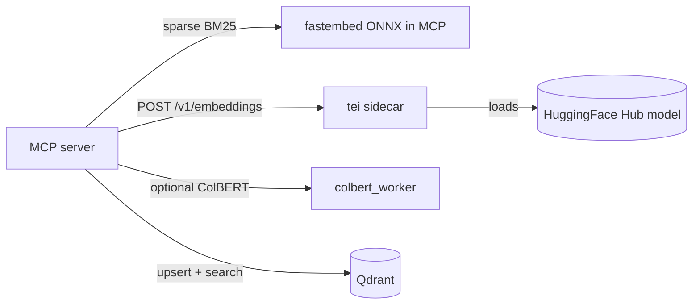

# 0025. Adopt HuggingFace TEI sidecar for dense embedding

- **Status:** Proposed
- **Date:** 2026-07-04
- **Deciders:** Maintainers
- **Related:** [0011](0011-ollama-only-dense-embedding.md), [0015](0015-colbert-http-sidecar.md), [0017](0017-model-tokenizer-ollama-dense-truncation.md), [0022](0022-gpu-default-cpu-fallback.md), [0021](0021-revert-jina-production-default-retire-qwen3.md), [0001](0001-pluggable-embed-backends.md), [Text Embeddings Inference](https://github.com/huggingface/text-embeddings-inference), [OpenAI Embeddings API](https://platform.openai.com/docs/api-reference/embeddings)
- **Supersedes:** [0011](0011-ollama-only-dense-embedding.md) — Ollama dense embedding removed entirely; no legacy backend or migration window

## Context

[ADR 0011](0011-ollama-only-dense-embedding.md) consolidated dense vectors behind **Ollama HTTP** (`POST /api/embed`) to isolate GPU memory from MCP. That trade-off created a **model-catalog ceiling**:

| Gap | Impact |
|-----|--------|
| Ollama library is curated | Many HuggingFace embedding models (e.g. CodeFuse F2LLM-v2, domain-specific checkpoints) have **no official or stable Ollama port** |
| `DENSE_EMBED_MODEL` vs `OLLAMA_EMBED_MODEL` split | Registry/metadata uses HF repo ids; inference uses a **separate community tag** — drift risk and operator confusion |
| Quantization parity | Community Ollama GGUF ports may not match upstream HF weights bit-for-bit |
| Deferred OpenAI backend | [ADR 0011](0011-ollama-only-dense-embedding.md) and [0001](0001-pluggable-embed-backends.md) deferred an OpenAI-compatible dense path |

The codebase already treats **`DENSE_EMBED_MODEL` as a HuggingFace repo id** (`config.py` dimension/token registries, [ADR 0017](0017-model-tokenizer-ollama-dense-truncation.md) tokenizer loader). Only the inference hop is Ollama-specific.

### Why now

- Production default is **Jina Embeddings v2 base code** ([ADR 0021](0021-revert-jina-production-default-retire-qwen3.md)) — TEI supports `jinaai/jina-embeddings-v2-base-code` natively.
- **GPU-default compose** ([ADR 0022](0022-gpu-default-cpu-fallback.md)) already runs inference sidecars; TEI replaces the Ollama dense slot in the same topology.
- **ColBERT sidecar pattern** ([ADR 0015](0015-colbert-http-sidecar.md)) proves HTTP offload + httpx client + compose merge is maintainable.
- **No backward-compatibility requirement** — pre-release policy allows a hard replace; Ollama dense code, compose, and env vars are deleted in one delivery.

### Hard constraints

1. **Hybrid search unchanged** — sparse BM25 stays in-process CPU ONNX in MCP ([0006](0006-explicit-fastembed-pipeline.md)).
2. **HTTP dense sidecar** — keep GPU/RAM isolation; no in-process PyTorch/`sentence-transformers` dense in MCP.
3. **Embedder facade + protocols** — `TeiDenseBackend` implements existing `DenseEmbedBackend`.
4. **Re-index required** — vector space is not portable from Ollama community ports to TEI native weights.
5. **GPU-default, CPU explicit fallback** — TEI sidecar follows [ADR 0022](0022-gpu-default-cpu-fallback.md): `ACCELERATOR=gpu` (default when unset) merges GPU compose + CUDA TEI image; **`ACCELERATOR=cpu` is the only CPU path** (CI, air-gapped CPU hosts).
6. **Hard replace** — remove Ollama dense backend, compose overlays, and all `OLLAMA_*` settings; no `DENSE_EMBED_BACKEND` switch.

### Requirements and goals

1. **Load any TEI-supported HF embedding model** by `DENSE_EMBED_MODEL` repo id.
2. **Industry-standard client API** — OpenAI-compatible `POST /v1/embeddings` between MCP and sidecar.
3. **Single model identifier** — `DENSE_EMBED_MODEL` is the only dense model config (delete `OLLAMA_EMBED_MODEL`).
4. **Model-accurate truncation** — reuse [ADR 0017](0017-model-tokenizer-ollama-dense-truncation.md) tokenizer loader keyed on `DENSE_EMBED_MODEL`.
5. **Matryoshka (MRL)** — pass optional `dimensions` for Qwen3-style models when `DENSE_EMBED_VECTOR_SIZE` is below native.

### Evaluation stack

| Layer | In scope? | Notes |
|-------|-----------|-------|
| Dense embed availability for HF repo ids | yes | Primary motivation |
| Index throughput / MCP RSS | partial | `bench.py` on TEI stack |
| Retrieval quality (recall@10, MRR) | yes | Refresh golden-set baseline on TEI+Jina |
| End-user Ragas | no | [ADR 0010](0010-defer-ragas-to-client.md) |
| LLM chat / completion | no | Out of scope — operators run Ollama/vLLM/TGI separately if needed |
| Sparse / ColBERT paths | no | Unchanged |

## Decision

We will **replace Ollama dense embedding entirely** with **HuggingFace Text Embeddings Inference (TEI)** as the sole dense sidecar. MCP calls TEI via the **OpenAI Embeddings API** (`POST /v1/embeddings`).

There is **no Ollama dense path**, **no backend selector**, and **no migration window**.

### Architecture



- **`TeiDenseBackend`** — httpx client to OpenAI `/v1/embeddings`; batching, retries, preload probe.
- **Sidecar:** official TEI image (see **Resolved defaults**); `--model-id ${DENSE_EMBED_MODEL}`; GPU via NVIDIA runtime when `ACCELERATOR=gpu`.
- **Removed:** `OllamaDenseBackend`, `ollama_dense.py`, `docker-compose.ollama.yml`, `docker-compose.ollama.gpu.yml`, all `OLLAMA_*` env vars, `DENSE_EMBED_BACKEND`, Ollama-related tests and docs.

### Resolved defaults

Implementation must follow these decisions — no further design choices required.

#### Accelerator and TEI image ([ADR 0022](0022-gpu-default-cpu-fallback.md))

| `ACCELERATOR` | TEI image default (`TEI_IMAGE`) | Compose merge |
|---------------|-----------------------------------|---------------|
| `gpu` *(default when unset)* | `ghcr.io/huggingface/text-embeddings-inference:89-1.9` | `docker-compose.tei.yml` + `docker-compose.tei.gpu.yml` |
| `cpu` *(explicit only)* | `ghcr.io/huggingface/text-embeddings-inference:cpu-1.9` | `docker-compose.tei.yml` only (no GPU override) |

- **`TEI_IMAGE`** — compose-only override for GPU architecture (e.g. `turing-1.9`, `1.9`, `hopper-1.9`). Document in `DEPLOYMENT.md` with [TEI hardware table](https://github.com/huggingface/text-embeddings-inference#docker-images).
- **`scripts/compose_files.py`** — replace `include_ollama` with `include_tei: bool = True`; merge TEI files per accelerator mode above.
- **Fail fast:** when `ACCELERATOR=gpu`, `require_gpu()` in integration harness unchanged; TEI container must receive NVIDIA device reservation.

#### Compose topology (bundled vs external)

| Mode | Configuration | Behavior |
|------|---------------|----------|
| **Bundled TEI (default)** | `COMPOSE_PROFILES=bundled-tei` in `.env.example` REQUIRED | `tei` service starts; MCP `TEI_URL=http://tei:80`; `depends_on: tei: service_healthy` |
| **External TEI** | Omit `bundled-tei` profile; `TEI_URL=http://host.docker.internal:8080` (or host URL) | No bundled `tei` container; MCP calls external URL |

Bundled service spec:

| Field | Value |
|-------|-------|
| `container_name` | `codeindexer_tei` |
| `profiles` | `["bundled-tei"]` |
| `ports` | `127.0.0.1:${TEI_PORT:-8080}:80` |
| `volumes` | `tei_data:/data` — Hub weight cache (avoid re-download every run) |
| `command` | `--model-id ${DENSE_EMBED_MODEL} --port 80` |
| `environment` | `HF_TOKEN: ${HF_TOKEN:-}` (gated models only) |
| `healthcheck` | `curl -f http://localhost:80/health` |
| cgroup caps | `TEI_MEM_LIMIT` (default `4g`), `TEI_CPUS` (default `4`) |

Canonical invocation (GPU default):

```bash
docker compose $(python scripts/compose_files.py) --profile bundled-tei up -d --build
```

CPU fallback (CI):

```bash
docker compose $(ACCELERATOR=cpu python scripts/compose_files.py) --profile bundled-tei up -d --build
```

#### OpenAI `/v1/embeddings` request semantics

TEI loads the model at **container startup** via `--model-id ${DENSE_EMBED_MODEL}`. The OpenAI `model` field in each request is **informational** — TEI defaults `--model-name` to `--model-id` ([TEI CLI](https://github.com/huggingface/text-embeddings-inference)).

**Client rule (`TeiDenseBackend`):**

- Send `"model": "<DENSE_EMBED_MODEL>"` in every `/v1/embeddings` request (matches operator config and logs).
- Send `"dimensions": <DENSE_EMBED_VECTOR_SIZE>` when MRL applies (`tei_embed_dimensions()` returns an int).
- Sidecar rejects/warns at preload if probe embedding length ≠ `DENSE_EMBED_VECTOR_SIZE`.

#### GPU verification (integration harness)

Replace Ollama `ollama pull` / `ollama ps` checks with:

| Check | When | Pass criteria |
|-------|------|---------------|
| `tei_health` | Always | `GET ${TEI_URL}/health` → HTTP 200 |
| `tei_embed_smoke` | Always | `POST ${TEI_URL}/v1/embeddings` with `input: "."` → 200 + embedding length == `DENSE_EMBED_VECTOR_SIZE` |
| `tei_gpu_visible` | `ACCELERATOR=gpu` only | `docker exec codeindexer_tei nvidia-smi` exits 0 (CUDA visible in container) |

No TEI equivalent of `ollama ps PROCESSOR` — GPU proof is **nvidia-smi in container** + successful embed smoke.

#### `CollectionStats.dense_embed_backend`

- **Remove** `dense_embed_backend` from `Settings` and env.
- **Keep** `CollectionStats.dense_embed_backend: str` for collection metadata display — **hardcode `"tei"`** at write/read sites in `qdrant.py` (same pattern as today but constant, not config-driven).
- Re-index warning text references `DENSE_EMBED_MODEL` / vector size only — no `OLLAMA_EMBED_MODEL`.

### HTTP contract (MCP → TEI)

| Endpoint | Method | Purpose |
|----------|--------|---------|
| `/health` | GET | Liveness (TEI native) |
| `/v1/embeddings` | POST | Batch dense embed |

**Request** (`POST /v1/embeddings`):

```json
{
  "input": ["string", "..."],
  "model": "jinaai/jina-embeddings-v2-base-code",
  "dimensions": 768
}
```

- `input` — string or array of strings (batch)
- `model` — `DENSE_EMBED_MODEL` (informational; see **Resolved defaults**)
- `dimensions` — optional; set when MRL applies (`tei_embed_dimensions()`)

**Response** (OpenAI shape):

```json
{
  "data": [
    { "embedding": [0.1, "..."], "index": 0 }
  ],
  "model": "jinaai/jina-embeddings-v2-base-code"
}
```

**Client behavior** — mirror [ColbertRemoteBackend](../../mcp_server/src/codebase_indexer/indexer/backends/colbert_remote.py):

- Preload: `GET /health` + probe embed of `"."`; validate `len(embedding) == DENSE_EMBED_VECTOR_SIZE`
- Batch requests with `TEI_EMBED_BATCH_SIZE`
- Retries with exponential backoff on HTTP 503 / connection errors
- `TEI_TIMEOUT` per request
- Truncation client-side via [ADR 0017](0017-model-tokenizer-ollama-dense-truncation.md) before HTTP call

**Security:** internal Compose network only; no bearer auth — same trust model as ColBERT sidecar ([ADR 0015](0015-colbert-http-sidecar.md)).

### In scope

| Component | Outcome |
|-----------|---------|
| `TeiDenseBackend` | OpenAI `/v1/embeddings` client; sole `DenseEmbedBackend` |
| Factory | `create_dense_backend()` always returns `TeiDenseBackend` |
| Config | `TEI_URL`, `TEI_EMBED_BATCH_SIZE`, `TEI_TIMEOUT`; remove `dense_embed_backend`, all `ollama_*` fields |
| Compose | `docker-compose.tei.yml` + `docker-compose.tei.gpu.yml`; profile `bundled-tei`; `scripts/compose_files.py` merges TEI per accelerator |
| **Deleted** | `ollama_dense.py`, `test_ollama_dense_backend.py`, `docker-compose.ollama.yml`, `docker-compose.ollama.gpu.yml`, Ollama sections in `.env.example` |
| Docs | `.env.example`, `DEPLOYMENT.md`, `ARCHITECTURE.md`, MCP tool descriptions — TEI only |
| Tests | `test_tei_dense_backend.py`; update factory/config/integration tests |
| Benchmarks | `bench.py` / `eval_retrieval.py` use TEI; refresh golden-set baseline |

### Out of scope

- Ollama for **LLM chat/completion** — external operator choice; not part of this stack
- Moving sparse BM25 or ColBERT to TEI
- HuggingFace **TGI** or **vLLM** — separate ADR if in-stack LLM serving is needed
- Commercial OpenAI / Azure embedding APIs
- Automatic re-index when `DENSE_EMBED_MODEL` changes
- Bit-identical vector parity with prior Ollama community ports
- ADR 0020 fine-tune **Ollama Modelfile export** — follow-up: Hub upload + TEI `--model-id` (not blocking this ADR)

### Default behavior and configuration

- **Default:** TEI is the only dense path — **breaking** for all Ollama dense deployments
- **No backend switch** — `DENSE_EMBED_BACKEND` removed from config

| Variable | Role |
|----------|------|
| `DENSE_EMBED_MODEL` | HF repo id — TEI `--model-id` and tokenizer registry |
| `DENSE_EMBED_VECTOR_SIZE` | Qdrant dense dimension; OpenAI `dimensions` when MRL |
| `TEI_URL` | MCP → TEI base URL (default `http://tei:80` bundled; external host URL when profile omitted) |
| `TEI_EMBED_BATCH_SIZE` | HTTP batch size (default `32`) |
| `TEI_TIMEOUT` | Per-request timeout seconds (default `120`) |
| `MAX_DENSE_EMBED_TOKENS` | Client truncation cap ([ADR 0017](0017-model-tokenizer-ollama-dense-truncation.md)) |
| `COMPOSE_PROFILES` | Set to `bundled-tei` for bundled sidecar (default in `.env.example`) |
| `TEI_IMAGE` | Compose-only TEI Docker tag override (defaults per accelerator table above) |
| `TEI_MEM_LIMIT`, `TEI_CPUS`, `TEI_PORT` | Compose cgroup caps and host port (compose-only) |
| `TEI_GPU_COUNT` | GPUs reserved for bundled TEI (default `1`; compose-only) |
| `HF_TOKEN` | Optional — gated Hub models only |
| `ACCELERATOR` | `gpu` default; `cpu` explicit fallback ([ADR 0022](0022-gpu-default-cpu-fallback.md)) |

**Removed variables:** `OLLAMA_URL`, `OLLAMA_EMBED_MODEL`, `OLLAMA_EMBED_BATCH_SIZE`, `OLLAMA_TIMEOUT`, `OLLAMA_GPU`, `OLLAMA_GPU_COUNT`, `OLLAMA_MEM_LIMIT`, `OLLAMA_CPUS`, `OLLAMA_PORT`, `DENSE_EMBED_BACKEND`, `COMPOSE_PROFILES=bundled-ollama`.

## Alternatives considered

| Option | Pros | Cons |
|--------|------|------|
| **TEI hard replace (chosen)** | HF-native models; single model id; OpenAI API standard; removes dual-path maintenance | Breaking; TEI support matrix; re-index required |
| **Phased TEI + Ollama legacy** | Gradual migration | User rejected — unnecessary complexity pre-release |
| **Infinity** | Fast; OpenAI-compatible | Less official than TEI; standardize on one server |
| **In-process sentence-transformers** | Lowest latency | Violates sidecar isolation; bloats MCP image |
| **Status quo (Ollama-only)** | Already deployed | Catalog gap remains |
| **Single `:latest` TEI tag** | Simple | Wrong — TEI requires arch-specific CUDA/CPU tags |

## Consequences

### Positive

- **Universal HF embedding access** (within TEI support matrix) using `DENSE_EMBED_MODEL` directly
- **Single model identifier** — no `OLLAMA_EMBED_MODEL` mapping
- **Simpler codebase** — one dense backend, one compose sidecar, no backend factory branch
- **Industry-standard API** — OpenAI `/v1/embeddings`
- **Consistent sidecar topology** — TEI + optional ColBERT worker + Qdrant + MCP
- **GPU-default preserved** — same operator story as [ADR 0022](0022-gpu-default-cpu-fallback.md) with TEI replacing Ollama in the dense slot

### Negative / trade-offs

- **Breaking change** — all deployments must migrate to TEI and **force re-index**
- **TEI model support list** — not every HF repo works; document verification via `/health`
- **TEI image selection** — operators on non–RTX-40xx GPUs may need `TEI_IMAGE` override
- **VRAM / RAM planning** — TEI footprint differs from Ollama GGUF; update `.env.example` presets
- **HTTP latency** — same class as prior Ollama sidecar; batching mitigates

### Neutral / follow-ups

- Extend tuner ([ADR 0024](0024-resource-aware-stack-tuner.md)) with `TEI_MEM_LIMIT` (replace `OLLAMA_MEM_LIMIT`)
- [0016](0016-qwen3-embedding-default-dense-model.md) — Qwen3 preset uses TEI + MRL `dimensions` only
- Rename ADR 0017 truncation references from “Ollama dense” to “TEI dense” in docs (behavior unchanged)
- ADR 0020 Phase 2 — export fine-tuned weights to Hub for TEI instead of Ollama Modelfile

### Downstream work

- [0024](0024-resource-aware-stack-tuner.md) — swap Ollama allocation rows for TEI
- [0022](0022-gpu-default-cpu-fallback.md) — live docs/agent instructions reference TEI (historical ADR body unchanged)

## Implementation notes

### New artifacts

| Path | Purpose |
|------|---------|
| `mcp_server/src/codebase_indexer/indexer/backends/tei_dense.py` | `TeiDenseBackend` |
| `docker-compose.tei.yml` | Bundled TEI service (`codeindexer_tei`, `tei_data` volume, healthcheck) |
| `docker-compose.tei.gpu.yml` | NVIDIA device reservation (`TEI_GPU_COUNT`) |
| `mcp_server/tests/test_tei_dense_backend.py` | Mocked HTTP tests |

### Modified artifacts

| Path | Change |
|------|--------|
| `mcp_server/src/codebase_indexer/indexer/backends/factory.py` | Always `TeiDenseBackend` |
| `mcp_server/src/codebase_indexer/config.py` | TEI settings; remove `ollama_*`, `dense_embed_backend`; rename `ollama_embed_dimensions` → `tei_embed_dimensions` |
| `scripts/compose_files.py` | `include_tei`; merge TEI compose; CPU vs GPU image selection |
| `scripts/run_compose_integration.py` | TEI service, health/embed/gpu checks; remove Ollama pull/ps |
| `docker-compose.yml` | `TEI_URL` env passthrough (replace `OLLAMA_*`) |
| `.env.example`, `DEPLOYMENT.md`, `ARCHITECTURE.md`, `CHANGELOG.md` | TEI-only operator path |
| `mcp_server/src/codebase_indexer/tools/search.py`, `main.py` | Remove Ollama references |
| `mcp_server/src/codebase_indexer/storage/qdrant.py` | Hardcode `dense_embed_backend="tei"`; update re-index warning |
| Benchmarks, integration tests, cursor agents | TEI URL/connectivity checks |

### Deleted artifacts

| Path | Reason |
|------|--------|
| `mcp_server/src/codebase_indexer/indexer/backends/ollama_dense.py` | Replaced by TEI |
| `mcp_server/tests/test_ollama_dense_backend.py` | Replaced |
| `docker-compose.ollama.yml` | Replaced by TEI compose |
| `docker-compose.ollama.gpu.yml` | Replaced by TEI GPU compose |
| Ollama connectivity helpers in benchmarks | Replaced with `tei_reachable` |

### Sidecar startup (reference)

```yaml
services:
  tei:
    profiles: ["bundled-tei"]
    image: ${TEI_IMAGE:-ghcr.io/huggingface/text-embeddings-inference:89-1.9}
    container_name: codeindexer_tei
    command: --model-id ${DENSE_EMBED_MODEL} --port 80
    volumes:
      - tei_data:/data
    environment:
      HF_TOKEN: ${HF_TOKEN:-}
    ports:
      - "127.0.0.1:${TEI_PORT:-8080}:80"
    healthcheck:
      test: ["CMD-SHELL", "curl -sf http://localhost:80/health || exit 1"]
      interval: 10s
      timeout: 5s
      retries: 10
      start_period: 120s

volumes:
  tei_data:
```

When `ACCELERATOR=cpu`, set `TEI_IMAGE=ghcr.io/huggingface/text-embeddings-inference:cpu-1.9` in compose env (via `compose_files.py` or integration env generator).

### Operator flow

1. Set `DENSE_EMBED_MODEL=jinaai/jina-embeddings-v2-base-code` and `DENSE_EMBED_VECTOR_SIZE=768`
2. `COMPOSE_PROFILES=bundled-tei`; `ACCELERATOR=gpu` (default)
3. `docker compose $(python scripts/compose_files.py) --profile bundled-tei up -d --build` — TEI pulls weights to `tei_data` on first start
4. Verify: `curl http://127.0.0.1:8080/health` and `docker exec codeindexer_tei nvidia-smi`
5. **Force re-index** all collections

### Dependencies

- **Runtime:** existing `httpx` in MCP
- **Sidecar:** pinned TEI tag per accelerator (defaults above; override via `TEI_IMAGE`)

### Rollout

**Breaking hard replace** — single PR/delivery:

1. Add TEI backend + compose
2. Delete Ollama dense code and compose in the same change
3. Update all docs, tests, benchmarks, `.env.example`, agent instructions
4. Refresh golden-set baseline on TEI+Jina (GPU)
5. Complete **Ollama removal inventory** below

### Ollama removal inventory

Every layer below must be updated or deleted in the same delivery. Historical ADR bodies (0011, 0015, 0022, …) keep Ollama mentions as superseded context only — no rewrite required unless cross-links break.

#### Application code (`mcp_server/src/`)

| Path | Action |
|------|--------|
| `indexer/backends/ollama_dense.py` | **Delete** |
| `indexer/backends/tei_dense.py` | **Add** |
| `indexer/backends/factory.py` | Remove `_ollama_model_name`, Ollama import; always `TeiDenseBackend` |
| `config.py` | Remove `ollama_*`, `dense_embed_backend`; add `tei_*`; rename `ollama_embed_dimensions` → `tei_embed_dimensions` |
| `indexer/embedder.py` | Telemetry label `dense_backend="ollama"` → `"tei"` |
| `main.py` | MCP server instructions + default settings dict — TEI/`DENSE_EMBED_MODEL` only |
| `storage/qdrant.py` | Hardcode `"tei"` for `CollectionStats.dense_embed_backend`; re-index warning uses `DENSE_EMBED_MODEL` only |
| `tools/search.py` | Tool description — TEI dense, not Ollama |
| `indexer/backends/base.py` | Protocol docstring — "TEI HTTP" not "Ollama HTTP" |

#### Tests (`mcp_server/tests/`)

| Path | Action |
|------|--------|
| `test_ollama_dense_backend.py` | **Delete** → `test_tei_dense_backend.py` |
| `test_factory.py` | Assert `TeiDenseBackend`; remove Ollama imports/settings |
| `test_config.py` | Remove `dense_embed_backend` / `ollama_*` tests; add TEI tests; rename MRL helper tests |
| `test_eval_retrieval.py`, `test_eval_multihop.py` | `ollama_reachable` → `tei_reachable`; `tei_url` |
| `test_run_compose_integration_gpu.py` | Replace Ollama GPU helpers with `check_tei_gpu_visible` / embed smoke |
| `test_compose_files.py` | Assert TEI compose files merged (GPU + CPU paths) |
| `test_index_status.py` | Remove `dense_embed_backend = "ollama"` fixture |
| `test_chunk_tool.py` | `CollectionStats` dense backend label `"tei"` |
| `test_telemetry_metrics.py` | Metric backend label `"tei"` |
| Any test using `ollama_embed_model=` in `Settings(...)` | TEI-only settings |

#### Benchmarks & maintainer scripts (`mcp_server/benchmarks/`, `scripts/`)

| Path | Action |
|------|--------|
| `benchmarks/_connectivity.py` | `tei_reachable(url)` via `GET /health` |
| `benchmarks/_settings.py` | `TEI_URL` env wiring |
| `benchmarks/bench.py` | TEI connectivity skip reason |
| `benchmarks/eval_retrieval.py`, `eval_multihop.py` | TEI URL params; baseline metadata |
| `benchmarks/suggest_labels.py`, `train/mine_hard_negatives.py` | TEI settings |
| `benchmarks/bench_colbert_sidecar.py` | TEI stack assumptions |
| `benchmarks/tune_colbert_env.py` | `TEI_EMBED_BATCH_SIZE` |
| `benchmarks/tune_rss_env.py` | `TEI_MEM_LIMIT` |
| `benchmarks/fixtures/eval_baseline*.json` | Refresh on TEI; update params |
| `benchmarks/fixtures/golden_queries.jsonl` | Update Ollama-specific query prose if present |
| `scripts/compose_files.py` | `include_tei`; TEI image defaults per `ACCELERATOR` |
| `scripts/run_compose_integration.py` | `tei` service; `tei_health`, `tei_embed_smoke`, `tei_gpu_visible`; `COMPOSE_PROFILE=bundled-tei` |

#### Compose & deployment

| Path | Action |
|------|--------|
| `docker-compose.ollama.yml` | **Delete** |
| `docker-compose.ollama.gpu.yml` | **Delete** |
| `docker-compose.tei.yml` | **Add** |
| `docker-compose.tei.gpu.yml` | **Add** |
| `docker-compose.yml` | Replace `OLLAMA_*` env passthrough with `TEI_*` |
| `docker-compose.colbert-worker.yml` | Update comment example (`bundled-tei`) |
| `.env.example` | TEI-only required vars; `COMPOSE_PROFILES=bundled-tei`; `ACCELERATOR=gpu` |

#### Documentation & agent instructions

| Path | Action |
|------|--------|
| `README.md` | Quick start, env table, diagrams, presets — TEI only |
| `docs/DEPLOYMENT.md` | Full rewrite of dense sidecar sections; TEI image override table |
| `docs/ARCHITECTURE.md` | TEI backend table |
| `CHANGELOG.md` | Breaking entry for TEI hard replace |
| `.github/copilot-instructions.md` | Embedder + compose + env sections |
| `.cursor/agents/adr-integration-tester.md` | TEI health/reachability checks |
| `.cursor/agents/deps-hygiene.md`, `ops-hygiene.md`, `doc-hygiene.md`, `git-hygiene.md` | TEI pin/check references |

#### Telemetry & metrics

| Location | Action |
|----------|--------|
| `record_embed_request("ollama", …)` | Removed with `ollama_dense.py` |
| `record_truncated_chunks("ollama", …)` | `"tei"` in `tei_dense.py` |
| Prometheus `backend="ollama"` label | `"tei"` |

### Data migration

**Yes — full re-index required** for every existing collection (Ollama vectors are not compatible with TEI native weights).

## Validation

### Automated tests

- **Unit** — `test_tei_dense_backend.py`: OpenAI response shape, batching, dimension mismatch, 503 retry, MRL `dimensions`, truncation
- **Factory** — `test_factory.py`: always `TeiDenseBackend`
- **Config** — `test_config.py`: TEI URL defaults; no `ollama_*` or `dense_embed_backend` fields
- **Integration** — TEI container smoke (`@pytest.mark.integration`); skipped when unreachable
- **Compose** — `test_compose_files.py`: GPU merges `tei.gpu.yml`; CPU merges CPU image default only
- **Integration harness** — `test_run_compose_integration_gpu.py`: `tei_gpu_visible` + embed smoke

### Fixture-based evaluation

- Refresh `benchmarks/fixtures/eval_baseline*.json` on **TEI + Jina** (GPU)
- Prior Ollama baseline is historical reference only

### CI adoption

- Default CI jobs: `ACCELERATOR=cpu` + `TEI_IMAGE=cpu-1.9`; mock unit tests; integration may skip TEI GPU checks
- GPU integration / self-hosted smoke: full `tei_health` + `tei_embed_smoke` + `tei_gpu_visible`

### Success criteria

1. Index and search work with TEI using `DENSE_EMBED_MODEL` as the Hub `--model-id`
2. **`rg -i ollama` across repo** returns matches only in historical ADR bodies and CHANGELOG history — zero in `mcp_server/src/`, `scripts/`, compose files, `.env.example`, `README.md`, `DEPLOYMENT.md`, `.github/`, `.cursor/agents/`
3. Hybrid search unchanged — TEI dense + in-process BM25 sparse + optional ColBERT rerank
4. Golden-set baseline captured on TEI+Jina (GPU)
5. `ACCELERATOR=gpu` (default) merges TEI GPU compose; `ACCELERATOR=cpu` uses CPU TEI image — fail-fast when GPU required but NVIDIA missing
6. Integration script validates `tei_health`, `tei_embed_smoke`, and `tei_gpu_visible` (GPU mode)

## Measured outcomes

*(Fill after implementation baseline refresh.)*

| Variant | recall@10 | MRR | Index chunks/sec | Notes |
|---------|-----------|-----|------------------|-------|
| TEI + Jina (GPU) | — | — | — | New committed baseline |
