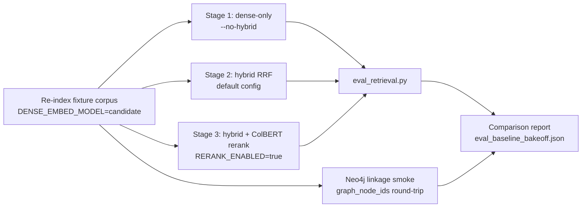

# 0026. Full-stack embedding model quality benchmark and selection framework

- **Status:** Accepted (phases 1–3; phases 4–5 open)
- **Date:** 2026-07-08
- **Deciders:** Maintainers
- **Related:** [0007](0007-ranx-retrieval-evaluation.md) — ranx golden-set harness (instrument being repaired here); [0016](0016-qwen3-embedding-default-dense-model.md) — Qwen3 default (measured-outcomes now disputed); [0020](0020-qwen3-code-finetune-jina-quality-gate.md) — fine-tune gate (failed against the same disputed baseline); [0021](0021-revert-jina-production-default-retire-qwen3.md) — Jina revert (measured-outcomes now disputed); [0025](0025-huggingface-tei-dense-embedding.md) — TEI dense sidecar (serving layer for every candidate); [0017](0017-model-tokenizer-tei-dense-truncation.md) — tokenizer-accurate truncation; [0003](0003-hybrid-search-rrf-default.md) — hybrid RRF; [0008](0008-optional-colbert-reranking.md) / [0015](0015-colbert-http-sidecar.md) — ColBERT rerank stage; [0002](0002-graphrag-neo4j-qdrant.md) — Neo4j graph linkage (`chunk_id` / `graph_node_ids`); [0009](0009-multi-hop-retrieval-strategies.md) — multi-hop eval; [MTEB CoIR leaderboard](https://mteb-leaderboard.hf.space/benchmark/CoIR)
- **Supersedes:** *(none directly — narrows confidence in [0016](0016-qwen3-embedding-default-dense-model.md), [0020](0020-qwen3-code-finetune-jina-quality-gate.md), and [0021](0021-revert-jina-production-default-retire-qwen3.md) "Measured outcomes" sections; does not change the current production default until this ADR's own Phase 5 decision lands)*

## Context

### Current situation and measurable gap

Three prior ADRs made dense-embedding-model decisions using this repo's golden-set harness ([ADR 0007](0007-ranx-retrieval-evaluation.md)):

- **0016** adopted Qwen3-Embedding-4B as default (CoIR rank #5), then measured −63.1% recall@10 vs a **frozen** Jina reference (0.660) and shipped with a waiver.
- **0020** used that same 0.660 frozen reference as a mandatory fine-tune gate; base Qwen3 (0.244) failed by a wide margin, and Phases 2–4 were cancelled.
- **0021** reverted the default to Jina, citing the −63.1% gap as primary evidence.

**0021's own committed "Measured outcomes" table contradicts the number that justified the revert:**

| Variant | recall@10 | Source | Note |
|---|---|---|---|
| Jina **frozen reference** (2026-07-02) | **0.660** | `eval_baseline_jina.json` | Basis for the "−63.1%" headline used in 0016/0020/0021 |
| Jina **live re-index, same harness** (2026-07-04) | **0.263** | `eval_baseline.json`, committed | Same model, same code — **−60% swing**, attributed in the ADR text to "golden alias line drift... outside ±2pp index-drift tolerance" |
| Qwen3-4B (retired default) | 0.244 | same live session | |

The apples-to-apples gap on the *same live corpus/label state* is **Jina 0.263 vs Qwen3 0.244** — roughly 2pp, at the edge of the ADR's own noise tolerance — not the 63-point cliff used to retire Qwen3 as a candidate family. The dramatic per-tag table in 0021 (`conceptual` 0.810 vs 0.190, `symbol` 0.722 vs 0.278, etc.) mixes the **stale frozen** Jina numbers against **live** Qwen3 numbers: different corpus/label states, not a controlled comparison. Compounding this, the underlying golden set has only **26 queries** (`golden_queries.jsonl`: `symbol` 9, `conceptual` 7, `config` 5, `cross_file` 5, `multi_hop` 4, with overlap), which has limited power to separate real effects from single-query flips.

**Conclusion driving this ADR:** the harness that produced 0016/0020/0021's numbers has a demonstrated ±60pp reproducibility problem on an *unchanged* model and corpus. Every model-family conclusion drawn from it — including "Qwen3-family embedders are a poor fit for this repo" — is **unverified**, not disproven and not confirmed. Separately, follow-up research surfaced additional open, license-clean, TEI-servable candidates never evaluated on this stack at all: `Alibaba-NLP/gte-modernbert-base`, `ibm-granite/granite-embedding-311m-multilingual-r2` (+ `-97m-multilingual-r2`), `google/embeddinggemma-300m`, `infly/inf-retriever-v1-1.5b`, `perplexity-ai/pplx-embed-v1-{0.6b,4b}`, plus a clean retest of `Qwen/Qwen3-Embedding-{0.6B,4B}` already registered in `config.py`.

We need one **repeatable, full-stack** comparison — fixing the measurement instrument first — before making (or continuing to defer) another default-model decision.

### Hard constraints

1. **Self-hosted only** — every candidate must be servable by the existing **TEI sidecar** ([ADR 0025](0025-huggingface-tei-dense-embedding.md)) via `DENSE_EMBED_MODEL`; no commercial embedding APIs (rules out the Perplexity *API*, though `perplexity-ai/pplx-embed-v1-*` **open weights** are in scope via TEI).
2. **Full stack, not dense-only** — the comparison must cover **hybrid RRF** (dense + BM25, [0003](0003-hybrid-search-rrf-default.md)) and **optional ColBERT rerank** ([0008](0008-optional-colbert-reranking.md)/[0015](0015-colbert-http-sidecar.md)), because 0021 asserted (without a controlled test) that Qwen3's dense channel "does not complement BM25 the way Jina does" — that claim needs its own evidence, not inheritance from the disputed baseline.
3. **Neo4j linkage is a regression guard, not a ranking signal** — `chunk_id` / `graph_node_ids` payload linkage ([ADR 0002](0002-graphrag-neo4j-qdrant.md) Phase 2) must remain intact after every candidate's re-index; dense model choice does not change graph content, but a broken re-index would silently corrupt linkage.
4. **One corpus snapshot per bake-off session** — every candidate is indexed and scored against the **same** pinned git SHA / chunk state in the same sitting, closing the exact gap that produced the 0.660→0.263 Jina swing (index/label drift between runs).
5. **License** — Apache-2.0 / MIT only (self-hosted commercial-safe); `google/embeddinggemma-300m` requires a one-time gated-repo license acceptance + `HF_TOKEN` for the initial pull — documented, not blocking.
6. **No GPU training in CI** — bake-off runs are maintainer/self-hosted-GPU executions, same policy as [0007](0007-ranx-retrieval-evaluation.md) and [0020](0020-qwen3-code-finetune-jina-quality-gate.md).
7. **GPU-only scoring** — every candidate that contributes to the comparison report **must** be indexed and queried with `ACCELERATOR=gpu` ([ADR 0022](0022-gpu-default-cpu-fallback.md)): TEI on its CUDA image, ColBERT worker on its GPU image ([ADR 0015](0015-colbert-http-sidecar.md) Phase 2), per the same GPU-default policy already governing this stack. **CPU is only acceptable when GPU is genuinely unavailable for a specific model** (e.g. a maintainer laptop without an eligible GPU driver, or a spike prototyping step before the timed session) — any such CPU-produced number is **excluded from the ranked comparison report** and, if kept at all, is logged separately as non-comparable. This avoids repeating [ADR 0025](0025-huggingface-tei-dense-embedding.md)'s own lesson: its committed baseline had to be re-captured after a silent CPU-fallback bug went undetected on driver 6xx (`huggingface/text-embeddings-inference#870`) — GPU must be **positively verified**, not assumed.

### Requirements and goals

1. Fix the harness reliability defect that produced the 0.660→0.263 Jina swing, with a regression test proving it cannot recur silently.
2. Grow the golden set beyond 26 queries to a size where a few-point recall delta is not noise.
3. Score **every viable candidate** (current default + 9 new candidates, pending two integration spikes) on **dense-only**, **hybrid**, and **hybrid+ColBERT rerank** stages, in one session.
4. Verify Neo4j graph-linkage integrity survives re-index for at least one representative candidate collection.
5. Produce one committed comparison report and an explicit, evidence-based promote/keep decision — replacing the disputed 0016/0020/0021 numbers as the reference for this question.

### Evaluation stack

| Layer | In scope? | Notes |
|---|---|---|
| Harness reproducibility (repeat-run stability) | **yes — new** | Root-cause fix for the 0021 defect; direct regression test |
| Golden-set retrieval relevance (ranx: recall@10, MRR, NDCG@10) | yes | Primary decision signal, same metric family as 0007 |
| Hybrid RRF interaction per model | yes | Tests 0021's unverified "Qwen3 doesn't complement BM25" claim |
| ColBERT rerank lift per model | yes | Was never measured per-candidate in 0016/0020/0021 |
| Neo4j graph-linkage integrity post-reindex | yes (smoke only) | Regression guard, not a ranking input |
| CoIR / MTEB public leaderboard rank | informative only | Shortlist filter; not sufficient alone (lesson from 0016) |
| Index throughput / MCP RSS per candidate | partial | Reuse `bench.py`; informs operational cost column, not the quality ranking |
| ANN recall (layer 1, Qdrant HNSW) | no | Documented operational check per [0007](0007-ranx-retrieval-evaluation.md); unaffected by model choice |
| End-user Ragas (layer 3) | no | [0010](0010-defer-ragas-to-client.md) |
| Fine-tuning any candidate | no | Out of scope here; only revisit per [0020](0020-qwen3-code-finetune-jina-quality-gate.md) pattern if a base model is close but short |

### Why now

- Two consecutive ADRs (0016 default switch, 0021 revert) now rest on a baseline the maintainers' own data shows is not reproducible — leaving the true answer to "which model is best for this repo" genuinely unknown.
- Research this cycle found five additional untested, license-clean, TEI-compatible candidates plus grounds to retest the two Qwen3 sizes already wired into `config.py` — the candidate pool has grown faster than the harness's ability to compare them fairly.
- Every future embedding change (new model releases, MRL dimension tuning, [0024](0024-resource-aware-stack-tuner.md) resource presets) inherits this same unreliable instrument until it is fixed once, centrally.

## Decision

We will **repair the golden-set harness's reproducibility defect, expand the golden set, and run one controlled full-stack bake-off** across the current default plus nine additional candidates, producing a single committed comparison report that becomes the new evidence base for the dense-embedding-model decision — explicitly superseding the disputed numbers in 0016/0020/0021's "Measured outcomes" sections (those sections are kept as historical record with a cross-link caveat, not deleted or rewritten).

This ADR does **not** itself change the production default. The default changes only if Phase 5's decision rule (below) is met, as a fast-follow phase with its own re-index rollout.

### Root cause fix (harness reliability)

0021's swing was attributed to **golden-set label drift**: labels key on `{rel_path}:{start_line}` aliases ([ADR 0007](0007-ranx-retrieval-evaluation.md) format), and line numbers shift as the indexed code changes between sessions. The fix:

- **Anchor labels to content, not line numbers.** Store `{rel_path}::{symbol_qualified_name}}` (already computed by the chunker/graph writer, per [ADR 0002](0002-graphrag-neo4j-qdrant.md)) as the primary key, with `start_line` retained only as a cached hint.
- At eval time, `--validate-labels` **re-resolves** a drifted alias by symbol name against the live collection instead of failing outright, and reports drift counts instead of silently scoring against stale ids.
- Add a **repeat-run regression test**: run `eval_retrieval.py` twice against an unchanged indexed collection and assert `recall@10` is identical (or within floating-point noise) — the test the 0021 defect should have tripped.

### Golden set expansion

Grow `golden_queries.jsonl` from 26 to **≥75 labeled queries**, keeping the existing tag taxonomy (`symbol`, `conceptual`, `config`, `cross_file`, `multi_hop`) roughly proportionally represented, using the existing `suggest_labels.py` maintainer workflow ([0007](0007-ranx-retrieval-evaluation.md) checklist) — not a new tool. Version-bump `golden_set_version` in `eval_baseline*.json`.

### Candidate registry

| Model | Params | Dim (native/MRL) | Context | License | TEI status | Integration notes |
|---|---|---|---|---|---|---|
| `jinaai/jina-embeddings-v2-base-code` (current default) | ~161M | 768 | 8,192 | Apache-2.0 | Native | Baseline; re-verify on the fixed harness, do not assume 0021's numbers |
| `Qwen/Qwen3-Embedding-0.6B` | 596M | 1024 (MRL) | 32,768 | Apache-2.0 | Native (already in `QWEN3_EMBED_SPECS`) | Clean retest — never scored on a controlled harness at this size |
| `Qwen/Qwen3-Embedding-4B` | 4.3B | 2560 (MRL) | 32,768 | Apache-2.0 | Native (already in `QWEN3_EMBED_SPECS`) | Retest — the only prior score for this model came from the disputed baseline |
| `Alibaba-NLP/gte-modernbert-base` | 149M | 768 | 8,192 | Apache-2.0 | Native (standard ModernBERT) | Matches current `DENSE_EMBED_VECTOR_SIZE=768`; independently published CoIR NDCG@10 79.31 |
| `ibm-granite/granite-embedding-311m-multilingual-r2` | 311M | 768 (MRL 768/512/384/256/128) | 32,768 | Apache-2.0 | Native | Explicit code-retrieval training claim per model card |
| `ibm-granite/granite-embedding-97m-multilingual-r2` | 97M | 384 | 32,768 | Apache-2.0 | Native | Optional cheap-tier comparator; **requires `DENSE_EMBED_VECTOR_SIZE=384` (re-index)** |
| `google/embeddinggemma-300m` | 308M | 768 (MRL to 128) | **2,048** | Apache-2.0 (gated download) | Native (TEI ≥1.8.1) | Short context — verify against actual chunk-length distribution before including in final ranking; needs `HF_TOKEN` |
| `infly/inf-retriever-v1-1.5b` | 1.5B | 1536 | 32,768 | Apache-2.0 | **Spike required** | `use_instructions=True` — needs task-prefixed query encoding; drop from bake-off if the spike cannot cleanly wire prefix formatting into `TeiDenseBackend` |
| `perplexity-ai/pplx-embed-v1-0.6b` | 596M | 1024 (MRL) | 32,768 | MIT | **Spike required** | Native INT8/binary unnormalized output — needs cosine-similarity handling distinct from the other float embedders; drop if infeasible within spike budget |
| `perplexity-ai/pplx-embed-v1-4b` | 4.3B | 2560 (MRL) | 32,768 | MIT | **Spike required** | Same INT8 caveat as 0.6b; largest/most expensive candidate |

### GPU-only execution policy

Every scored run in this ADR uses `ACCELERATOR=gpu` ([ADR 0022](0022-gpu-default-cpu-fallback.md)) end to end — TEI CUDA image, ColBERT worker GPU image ([ADR 0015](0015-colbert-http-sidecar.md)), same compose merge (`scripts/compose_files.py`) already used in production. Before any candidate is indexed, `bakeoff.py` runs the same GPU-verification checks introduced in [ADR 0025](0025-huggingface-tei-dense-embedding.md) and fails fast rather than silently falling back to CPU:

| Check | When | Pass criteria |
|---|---|---|
| `tei_health` | Every candidate | `GET ${TEI_URL}/health` → HTTP 200 |
| `tei_embed_smoke` | Every candidate | `POST ${TEI_URL}/v1/embeddings` → 200, embedding length matches candidate's registered dimension |
| `tei_gpu_visible` | Every candidate | `docker exec codeindexer_tei nvidia-smi` exits 0 **and** TEI startup log shows the CUDA backend (not the CPU fallback that [ADR 0025](0025-huggingface-tei-dense-embedding.md) had to patch around on driver 6xx) |
| `colbert_gpu_visible` | Stage 3 only (rerank) | `docker exec <colbert_worker> nvidia-smi` exits 0; worker `/health` reports `cuda_available: true` ([ADR 0015](0015-colbert-http-sidecar.md) Phase 2) |

**Policy:**

- A candidate's Stage 1–3 numbers are eligible for the comparison report **only if all applicable GPU checks pass** for that run.
- If a specific candidate's TEI build genuinely cannot run on the available GPU (e.g. an unsupported architecture), `bakeoff.py` records the failure, **excludes that candidate from the ranked report**, and documents the reason in `model_candidates.yaml` rather than silently substituting a CPU number into the comparison.
- The two integration spikes (Phase 3, instruction-prefix / INT8 handling) may prototype on CPU for speed, but the **timed Phase 4 bake-off session itself is GPU-only** — no spike-stage CPU numbers are carried into `eval_baseline_bakeoff.json`.
- VRAM budgeting: the largest candidates (`Qwen3-Embedding-4B`, `pplx-embed-v1-4b`, both ~4.3B params) must fit the bake-off GPU alongside the ColBERT worker for Stage 3; if VRAM is insufficient to run both sidecars concurrently, sequence Stage 3 after freeing the dense sidecar rather than downgrading to CPU.

### Full-stack test matrix

For every viable candidate (post-spike), one indexing session against the pinned corpus snapshot, scored at three stages:

- Stages 1–3 reuse `eval_retrieval.py` (`--no-hybrid`, default, `--rerank`) — no new metrics code, only orchestration.
- Stage 4 (Neo4j smoke) reuses [ADR 0002](0002-graphrag-neo4j-qdrant.md) Phase 2 payload-linkage assertions (`graph_node_ids` present, no `graph_linkage_missing` warnings) on at least one candidate collection, to confirm dense-model swap does not disturb graph writer behavior.
- `eval_multihop.py` runs once per candidate on the `multi_hop` slice (2-hop client RRF), per [0009](0009-multi-hop-retrieval-strategies.md).

### Decision rule (Phase 5)

A candidate is **promoted** only if, on the fixed harness and expanded golden set, in the **same bake-off session**:

1. Hybrid recall@10 **≥ re-verified current-default (Jina) recall@10 + 5pp**, matching the margin convention already used in [0020](0020-qwen3-code-finetune-jina-quality-gate.md)'s gate, **or**
2. Hybrid recall@10 is within ±2pp of the current default **and** offers a clearly better operational profile (smaller params, longer context needed for large chunks, cheaper serving) — documented as a judgment call, not an automatic win.

If no candidate clears bar 1, the current default is **explicitly reaffirmed** with the new, reliable evidence — closing the credibility gap left by 0021, rather than leaving the decision resting on disputed numbers.

### In scope

| Area | Change |
|---|---|
| Harness | Content-anchored label resolution; repeat-run reproducibility test; `--validate-labels` drift re-resolution |
| Golden set | Expand `golden_queries.jsonl` 26 → ≥75, versioned |
| Candidate registry | `benchmarks/fixtures/model_candidates.yaml` — the 10-row table above, machine-readable |
| Orchestration | `benchmarks/bakeoff.py` — loop candidates × 3 stages, single corpus snapshot, one report |
| Integration spikes | Instruction-prefix templating (`inf-retriever`); INT8/unnormalized-cosine response handling (`pplx-embed`) — time-boxed, drop candidate on failure |
| Neo4j smoke | Reuse existing Phase 2 payload-linkage assertions across one candidate re-index |
| Report | `benchmarks/fixtures/eval_baseline_bakeoff.json` + rendered markdown summary |
| ADR cross-links | Header caveat added to 0016, 0020, 0021 once this ADR's baseline is committed |

### Out of scope

- Fine-tuning any candidate (only revisit per [0020](0020-qwen3-code-finetune-jina-quality-gate.md) pattern, and only with the *fixed* harness, if a near-miss candidate justifies it)
- Multi-repo / cross-language golden-set expansion (single-repo fixture remains the scope, per existing [0007](0007-ranx-retrieval-evaluation.md) limitation)
- Changing sparse BM25 model or ColBERT model choice — only the dense encoder varies across candidates
- Neo4j ontology or schema changes
- Commercial embedding APIs (Perplexity API, OpenAI, Voyage, Cohere, Gemini) — self-hosted open weights only
- Automatically promoting a winner without a documented decision step (Phase 5 is deliberate, not automatic CI gating)
- CI-gating every PR on bake-off results (mirrors [0007](0007-ranx-retrieval-evaluation.md) non-blocking policy)

### Default behavior and configuration

- **Default:** **unchanged for Phases 1–4** — production stays on the current Jina default throughout harness repair, golden-set expansion, and bake-off execution. Every candidate re-index in this ADR targets a **throwaway fixture collection**, not the production collection.
- **Phase 5, if a promotion occurs:** breaking, same rollout shape as [0021](0021-revert-jina-production-default-retire-qwen3.md) — update `.env.example` / `DENSE_EMBED_MODEL` / `DENSE_EMBED_VECTOR_SIZE`, force re-index of real collections.
- **Configuration surface:** no new runtime env vars for MCP itself; `benchmarks/bakeoff.py` reads/writes the same `DENSE_EMBED_MODEL` / `TEI_*` vars already defined in [0025](0025-huggingface-tei-dense-embedding.md), swapped per candidate run. `HF_TOKEN` required once for the gated `embeddinggemma-300m` pull.

### Phased delivery

1. **Phase 1 — Harness reliability fix.** Content-anchored label resolution; drift re-resolution in `--validate-labels`; repeat-run regression test proving the 0021 defect cannot recur silently.
2. **Phase 2 — Golden-set expansion.** Grow to ≥75 queries via the existing `suggest_labels.py` workflow; version bump.
3. **Phase 3 — Candidate registry + integration spikes.** Wire the six "native" candidates as drop-in `DENSE_EMBED_MODEL` values (verify `tei_health` / `tei_embed_smoke` per model); time-boxed spikes for `inf-retriever-v1-1.5b` (instruction prefixing) and `pplx-embed-v1-{0.6b,4b}` (INT8/cosine handling); drop any candidate whose spike fails, with a documented reason.
4. **Phase 4 — Full-stack bake-off execution (GPU-only).** One session, `ACCELERATOR=gpu`, all viable candidates, three stages each, Neo4j linkage smoke; every run gated on `tei_gpu_visible` (and `colbert_gpu_visible` for Stage 3) before scoring; commit `eval_baseline_bakeoff.json` with GPU verification evidence attached per candidate.
5. **Phase 5 — Decision + promotion.** Apply the decision rule; either promote a new default (with full re-index rollout) or reaffirm the current default with reliable evidence; cross-link 0016/0020/0021.

## Alternatives considered

| Option | Pros | Cons |
|---|---|---|
| **Fix harness + full controlled bake-off (chosen)** | Restores trust in the measurement instrument itself, not just this one decision; covers hybrid + rerank interaction the prior ADRs asserted but never tested; one-time investment de-risks all future model changes | Significant maintainer/GPU time; two spikes may fail and waste partial effort; golden-set expansion is manual curation labor |
| **Run the bake-off on CPU for cost/availability** | No GPU scheduling; runs anywhere | Not representative of the production `ACCELERATOR=gpu` default ([ADR 0022](0022-gpu-default-cpu-fallback.md)); [ADR 0025](0025-huggingface-tei-dense-embedding.md) already hit a silent CPU-fallback bug that would have poisoned results undetected; larger candidates (4B-class) are impractically slow on CPU, biasing the comparison against them |
| **Trust the public CoIR/MTEB leaderboard rank directly** | Fast, zero repo-specific tooling | Exactly the mistake [ADR 0016](0016-qwen3-embedding-default-dense-model.md) made — leaderboard rank did not predict this repo's real recall even before the harness bug was found |
| **Leave [ADR 0021](0021-revert-jina-production-default-retire-qwen3.md)'s revert as-is; do nothing** | Zero effort | Decision rests on a self-contradicting baseline (0.660 vs 0.263 for the same model); leaves a possible real quality win undiscovered indefinitely |
| **Test only 1–2 "safest" candidates instead of the full pool** | Cheaper, faster | The root problem is the harness's credibility, not candidate count; a narrow test does not rebuild confidence in the instrument itself |
| **Outsource to a third-party eval service / vendor benchmark** | Independent judgment | Not code-domain- or repo-specific; costs money; contradicts the self-hosted, in-repo evaluation culture established in [0007](0007-ranx-retrieval-evaluation.md)/[0010](0010-defer-ragas-to-client.md) |
| **Jump straight to fine-tuning the current best public-CoIR model** | Might leapfrog base-model limits | Skips the base comparison entirely; [0020](0020-qwen3-code-finetune-jina-quality-gate.md) already showed fine-tuning on a tiny golden set is high overfit risk — worse before the golden set is even expanded |

## Consequences

### Positive

- Repairs the specific defect (label/line drift) that produced two rounds of contradictory model-comparison numbers
- Full-stack coverage (dense-only / hybrid / hybrid+rerank / graph-linkage smoke) tests claims prior ADRs asserted but never measured in isolation
- One-time harness and golden-set investment benefits every future embedding-model decision, not just this one
- Produces a single, defensible comparison report instead of a chain of superseding ADRs each disputing the last
- Neo4j linkage smoke catches a class of regression ([ADR 0002](0002-graphrag-neo4j-qdrant.md)) that a pure retrieval-metric comparison would miss

### Negative / trade-offs

- Meaningful maintainer time: up to 10 candidates × 3 stages × full re-index, some requiring GPU (Qwen3-4B, pplx-embed-4b)
- Golden-set expansion from 26 to ≥75 queries is manual curation labor, subject to the same alias/wording pitfalls [ADR 0007](0007-ranx-retrieval-evaluation.md) already documents
- Two integration spikes (instruction-prefix, INT8 quantization) are genuinely uncertain and may be dropped, narrowing the candidate pool without a quality answer for those two families
- A larger bake-off surface increases the chance of a *new* subtle methodology bug; mitigated by the same-session/single-snapshot discipline and the new repeat-run regression test, but not eliminated

### Neutral / follow-ups

- If `gte-modernbert-base` or `granite-embedding-311m-multilingual-r2` wins, both are 768-dim — no `DENSE_EMBED_VECTOR_SIZE` change on promotion, though a full re-index is still required (different vector space)
- Multi-repo / multi-language golden-set expansion remains deferred to a future ADR
- If a near-miss candidate is identified (within a few points of the promotion bar), an [ADR 0020](0020-qwen3-code-finetune-jina-quality-gate.md)-style fine-tune track can be revisited — but only against the fixed harness and expanded golden set
- [ADR 0024](0024-resource-aware-stack-tuner.md) RAM/VRAM presets should be revisited once Phase 5 selects a model, if it differs in footprint from the current default

### Downstream work

- [0016](0016-qwen3-embedding-default-dense-model.md), [0020](0020-qwen3-code-finetune-jina-quality-gate.md), [0021](0021-revert-jina-production-default-retire-qwen3.md) — add header cross-link caveat once this ADR's Phase 4 baseline is committed
- [0002](0002-graphrag-neo4j-qdrant.md) Phase 2 — linkage smoke reused as a template for future re-index regression checks
- [0024](0024-resource-aware-stack-tuner.md) — update allocation presets if the promoted model's footprint differs materially from Jina's

## Implementation notes

### New artifacts

| Path | Purpose |
|---|---|
| `mcp_server/benchmarks/fixtures/model_candidates.yaml` | Machine-readable candidate registry (the 10-row table above) |
| `mcp_server/benchmarks/bakeoff.py` | Orchestrates re-index + 3-stage eval per candidate; single corpus snapshot; writes combined report |
| `mcp_server/benchmarks/label_anchor.py` | Content-anchored label resolution (`rel_path::qualified_name` primary key; line number as cached hint) |
| `mcp_server/benchmarks/fixtures/golden_queries_v3.jsonl` | Expanded (≥75 query) golden set; supersedes `golden_queries.jsonl` as the live fixture |
| `mcp_server/benchmarks/fixtures/eval_baseline_bakeoff.json` | Committed multi-candidate, multi-stage comparison report |
| `mcp_server/tests/test_harness_reproducibility.py` | Repeat-run regression test (recall@10 stable across two runs on unchanged corpus) |

### Modified artifacts

| Path | Change |
|---|---|
| `mcp_server/benchmarks/eval_retrieval.py` | Use `label_anchor` resolution; `--validate-labels` re-resolves drifted aliases and reports drift count instead of hard-failing |
| `mcp_server/benchmarks/_settings.py` | Helper to swap `DENSE_EMBED_MODEL` / `DENSE_EMBED_VECTOR_SIZE` / `TEI_*` per bake-off candidate run |
| `mcp_server/src/codebase_indexer/indexer/backends/tei_dense.py` | If spikes succeed: optional instruction-prefix templating hook (`inf-retriever`) and optional INT8/unnormalized-cosine response decoding (`pplx-embed`) — both feature-flagged per candidate, no change to the Jina/default path |
| `mcp_server/src/codebase_indexer/config.py` | Registry entries (`KNOWN_EMBED_MODEL_DIMENSIONS`, `KNOWN_EMBED_MODEL_MAX_TOKENS`) for any candidate accepted post-spike: `gte-modernbert-base`, `granite-embedding-311m-multilingual-r2`, `granite-embedding-97m-multilingual-r2`, `embeddinggemma-300m`, and — if spikes succeed — `inf-retriever-v1-1.5b`, `pplx-embed-v1-{0.6b,4b}` |
| `docs/adr/0016-qwen3-embedding-default-dense-model.md`, `0020-qwen3-code-finetune-jina-quality-gate.md`, `0021-revert-jina-production-default-retire-qwen3.md` | Header caveat: "Measured outcomes superseded by [0026](0026-full-stack-embedding-quality-benchmark.md)'s reliable baseline" once Phase 4 lands |

### Dependencies

- **Runtime:** none new for the six "native" candidates — all route through the existing `TeiDenseBackend` ([ADR 0025](0025-huggingface-tei-dense-embedding.md))
- **Spike-conditional:** instruction-prefix templating needs no new dependency (string formatting only); INT8 response decoding needs no new dependency (`numpy`/stdlib `struct`, already available) — if either spike requires more than that, treat it as a spike failure and drop the candidate rather than adding weight
- **Operational:** `HF_TOKEN` for the gated `google/embeddinggemma-300m` pull

### Maintainer tooling

- `bakeoff.py` — single command to re-index + score one candidate across all three stages
- `model_candidates.yaml` — single source of truth for candidate metadata, avoiding ad hoc notes scattered across ADRs
- `label_anchor.py` — reusable beyond this ADR for any future golden-set maintenance

### Rollout

- Phases 1–4: opt-in, maintainer-run, **GPU-only** (`ACCELERATOR=gpu`) for every scored candidate, zero production impact (throwaway fixture collections only)
- Phase 5 (conditional): breaking, same shape as [0021](0021-revert-jina-production-default-retire-qwen3.md) — `.env.example` update + forced re-index of real collections, only if the decision rule promotes a new model

### Data migration

- **Phases 1–4:** no production re-index — bake-off targets ephemeral fixture collections
- **Phase 5:** yes, full re-index of production collections, but only if a candidate is promoted

## Validation

### Automated tests

- **Unit** — `label_anchor.py`: given a labeled symbol whose line number has drifted, correctly re-resolves to the current `chunk_id` (direct regression test for the 0021 defect)
- **Unit** — `bakeoff.py` orchestrator dry run against a mocked TEI/Qdrant backend: validates report schema without live services
- **Integration** — harness reproducibility: run `eval_retrieval.py` twice against an unchanged indexed collection; assert `recall@10` identical within floating-point tolerance
- **Integration** — Neo4j linkage smoke: after a candidate re-index, every upserted chunk still carries `graph_node_ids` per [ADR 0002](0002-graphrag-neo4j-qdrant.md) Phase 2 assertions
- **Integration** — GPU verification gate: `bakeoff.py` refuses to score a candidate run when `tei_gpu_visible` (or `colbert_gpu_visible` for Stage 3) fails, instead of silently accepting a CPU-produced number

### Fixture-based evaluation

- **Fixture location/format:** `mcp_server/benchmarks/fixtures/golden_queries_v3.jsonl` — same JSONL shape as [0007](0007-ranx-retrieval-evaluation.md), ≥75 entries, content-anchored labels
- **Label keys/alias rules:** `rel_path::qualified_name` primary; `start_line` cached hint only, re-resolved on drift
- **Pre-flight:** `--validate-labels` must report zero unresolved labels before any candidate is scored
- **Metrics:** `recall@10`, `MRR`, `NDCG@10`, per-tag and per-stage (dense-only / hybrid / hybrid+rerank)
- **Baseline artifact:** `eval_baseline_bakeoff.json` — one row per (candidate × stage); `golden_set_version` bumped
- **Variant comparison:** all viable candidates scored in the same report; current default (Jina) is the re-verified reference row, not an inherited historical number
- **GPU provenance:** each row in `eval_baseline_bakeoff.json` records the GPU verification evidence (`tei_gpu_visible`, `colbert_gpu_visible` where applicable) it was captured under; any candidate without passing evidence is omitted from the ranked table, not included with a caveat

### CI adoption

- **Default:** non-blocking; bake-off is a maintainer/self-hosted-GPU workflow, not a PR gate, mirroring [0007](0007-ranx-retrieval-evaluation.md)
- **Compare + threshold:** deferred until Phase 5 lands and a new baseline stabilizes
- **Do not** gate any PR on bake-off results

### Success criteria

1. Repeat-running the harness on an unchanged model + corpus reproduces `recall@10` within ±1pp (fixes the 0021 defect)
2. Golden set has ≥75 queries, stratified across existing tags, with zero unresolved labels after `--validate-labels`
3. Every candidate surviving its integration spike (or requiring none) is indexed and scored on one shared corpus snapshot, across all three stages, in one GPU session (`ACCELERATOR=gpu`, `tei_gpu_visible` / `colbert_gpu_visible` passing for every scored row)
4. `eval_baseline_bakeoff.json` is committed with a full candidate × stage comparison, including operational-cost columns (params, license, context length, integration complexity) and GPU verification evidence per row; zero CPU-produced numbers in the ranked table
5. A decision is documented in this ADR's **Measured outcomes** — either a promotion (with rollout) or an explicit, evidence-based reaffirmation of the current default
6. Header caveats added to 0016, 0020, and 0021 pointing to this ADR's baseline as the reliable reference

## Measured outcomes

*(Not yet run — Phases 1–4 pending. This section will be filled in with real Phase 4 bake-off numbers and the Phase 5 decision once executed. No numbers are fabricated in this proposal; treat the tables above as the candidate/test-plan design, not results.)*

### Baseline summary

| Variant | recall@10 | MRR | NDCG@10 | Notes |
|---|---|---|---|---|
| *(TBD per candidate × stage — see decision rule)* | | | | |

### Maintainer checklist

1. Pin and record the exact git SHA / corpus snapshot used for the entire bake-off session before starting Phase 4
2. Re-verify the current default (Jina) on the **fixed** harness first — do not carry forward any 0016/0020/0021 number unverified
3. Run spikes (instruction-prefix, INT8 decoding) to completion or documented failure **before** the timed bake-off session, so the session itself is not blocked mid-run
4. Confirm `ACCELERATOR=gpu`, `tei_gpu_visible`, and (for Stage 3) `colbert_gpu_visible` **before** scoring each candidate — do not trust that the compose profile alone guarantees GPU execution ([ADR 0025](0025-huggingface-tei-dense-embedding.md) had a silent CPU-fallback bug pass unnoticed until explicitly checked)
5. Score all three stages (dense-only / hybrid / hybrid+rerank) for every candidate — a candidate that loses dense-only but wins hybrid (or vice versa) is exactly the signal 0021 asserted without proof
6. Do not promote on a single metric — require the full decision-rule check (aggregate + per-tag + multi-hop, per the [0020](0020-qwen3-code-finetune-jina-quality-gate.md) gate pattern) before Phase 5
