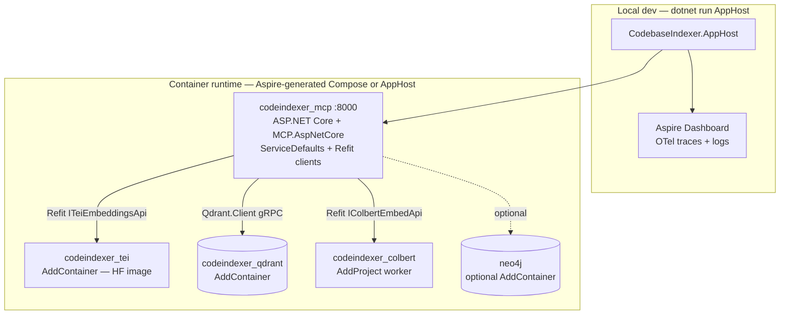
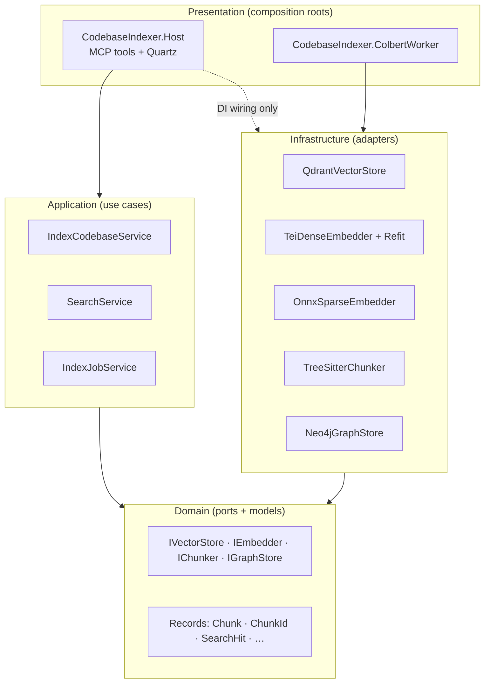

# 0030. Migrate MCP server runtime from Python to C# .NET 10

- **Status:** Accepted (phases 1–6)
- **Date:** 2026-07-12
- **Deciders:** Maintainers
- **Related:** [0002](0002-graphrag-neo4j-qdrant.md), [0003](0003-hybrid-search-rrf-default.md), [0005](0005-mcp-retrieval-connector.md), [0006](0006-explicit-fastembed-pipeline.md), [0008](0008-optional-colbert-reranking.md), [0014](0014-vector-discovery-and-ops-automation.md), [0015](0015-colbert-http-sidecar.md), [0017](0017-model-tokenizer-tei-dense-truncation.md), [0018](0018-telemetry-observability-otel-prometheus.md), [0022](0022-gpu-default-cpu-fallback.md), [0025](0025-huggingface-tei-dense-embedding.md), [0028](0028-apple-silicon-arm64-cpu-deployment.md), [MCP C# SDK](https://github.com/modelcontextprotocol/csharp-sdk), [Qdrant .NET SDK](https://github.com/qdrant/qdrant-dotnet), [TreeSitter.DotNet](https://www.nuget.org/packages/TreeSitter.DotNet), [Refit](https://github.com/reactiveui/refit), [.NET Aspire](https://learn.microsoft.com/en-us/dotnet/aspire/)
- **Supersedes:** [0018](0018-telemetry-observability-otel-prometheus.md) Phase 1 Python `prometheus_client` metrics for the MCP host and ColBERT worker once Phase 7 completes (OTel via ServiceDefaults becomes the .NET runtime telemetry path per [0018](0018-telemetry-observability-otel-prometheus.md) Phase 2+ intent)

## Context

The MCP server (`mcp_server/`, ~10k LOC production + ~9k LOC tests) is implemented in **Python 3.12** with FastMCP, pydantic-settings, fastembed ONNX sparse BM25, tree-sitter grammars, and httpx clients to TEI / ColBERT / Qdrant / Neo4j. The maintainer has **significantly stronger expertise in C# / .NET** than Python, which increases the cost of ongoing feature work, debugging, and operational troubleshooting in the current stack.

### Current capability surface (must preserve)

| Area | Python modules today | User-visible behavior |
|------|---------------------|------------------------|
| MCP transport | `main.py`, `stdio_proxy.py` | HTTP streamable (primary, port 8000); optional stdio sidecar proxy; optional bearer auth |
| Indexing | `indexer/scanner.py`, `chunker.py`, `pipeline.py`, `embedder.py` | Incremental SHA-256 scan; tree-sitter AST chunking (9 languages + SQL); double-buffered flush; cgroup memory guard |
| Dense embed | `backends/tei_dense.py` | TEI OpenAI `/v1/embeddings`; MRL `dimensions`; model tokenizer truncation |
| Sparse embed | `backends/onnx_sparse.py` | In-process BM25 via fastembed ONNX (`Qdrant/bm25` default) |
| ColBERT | `backends/colbert_remote.py`, `colbert_onnx.py`, `colbert_worker/` | Optional multivector rerank; remote GPU sidecar default; in-process ONNX on CPU |
| Storage | `storage/qdrant.py` | Hybrid dense+sparse collections; optional ColBERT multivector; recommendation API; HNSW deferral during bulk upload |
| GraphRAG | `storage/neo4j.py`, `indexer/graph_writer.py`, `tools/graph_search.py` | Optional Neo4j graph; `expand_search_context` when `GRAPH_ENABLED=true` |
| MCP tools (14) | `tools/*.py` | `index_codebase`, `index_status`, `stop_indexing`, `index_all`, `search_codebase`, `search_symbols`, `get_chunk`, `get_file_outline`, `get_collection_summary`, `list_collections`, `find_cross_references`, `map_service_dependencies`, `recommend_code`, `find_outlier_chunks`, `expand_search_context` (gated) |
| Cron | `cron/reindex.py` | Daily git pull + incremental re-index via MCP HTTP (separate container) |
| Ops scripts | `scripts/compose_files.py`, `tune_alloc.py`, `tune_stack.py`, `run_compose_integration.py` | Compose merge, stack tuning, integration harness |
| Benchmarks | `mcp_server/benchmarks/` | Golden-set retrieval eval (ranx), multihop RRF, ColBERT benches, training extras |
| Telemetry | `telemetry/metrics.py` | Prometheus `/metrics` via `prometheus_client` (ADR 0018 Phase 1 — Python only) |

### Feature parity assessment (.NET 10)

All **runtime MCP and indexing features** are achievable in C# with maintained libraries. None require staying on Python for technical reasons. Gaps are **reimplementation work**, not missing platform capabilities.

| Capability | .NET 10 approach | Parity |
|------------|------------------|--------|
| MCP HTTP server | `ModelContextProtocol.AspNetCore` on **ASP.NET Core minimal hosting** (.NET 10) | ✅ Full — official SDK v1.4+; attribute/`[McpServerTool]` discovery |
| MCP stdio proxy | `ModelContextProtocol` stdio transport + thin forwarder | ✅ Full |
| Bearer auth + `/health` | ASP.NET Core middleware | ✅ Full |
| Settings / config | `IOptions<Settings>` via **`BindConfiguration`** (`CodebaseIndexer` section); **FluentValidation** via `IValidateOptions<Settings>` + `ValidateOnStart()` — **no `.env` file loading** in .NET hosts | ✅ Full — replaces pydantic-settings + repo-root `.env` for C# runtime |
| TEI dense HTTP | **Refit** `ITeiEmbeddingsApi` → `GET /health` + OpenAI `/v1/embeddings` DTOs (single client) | ✅ Full |
| Sparse BM25 ONNX | `Microsoft.ML.OnnxRuntime` + **`Lucene.Net.Analysis.Common`** Snowball English stemmer (parity with fastembed `py-rust-stemmers`); same fastembed ONNX artifacts (`Qdrant/bm25`) | ✅ Full — reimplement fastembed wrapper; same vectors at index time |
| Tokenizer truncation | `Microsoft.ML.Tokenizers` or `HuggingFace.Tokenizers` (.NET) | ✅ Full — replaces `tokenizers` Python crate |
| Qdrant hybrid RRF | `Qdrant.Client` `QueryAsync` + `Fusion.Rrf` prefetch | ✅ Full — official SDK 1.18.x |
| Qdrant recommend / outliers | `QueryAsync` recommend strategies | ✅ Full |
| Tree-sitter chunking | `TreeSitter.DotNet` 1.3+ (28+ grammars incl. C#, Go, Rust, Java, C/C++) | ✅ Full — port `chunker.py` logic; verify `tree-sitter-sql` grammar availability (fallback: regex path already exists) |
| `.gitignore` / `.codeindexignore` | `Ignore` NuGet or `LibGit2Sharp` + pathspec port | ✅ Full |
| Neo4j GraphRAG | `Neo4j.Driver` 5.x async API | ✅ Full |
| ColBERT sidecar | ASP.NET Core minimal API + `Microsoft.ML.OnnxRuntime` (+ CUDA EP); MCP calls via **Refit** `IColbertEmbedApi` | ✅ Full — port `colbert_worker/` |
| Cgroup memory guard | Read `/sys/fs/cgroup/memory.*` from .NET | ✅ Full |
| Observability | **Built-in OpenTelemetry** (`AddOpenTelemetry`) — traces + metrics via OTLP; optional Prometheus scrape via `OpenTelemetry.Exporter.Prometheus.AspNetCore` only when direct scrape is needed | ✅ Full — **no `prometheus-net`**; supersedes Python `prometheus_client` for .NET runtime |
| Structured logging | `ILogger<T>` + OTel log correlation (`Activity.Current`) | ✅ Full — preserve stderr-only rule for stdio proxy child |
| Scheduled reindex | In-process **`BackgroundService`** or **Quartz.NET** job in Host; calls indexer directly (no MCP HTTP self-round-trip) | ✅ Full — replaces `codeindexer_cron` sidecar |
| Compose / tuning scripts | **.NET Aspire AppHost** replaces `scripts/compose_files.py`; `tune_alloc` / `tune_stack` as CLI or AppHost parameters | ✅ Full (Phase 1 scaffold, Phase 6 cutover) |
| Golden-set benchmarks (`ranx`) | **Keep Python harness** under `benchmarks/` OR port metrics to .NET test project | ⚠️ Partial — evaluation tooling, not MCP runtime; Python acceptable |
| Training (`torch` / `peft` finetune) | Remain Python under `benchmarks/train/` | ⚪ Out of scope — offline ML, not server runtime |
| ADR tracker render | Remain Python `scripts/render_adr_tracker.py` | ⚪ Out of scope — maintainer docs tooling |

**Conclusion:** A **full runtime migration** to C# .NET 10 is feasible with **no feature loss** on the MCP tool surface, indexing pipeline, hybrid search, GraphRAG, ColBERT, and deployment profiles ([0022](0022-gpu-default-cpu-fallback.md), [0028](0028-apple-silicon-arm64-cpu-deployment.md)). Offline benchmark/training scripts may remain Python.

### Hard constraints

1. **Retrieval semantics unchanged** — same chunk IDs (`sha256("{rel_path}:{start_line}")`), payload schema, hybrid RRF, and tool signatures. **.NET configuration** uses `appsettings.json` (`CodebaseIndexer` section) with optional ASP.NET Core env overrides (`CodebaseIndexer__PropertyName`); Python `.env` remains until Phase 7 cutover only for the legacy Python image.
2. **Re-index required** — not because vectors change, but to validate parity; operators should run `index_all(force=true)` once after cutover.
3. **Third-party data-plane images unchanged** — TEI, Qdrant, and Neo4j **container images and vector/graph semantics** stay as-is. **Orchestration changes:** Aspire AppHost replaces `scripts/compose_files.py` and hand-merged compose; `mcp_server` and `colbert_worker` images become .NET. The **`codeindexer_cron` container is removed** — scheduled reindex runs in-process in the MCP host.
4. **Docker integration mandatory per phase** — each phase must pass `scripts/run_compose_integration.py` (ported to .NET or kept as orchestrator) before review.
5. **Pre-release policy** — no backward-compat requirement for Python runtime once Phase 7 completes; delete `mcp_server/` Python package.

### Why now

- Maintainer velocity is higher in C# than Python for this codebase.
- Official MCP C# SDK reached v1.0+ with ASP.NET Core HTTP transport — production-ready for this server's primary mode.
- Qdrant .NET SDK supports Universal Query API (hybrid RRF, recommend, prefetch) matching current `qdrant.py` usage.
- Python stack is pre-1.0; a language migration is cheaper now than after a 1.0 API freeze.

### Evaluation stack

| Layer | In scope? | Notes |
|-------|-----------|-------|
| MCP tool behavioral parity | yes | Primary gate — same inputs/outputs |
| Index incremental correctness | yes | SHA-256 skip, stale purge |
| Hybrid search ranking parity | yes | Golden-set recall@10 within ±2% of Python baseline |
| Index throughput / RSS | partial | `bench.py` port; p95 not worse than Python + 10% on fixture hardware |
| ColBERT MAX_SIM rerank | yes | When `RERANK_ENABLED=true` |
| GraphRAG expand | yes | When `GRAPH_ENABLED=true` |
| ranx benchmark harness | no | May stay Python; refresh baseline after Phase 7 |
| torch training scripts | no | Unchanged |

## Decision

We will **replace the Python MCP server runtime** (`mcp_server/src/codebase_indexer/`, ColBERT worker) with a **C# .NET 10** solution using **.NET Aspire** for orchestration, **Refit** for outbound HTTP, and current best practices — delivered in **seven phases** (one PR per phase). Python is **removed from the production Docker image** after Phase 7. Scheduled git-pull + reindex moves **in-process** (no cron sidecar).

### Target architecture



**Dual deployment model:**

| Mode | Entry | Purpose |
|------|-------|---------|
| **Developer** | `dotnet run --project src/CodebaseIndexer.AppHost` | Aspire dashboard, service discovery, `WaitFor` health ordering |
| **Production / CI** | Aspire **Docker Compose publishing** (`Aspire.Hosting.Docker`) or checked-in generated `docker-compose.aspire.yml` | Replaces hand-maintained `docker-compose.yml` + `scripts/compose_files.py` ([0022](0022-gpu-default-cpu-fallback.md) GPU/CPU branching lives in AppHost) |

Third-party images (TEI, Qdrant, Neo4j) are **`AddContainer()`** with `WithImageTag()` pins matching today's compose. .NET services are **`AddProject<T>()`** with `WithReference()` for connection injection. GPU TEI / ColBERT use `PublishAsDockerComposeService` overrides for NVIDIA `device_requests` where the generated compose requires it.

### .NET 10 patterns (mandatory)

| Concern | Pattern |
|---------|---------|
| Solution layout | **Clean Architecture** layers (see below) + `AppHost/`, `ServiceDefaults/`, `Host/`, `ColbertWorker/` composition roots |
| Layering | `Domain` ← `Application`; `Domain` ← `Infrastructure`; `Host` / `ColbertWorker` wire both — **dependency rule enforced** (Application and Infrastructure are siblings; neither references the other) |
| Immutable models | **`record`** preferred; when a `class` is required, properties use **`{ get; init; }` only** — never `{ get; set; }` on data-carrying types (see Records policy) |
| Aspire AppHost | `DistributedApplication.CreateBuilder`; `AddProject<Projects.Host>()`; `AddContainer("qdrant")`, `AddContainer("tei")` with profiles; `WithReference()` + `WaitFor()`; `AddDockerComposeEnvironment()` for compose publishing |
| Service defaults | **`CodebaseIndexer.ServiceDefaults`** — **Aspire template defaults; do not modify**. Call `AddServiceDefaults()` from Host/Worker; project-specific OTel (`AddSource`/`AddMeter`), health checks, and MCP wiring live in **Host** / **ColbertWorker** extensions |
| Hosting | **`WebApplication.CreateSlimBuilder`** + `builder.AddServiceDefaults()` in Host/Worker — no `Startup` class; no full `CreateBuilder` unless a feature requires it |
| Health | ASP.NET Core **`AddHealthChecks()`** + custom **`IHealthCheck`** implementations (runtime, Qdrant, TEI, ColBERT); **`MapHealthChecks("/health")`** with custom JSON `ResponseWriter` — **not** ad-hoc `MapGet("/health")` |
| MCP tools | Non-static `[McpServerToolType]` classes with constructor DI in **Host** — each tool method ends in `Async`, has `[McpServerTool(Name = "...")]` + `[Description]`; return **typed response records** (not anonymous objects or tuples); delegate to **Application** handlers/services |
| Configuration | **`IOptions<Settings>`** via **`BindConfiguration("CodebaseIndexer")`** from **`appsettings.json`** (+ `appsettings.{Environment}.json`, e.g. `Docker`); Aspire / Compose override with **`CodebaseIndexer__*`** env vars; **FluentValidation** `AbstractValidator<Settings>` registered as **`IValidateOptions<Settings>`** with **`ValidateOnStart()`**; **no property defaults** on `Settings` — required fields enforced by validators; optional defaults live in JSON only; **no `.env` dotenv loading** in .NET projects |
| Outbound HTTP | **Refit** typed clients — `AddRefitClient<ITeiEmbeddingsApi>()` and `AddRefitClient<IColbertEmbedApi>()` with `ConfigureHttpClient(c => c.BaseAddress = new Uri("https+http://tei"))` under Aspire; standalone Host/tests read `CodebaseIndexer:TeiUrl` from configuration. Add `AddStandardResilienceHandler()` (timeouts, retry, circuit breaker) |
| Qdrant / Neo4j | **Not Refit** — `Qdrant.Client` gRPC and `Neo4j.Driver` are SDK-native; register as singletons with Aspire `WithReference` connection string injection |
| CPU-bound work | **`Channel<T>`** pipeline stages + `async`/`await` only — **`Task.Run` is forbidden** (see Performance guidance) |
| Async returns | **`ValueTask` / `ValueTask<T>`** on hot port paths that often complete synchronously; **`Task` / `Task<T>`** for I/O-bound work (HTTP, gRPC, ONNX, indexing batches) — see Performance guidance |
| Observability | `AddServiceDefaults()` wires OTel traces + metrics + OTLP via `OpenTelemetry.Extensions.Hosting` + `UseOtlpExporter()` per [`configuring-opentelemetry-dotnet`](https://github.com/dotnet/skills/tree/main/plugins/dotnet-aspnetcore/skills/configuring-opentelemetry-dotnet). Register `AddSource`/`AddMeter` for `Experimental.ModelContextProtocol` (MCP SDK built-in) and `CodebaseIndexer.*` custom sources. Custom metrics via injected **`IMeterFactory`** (not `new Meter()`). Add **`OpenTelemetry.Instrumentation.GrpcNetClient`** for Qdrant gRPC. Filter `/health` from traces. Aspire dashboard in dev. **No `prometheus-net`** — optional `OpenTelemetry.Exporter.Prometheus.AspNetCore` when `METRICS_ENABLED=true` |
| Index pipeline | Dedicated **`IHostedService` / `BackgroundService`** (`IndexPipelineHostedService`) — **never** run channel consumers on HTTP request threads |
| Scheduled reindex | `IHostedService`: **Quartz.NET** when `REINDEX_CRON` set; **`BackgroundService`** + `PeriodicTimer` when only `REINDEX_INTERVAL` set. Calls `IIndexJobService` directly; git pull via `LibGit2Sharp`. **.NET 10:** all of `ExecuteAsync` runs on a background thread — use `StartAsync` / `IHostedLifecycleService` for TEI probe and ONNX preload ordering per [`migrate-dotnet9-to-dotnet10`](https://github.com/dotnet/skills/tree/main/plugins/dotnet-aspnetcore/skills/migrate-dotnet9-to-dotnet10) |
| Logging | `ILogger<T>` with OTel correlation; JSON console to stderr in container |
| Testing | xUnit per [`mcp-csharp-test`](https://github.com/dotnet/skills/tree/main/plugins/mcp-csharp/skills/mcp-csharp-test): **Application.Tests** (mocked ports), **Host.Tests** (`WebApplicationFactory` + `McpClient` `ListToolsAsync` / `CallToolAsync` protocol smoke for all 14 tools), **AppHost.Tests** (`DistributedApplicationTestingBuilder`); Testcontainers for Infrastructure isolation |
| Containers | AppHost generates compose; per-service `Dockerfile` multi-stage `mcr.microsoft.com/dotnet/aspnet:10.0` — **.NET 10 images use Ubuntu 24.04 (Noble)**, not Debian; account for native `.so` deps (Tree-sitter, ONNX) in `apt` packages per [`migrate-dotnet9-to-dotnet10`](https://github.com/dotnet/skills/tree/main/plugins/dotnet-aspnetcore/skills/migrate-dotnet9-to-dotnet10) |
| Nullable | `<Nullable>enable</Nullable>` project-wide |

### Performance guidance

Apply pragmatically — **measure with `IndexPipeline` / `SearchService` benchmarks** (port of `bench.py`) before micro-optimizing. Priorities match today's Python bottlenecks: TEI/Qdrant I/O first, then allocations in scan/chunk/flush, then sync fast paths.

#### `ValueTask` vs `Task`

| Return type | Use when |
|-------------|----------|
| **`ValueTask<T>`** | Hot **read** paths that **often complete synchronously**: chunk cache hit, settings guard clause, empty collection short-circuit, in-memory `IndexJobTracker` status lookup, `FrozenDictionary` language lookup |
| **`Task<T>`** | **Always-async** I/O: Refit TEI/ColBERT, Qdrant gRPC, Neo4j Bolt, ONNX embed, bulk upsert, MCP tool boundaries wrapping real I/O |
| **`ValueTask` (non-generic)** | Rare fire-and-forget helpers; prefer `Task` for clarity in most code |

**Domain port examples:**

```csharp
// Sync-complete common → ValueTask
ValueTask<Chunk?> GetChunkAsync(ChunkId id, CancellationToken ct);
ValueTask<bool> CollectionExistsAsync(string name, CancellationToken ct);

// I/O-bound → Task
Task<IReadOnlyList<SearchHit>> SearchAsync(SearchQuery query, CancellationToken ct);
Task UpsertChunksAsync(IReadOnlyList<Chunk> batch, CancellationToken ct);
```

**`ValueTask` rules (mandatory when used):**

1. **Consume once** — never `await` the same `ValueTask` twice or `.GetAwaiter().GetResult()` after await.
2. **Do not store** `ValueTask` / `ValueTask<T>` in fields or collections.
3. **Do not return pooled `ValueTask`** from async methods that may suspend — use `new ValueTask<T>(result)` only on proven sync paths, otherwise return `Task`.
4. **Interface stability** — if a method is `Task` today and I/O-bound, do not switch to `ValueTask` without evidence of sync-fast-path ratio.

#### Async, threading, and `Channel<T>` (**`Task.Run` forbidden**)

All concurrency uses **`async`/`await`** and **`System.Threading.Channels`** — never `Task.Run`, `Task.Factory.StartNew`, or thread-pool queueing to hide sync work.

| Pattern | Application |
|---------|-------------|
| **`Channel<T>` pipeline** | Index pipeline stages: `scan → parse → embed → upsert` — runs inside dedicated **`IndexPipelineHostedService`** (`BackgroundService`); each stage is an `async` consumer loop (`await reader.ReadAsync(ct)`) calling sync CPU work **inline on that consumer** (Tree-sitter, ONNX) without `Task.Run` |
| **Bounded channels** | `BoundedChannelOptions` capacity tied to `READAHEAD_BUFFER` / `FLUSH_EVERY`; `FullMode.Wait` applies backpressure |
| **Worker fan-out** | File SHA-256 pre-scan: one producer channel + **`DOP` async consumer tasks** (`await Task.WhenAll(workers)`) where each worker runs `while (await channel.Reader.WaitToReadAsync(ct))` — not `Parallel.ForEachAsync`, not `Task.Run` |
| **`IAsyncEnumerable<T>`** | Large Qdrant scrolls (`get_file_outline`, stale-file purge) — `await foreach` without materializing full lists |
| **`ConfigureAwait(false)`** | **Infrastructure** and **Application** library code |
| **CPU sync inside consumers** | Tree-sitter parse and ONNX encode run synchronously **inside** channel consumer `async` methods (dedicated pipeline consumers, not per-call `Task.Run`) |
| **Never** | **`Task.Run`** / `Task.Factory.StartNew` / `ThreadPool.QueueUserWorkItem`; `.Result` / `.Wait()`; `async void` |

```csharp
// Index pipeline stage — async consumer, sync CPU inline, no Task.Run
await foreach (var file in scannerChannel.Reader.ReadAllAsync(ct))
{
    var chunks = chunker.Chunk(file);           // sync CPU on consumer
    await embedChannel.Writer.WriteAsync(chunks, ct);
}
```

#### Allocations and GC

| Pattern | Application |
|---------|-------------|
| **`FrozenDictionary` / `FrozenSet`** | Lookup tables built at startup: `KnownEmbedModelsOptions` (`IOptions`, merged from config + defaults), language extensions, `EXCLUDED_DIRS`, build-dep manifest matchers |
| **`ReadOnlySpan<char>`** | Import-header symbol matching, BM25 tokenization, chunk line slicing via `LineIndex` (no per-chunk `Split`/`Join`) |
| **`ArrayPool<byte>`** | File hash buffers in `WorkspaceScanner` |
| **`LoggerMessage` source generators** | Hot paths: pipeline flush, embed batch, memory-pressure guard ([CA1848](https://learn.microsoft.com/dotnet/fundamentals/code-analysis/quality-rules/ca1848)) |
| **Avoid** | LINQ in chunker / per-chunk embed loops; closure captures in tight loops; allocating `string.Split` — use `Span`/`MemoryExtensions` |
| **`IReadOnlyList<T>`** | Public APIs and records — prevent hidden multiple enumeration |

#### HTTP, gRPC, and batching

| Pattern | Application |
|---------|-------------|
| **Refit + `IHttpClientFactory`** | TEI / ColBERT — connection pooling (mandatory) |
| **`AddStandardResilienceHandler()`** | Retry only on idempotent TEI reads; indexing embed calls use timeout + circuit breaker, not aggressive retry |
| **Singleton gRPC channel** | `QdrantClient` — one per process; align with `QDRANT_TIMEOUT` |
| **Batch sizes** | Preserve env knobs: `BATCH_SIZE`, `TEI_EMBED_BATCH_SIZE`, `UPSERT_BATCH`, `FLUSH_EVERY` — same semantics as Python |
| **Concurrent embed** | Dense + sparse in parallel when `SEQUENTIAL_EMBED=false` and memory guard allows |

#### ONNX and native compute

| Pattern | Application |
|---------|-------------|
| **Singleton `InferenceSession`** | Sparse BM25 + ColBERT — load once; `Release` after index when `RELEASE_MODELS_AFTER_INDEX=true` |
| **`SPARSE_THREADS` / ORT intra-op threads** | Match Python `onnx_sparse.py` thread cap — do not default to all cores |
| **CUDA EP** | ColBERT worker only when `ACCELERATOR=gpu`; CPU EP on Apple Silicon ([0028](0028-apple-silicon-arm64-cpu-deployment.md)) |

#### Caching

| Pattern | Application |
|---------|-------------|
| **`IMemoryCache`** | `get_collection_summary`, `get_file_outline` metadata, collection-exists checks — short TTL or size-bound |
| **No cache** | Hybrid search results (stale vectors); embed outputs |

#### Serialization and logging

| Pattern | Application |
|---------|-------------|
| **`System.Text.Json` source generators** | MCP tool DTOs if custom JSON needed beyond MCP SDK defaults |
| **Structured logging** | `ILogger` + `LoggerMessage` — avoid string interpolation in hot loops when log level is disabled |

#### Container and runtime

| Pattern | Application |
|---------|-------------|
| **`DOTNET_GCHeapHardLimit`** | Complement cgroup memory guard (`memory.py` parity) in container entrypoint |
| **GC Server mode** | Default in `aspnet` image — keep for multi-threaded index pipeline |
| **Trim / R2R** | Evaluate after Phase 7 for `ColbertWorker` and arm64 ([0028](0028-apple-silicon-arm64-cpu-deployment.md)) — not Phase 1 |
| **Native AOT** | Deferred — incompatible with heavy reflection (Tree-sitter native libs, ONNX); revisit for slim proxy only |

#### Explicitly out of scope (premature)

- `ValueTask` on every interface method
- **`Task.Run`** / ad-hoc thread-pool offload (use `Channel<T>` consumers instead)
- `Parallel.ForEachAsync` (use channel worker fan-out for bounded parallelism)
- Manual `Vector128` / SIMD in chunker
- Custom thread pools beyond ORT caps and channel `DOP`
- `stackalloc` except in proven micro-benchmark wins

#### Validation

- Port `mcp_server/benchmarks/bench.py` scenarios to `CodebaseIndexer.Benchmarks` (BenchmarkDotNet or custom harness) by Phase 3.
- Regression gate: **index + search p95 not worse than Python baseline + 10%** on same fixture hardware (observation CI job, non-blocking until baseline stable).

### Microsoft official skills (implementation reference)

Use official skills from [dotnet/skills](https://github.com/dotnet/skills) during each phase — invoke the skill before scaffolding or reviewing that area:

| Work area | Skill | When |
|-----------|-------|------|
| MCP HTTP server, stdio proxy, tool attributes | [`mcp-csharp-create`](https://github.com/dotnet/skills/tree/main/plugins/mcp-csharp/skills/mcp-csharp-create) | Phase 1 Host scaffold; every new MCP tool |
| MCP unit + protocol integration tests | [`mcp-csharp-test`](https://github.com/dotnet/skills/tree/main/plugins/mcp-csharp/skills/mcp-csharp-test) | Phase 1+ Host.Tests; gate Phase 3 tool parity |
| OpenTelemetry packages, `AddSource`/`AddMeter`, OTLP | [`configuring-opentelemetry-dotnet`](https://github.com/dotnet/skills/tree/main/plugins/dotnet-aspnetcore/skills/configuring-opentelemetry-dotnet) | Phase 1 ServiceDefaults; Phase 6 metrics scrape |
| `ValueTask`, `FrozenDictionary`, hot-path review | [`analyzing-dotnet-performance`](https://github.com/dotnet/skills/tree/main/plugins/dotnet-aspnetcore/skills/analyzing-dotnet-performance) | Phase 2–3 pipeline/search tuning |
| .NET 10 `BackgroundService` threading, Ubuntu containers, config null-binding | [`migrate-dotnet9-to-dotnet10`](https://github.com/dotnet/skills/tree/main/plugins/dotnet-aspnetcore/skills/migrate-dotnet9-to-dotnet10) | Phase 1 Host/Worker; Phase 6 compose images |
| `sealed record` DTOs, minimal hosting | [`dotnet-webapi`](https://github.com/dotnet/skills/tree/main/plugins/dotnet-aspnetcore/skills/dotnet-webapi) | All phases — Domain/Application records |

**No official skill** exists for Aspire AppHost or Refit — follow Microsoft Learn docs and this ADR's AppHost sketch; pin `Aspire.AppHost.Sdk` and test GPU/arm64 parity early ([0022](0022-gpu-default-cpu-fallback.md), [0028](0028-apple-silicon-arm64-cpu-deployment.md)).

### MCP tool conventions (mandatory — `mcp-csharp-create`)

```csharp
[McpServerToolType]
public sealed class IndexTools(IIndexJobService jobs)
{
    [McpServerTool, Description("Index a project folder into the vector store.")]
    public async Task<IndexResult> IndexCodebase(
        [Description("Project folder name under WORKSPACE_ROOT")] string path,
        [Description("Force full re-index even if file SHA unchanged")] bool force = false,
        CancellationToken cancellationToken = default)
        => await jobs.IndexAsync(new IndexCodebaseCommand(path, force), cancellationToken);
}

// Host Program.cs — HTTP transport + framework health checks
builder.Services.AddHealthChecks()
    .AddCheck<McpHostHealthCheck>("codebase-indexer", tags: ["ready"]);
var app = builder.Build();
app.MapMcp();
app.MapHealthChecks("/health", new HealthCheckOptions
{
    Predicate = r => r.Tags.Contains("ready"),
    ResponseWriter = HealthCheckJsonResponseWriter.WriteAsync,
});
```

**Stdio proxy** (`CodebaseIndexer.Proxy`): set `LogToStandardErrorThreshold = LogLevel.Trace` so MCP stdio transport logs to stderr only (stdout reserved for JSON-RPC).

### Clean Architecture (adopted)

Clean Architecture fits this codebase: **multiple composition roots** (MCP Host, ColBERT Worker, AppHost), **testable retrieval logic** without Docker, and a stable **port/adapter** boundary around Qdrant / TEI / ONNX / Tree-sitter — mirroring today's Python `backends/base.py` protocols and `storage/` separation.



| Project | Responsibility | Depends on |
|---------|----------------|------------|
| **`CodebaseIndexer.Domain`** | Port interfaces (`IVectorStore`, `IDenseEmbedder`, `ISparseEmbedder`, `ICodeChunker`, `IGraphStore`); domain **`record`** types (`Chunk`, `ChunkId`, `SearchHit`, `CollectionStats`); domain exceptions | *(none)* |
| **`CodebaseIndexer.Application`** | Use-case services (`IndexCodebaseService`, `SearchService`, `IndexJobService`, `CrossReferenceService`); command/query **`record`** types; orchestrates ports | `Domain` |
| **`CodebaseIndexer.Infrastructure`** | Adapters: `QdrantVectorStore`, `TeiDenseEmbedder`, `OnnxSparseEmbedder`, `TreeSitterChunker`, `Neo4jGraphStore`, `WorkspaceScanner`; Refit API interfaces + HTTP **`record`** DTOs; `Microsoft.Extensions.DependencyInjection` registration extensions | `Domain` only |
| **`CodebaseIndexer.Host`** | MCP `[McpServerTool]` thin adapters, middleware, Quartz/BackgroundService, `Program.cs` DI composition root | `Application`, `Infrastructure`, `ServiceDefaults` |
| **`CodebaseIndexer.ColbertWorker`** | ColBERT HTTP API host; ONNX adapter | `Infrastructure`, `ServiceDefaults` |
| **`CodebaseIndexer.AppHost`** | Aspire orchestration only | Host/Worker project refs |
| **`CodebaseIndexer.ServiceDefaults`** | Aspire **`AddServiceDefaults()` template — immutable; no project-specific edits** | BCL + Aspire packages only |

**What does not get a fourth layer:** MCP tool JSON shapes map 1:1 to Application command/query records — no separate "API layer" project. AppHost is orchestration, not business logic.

**Rejected:** single `CodebaseIndexer.Core` monolith — would mix ports and Qdrant/ONNX adapters, making Host/Worker tests pull in heavy infrastructure deps.

### Records and immutability policy (mandatory)

**Default:** C# **`record`** (or **`readonly record struct`** for small value types) for all DTOs, value objects, API contracts, tool inputs/outputs, and domain entities.

**When a `class` is required** (options binding, DI-owned services, framework base types): every **public data property** uses **`{ get; init; }`** — **`{ get; set; }` is forbidden** on models, DTOs, options, and snapshots. Mutable state lives in `private` fields or concurrent collections inside service classes only (e.g. `IndexJobTracker` job table), never on exposed data shapes.

| Use `record` | Use `class` with `{ get; init; }` only |
|--------------|----------------------------------------|
| Domain models: `Chunk`, `SearchHit`, `SparseVector` | `Settings` / `IOptions<Settings>` bind model (`required` + `{ get; init; }`, **no C# property defaults** — defaults in `appsettings.json` only) |
| Application commands/queries: `IndexCodebaseCommand`, `SearchCodebaseQuery` | Rare framework subclasses that cannot be records |
| Refit/HTTP DTOs: `EmbeddingsRequest`, `ColbertEmbedResponse` | |
| MCP tool result payloads | |
| Value objects: `readonly record struct ChunkId(string Value)` | |
| `IndexJobSnapshot` (read model returned to MCP tools) | |

| Use `class` with private mutable state | Never use `{ get; set; }` on |
|----------------------------------------|------------------------------|
| `IndexJobTracker` (internal `ConcurrentDictionary` — expose **`IndexJobSnapshot` records** outward) | DTOs, domain models, commands, queries, Refit contracts, MCP payloads, `Settings` |

```csharp
// Domain — records (preferred)
public readonly record struct ChunkId(string Value);
public sealed record Chunk(
    ChunkId Id,
    string RelPath,
    string Content,
    int StartLine,
    int EndLine,
    string? SymbolName,
    string Language,
    string FileSha256);

// Application — records
public sealed record IndexCodebaseCommand(
    string Collection,
    string Path,
    bool Force = false,
    bool Wait = true);

// Settings — class with init-only; no C# defaults; FluentValidation enforces required fields
public sealed class Settings
{
    public const string SectionName = "CodebaseIndexer";

    public required string QdrantUrl { get; init; }
    public required int QdrantTimeoutSeconds { get; init; }
    public required string DenseEmbedModel { get; init; }
    public required int DenseEmbedVectorSize { get; init; }
    public required bool HybridSearch { get; init; }
    // … all properties { get; init; } — no `= default` on class; optional empty strings use string.Empty in appsettings.json
}

// FluentValidation — registered as IValidateOptions<Settings> + ValidateOnStart()
public sealed class SettingsValidator : AbstractValidator<Settings>
{
    public SettingsValidator()
    {
        RuleFor(x => x.QdrantUrl).NotEmpty();
        RuleFor(x => x.DenseEmbedModel).NotEmpty();
        RuleFor(x => x.DenseEmbedVectorSize).GreaterThan(0);
    }
}

// Infrastructure/Refit — records
public sealed record EmbeddingsRequest(string Model, IReadOnlyList<string> Input, int? Dimensions = null);
public sealed record EmbeddingsResponse(IReadOnlyList<EmbeddingData> Data);
```

**Rules:**

1. Prefer `sealed record`; use `readonly record struct` for small value types.
2. **`{ get; set; }` is banned** on any data-carrying type — use `record` or `{ get; init; }`.
3. Use `IReadOnlyList<T>` / `IReadOnlyDictionary<K,V>` in records and init-only classes.
4. `[McpServerTool]` methods accept and return `record` types (or init-only classes only when unavoidable).
5. Enforce immutability in CI: **NetArchTest** layer rules + **[CA2227](https://learn.microsoft.com/dotnet/fundamentals/code-analysis/quality-rules/ca2227)** (`Collection properties should be read only`) on DTO paths — not IDE0025 (that rule is unrelated to `get; set;`).
6. Use **`string.Empty`** for intentional empty strings in C# — never `""`.
7. **One type per file** — each `record`, `class`, `interface`, and `enum` gets its own `.cs` file named after the type (e.g. `Chunk.cs`, `IDenseEmbedder.cs`). Do not combine multiple types in barrel files like `Records.cs` or `Ports.cs`; nested private helpers may stay in their parent when not reused.

### Refit API surface (Infrastructure project)

Refit interfaces and HTTP **`record`** DTOs live in **`CodebaseIndexer.Infrastructure`**. Application consumes **`IDenseEmbedder`** / **`IColbertEmbedder`** domain ports — not Refit types directly. Register concrete embedders with **`AddKeyedSingleton`** and resolve via **`[FromKeyedServices(EmbedderBackendKeys.*)]`**; backend id strings live in **`EmbedderBackendKeys`** constants only (no `BackendName` on port interfaces).

```csharp
// TEI OpenAI-compatible embeddings ([0025](0025-huggingface-tei-dense-embedding.md))
public interface ITeiEmbeddingsApi
{
    [Get("/health")]
    Task<HttpResponseMessage> GetHealthAsync(CancellationToken ct = default);

    [Post("/v1/embeddings")]
    Task<EmbeddingsResponse> CreateEmbeddingsAsync(
        [Body] EmbeddingsRequest request, CancellationToken ct = default);
}

// ColBERT sidecar ([0015](0015-colbert-http-sidecar.md))
public interface IColbertEmbedApi
{
    [Post("/embed")]
    Task<ColbertEmbedResponse> EmbedAsync(
        [Body] ColbertEmbedRequest request, CancellationToken ct = default);

    [Get("/health")]
    Task<HealthResponse> GetHealthAsync(CancellationToken ct = default);
}
```

`TeiDenseEmbedder` and `ColbertRemoteEmbedder` (Infrastructure) implement domain ports via these Refit clients — no raw `HttpClient` in Application or Host.

### In scope

- Full port of all 14 MCP tools and indexing pipeline
- ColBERT worker port to ASP.NET Core
- Scheduled reindex as in-process `BackgroundService` / Quartz.NET (replaces `codeindexer_cron` container)
- **.NET Aspire AppHost** as orchestration source of truth (replaces `scripts/compose_files.py` + hand-merge compose)
- **Refit** for all TEI and ColBERT HTTP ([0025](0025-huggingface-tei-dense-embedding.md), [0015](0015-colbert-http-sidecar.md))
- **Clean Architecture** layering (`Domain` / `Application` / `Infrastructure` / `Host`)
- `CodebaseIndexer.ServiceDefaults` shared across Host and ColbertWorker
- **`record`** types for all immutable models; classes use **`{ get; init; }` only**
- Docker Compose Dockerfile swap for `mcp_server` and `colbert_worker`; **remove `cron` service**
- Port or replace: `compose_files`, `tune_alloc`, `tune_stack`, `run_compose_integration` orchestration
- Docs sync: `README.md`, `ARCHITECTURE.md`, `DEPLOYMENT.md`, `copilot-instructions.md`, `skill/codebase-indexer/SKILL.md`
- Golden-set baseline refresh after parity sign-off

### Out of scope

- Changing TEI, Qdrant, or Neo4j service topology
- Replacing sparse BM25 with server-side-only Qdrant inference (must keep explicit in-process sparse vectors per [0006](0006-explicit-fastembed-pipeline.md))
- Porting `benchmarks/train/` (torch finetune) to C#
- Porting `scripts/render_adr_tracker.py`
- In-server LLM / Ragas generation ([0010](0010-defer-ragas-to-client.md), [0012](0012-retrieval-only-rag-split.md))

### Default behavior and configuration

- **Python (until Phase 7):** unchanged — repo-root `.env` keys and compose profiles for the legacy Python image
- **.NET runtime (Phase 1+):** configuration lives in **`appsettings.json`** under the `CodebaseIndexer` section; environment-specific overrides in `appsettings.{Environment}.json` (e.g. `Docker` for container URLs); Aspire / Compose inject **`CodebaseIndexer__*`** env vars (e.g. `CodebaseIndexer__QdrantUrl`) — **not** flat `QDRANT_URL` / `.env` dotenv in .NET projects. Required fields have **no C# defaults**; **FluentValidation** fails fast at startup via `ValidateOnStart()`. Use **`string.Empty`** in C# for intentional empty strings — never `""`.

### Phased delivery

| Phase | PR scope | Exit criteria |
|-------|----------|---------------|
| **1 — Scaffold + storage + TEI** | **AppHost + ServiceDefaults**; **Domain / Application / Infrastructure / Host** projects; port interfaces + `Chunk` records; `QdrantVectorStore`; `TeiDenseEmbedder` via Refit; Host MCP stub with `[Description]` + `MapMcp()`; OTel via ServiceDefaults (incl. MCP `Experimental.ModelContextProtocol` source); AppHost boots Qdrant + TEI | `dotnet run --project AppHost` starts stack; Domain unit tests have zero infra refs; Refit TEI embed smoke; Host.Tests `McpClient` lists tools |
| **2 — Indexing pipeline** | `WorkspaceScanner`, `TreeSitterChunker`, `OnnxSparseEmbedder`, `IndexPipeline` (**`Channel<T>`** stages in **`IndexPipelineHostedService`**: scan→parse→embed→upsert); `IndexCodebaseService`; MCP index tools; **`ArrayPool` hashing**, channel worker fan-out for scan | Incremental index of fixture repo; chunk IDs match Python golden samples |
| **3 — Core search tools** | `search_codebase`, `search_symbols`, `get_chunk`, `get_file_outline`, `get_collection_summary`, `list_collections` | Golden queries recall@10 within ±2% on fixture collection |
| **4 — Cross-ref + discovery** | `find_cross_references`, `map_service_dependencies`, `recommend_code`, `find_outlier_chunks`; build-deps parsers | Tool contract tests; service-map smoke on multi-collection fixture |
| **5 — GraphRAG** | `Neo4jStorage`, graph writer, `expand_search_context` (gated by `GRAPH_ENABLED`) | Graph overlay integration test passes |
| **6 — ColBERT + ops** | ColBERT worker (ServiceDefaults + Refit `/health`); remote + in-process ONNX; Quartz/BackgroundService reindex; **Aspire Docker Compose publishing** replaces root `docker-compose.yml`; stdio proxy | GPU/CPU ColBERT smoke; `docker compose -f docker-compose.aspire.yml up` parity with today; `cron/` removed |
| **7 — Cutover + delete Python** | Remove `mcp_server/` Python runtime; update CI; refresh docs + eval baseline; migration note in CHANGELOG | Full integration harness green; Python image removed |

Phases 1–3 deliver a **usable search stack**; phases 4–6 reach **full parity**; phase 7 is **irreversible cleanup**.

## Alternatives considered

| Option | Pros | Cons |
|--------|------|------|
| **Full .NET 10 + Aspire + Refit (chosen)** | Maintainer expertise; Aspire dev dashboard; Refit typed HTTP; compose generation | Multi-phase; AppHost GPU/NVIDIA compose customization |
| Plain ASP.NET (no Aspire) | Simpler initial scaffold | Keeps `compose_files.py`; no service discovery; rejected |
| Raw `HttpClient` (no Refit) | Fewer packages | Manual DTO wiring; no typed API; rejected |
| Stay on Python | Zero migration cost | Continued maintainer friction; slower feature delivery |
| Rust rewrite | Smallest binary; best memory | Steeper ramp; weaker MCP/ONNX ergonomics vs C# for this maintainer |
| Hybrid (.NET MCP front, Python indexer) | Smaller initial PR | Two runtimes forever; operational complexity; defeats motivation |
| Partial (.NET tools only, Python indexer as lib) | Incremental | PyO3 reverse direction; still need Python in container |
| Separate cron container (.NET) | Parity with current compose | Extra container, MCP HTTP loopback, duplicate auth; rejected |
| Monolithic `Core` project | Fewer projects initially | Ports + adapters coupled; Application tests need Qdrant/ONNX refs; rejected |
| `prometheus-net` for metrics | Familiar `/metrics` scrape | Redundant with OTel; second metrics stack; rejected |
| Mutable `{ get; set; }` properties | Familiar mutable DTOs | Breaks immutability; rejected — use `record` or `{ get; init; }` |
| `Task.Run` for CPU offload | Quick escape hatch | Hides threading bugs; fights ASP.NET scheduling; rejected — `Channel<T>` consumers |

## Consequences

### Positive

- Maintainer can implement and debug the full runtime in their primary language
- **Aspire dashboard** for local dev — unified OTel traces across MCP → TEI → ColBERT without manual wiring
- **Refit** eliminates httpx-style boilerplate; TEI/ColBERT contracts are compile-time checked
- **Clean Architecture** enables Application-layer unit tests with mocked ports (no Qdrant/TEI Docker)
- **`record`** + **`{ get; init; }`** on classes give immutable MCP contracts — `{ get; set; }` banned on data types
- Lower process RSS vs CPython; no GIL for concurrent embed + I/O pipeline
- **`ValueTask`** on sync-fast read paths avoids thread-pool allocation tax vs Python `asyncio` overhead on cache hits
- **`FrozenDictionary`**, `ArrayPool`, and `Channel<T>` reduce GC pressure during bulk indexing
- Strong typing, **FluentValidation**, and `ValidateOnStart()` catch config errors at boot
- **One fewer container** — scheduled reindex in-process; direct indexer calls (no MCP loopback)
- **Single observability stack** — OpenTelemetry traces + metrics with OTLP export; aligns with [0018](0018-telemetry-observability-otel-prometheus.md) Phase 2+ intent
- Single runtime for MCP host and ColBERT worker

### Negative / trade-offs

- Multi-month phased migration; feature freeze on large new Python modules during cutover
- Tree-sitter and BM25 paths must be revalidated chunk-by-chunk against Python fixtures
- `TreeSitter.DotNet` is community-maintained (not Microsoft) — pin version, add grammar smoke tests
- AppHost GPU TEI / NVIDIA `device_requests` may need `ConfigureComposeFile` overrides — test on amd64+NVIDIA and arm64 CPU profiles early in Phase 1
- Aspire is newer than raw Compose — pin `Aspire.AppHost.Sdk` version; document fallback `docker compose` path for operators who skip AppHost
- Contributors familiar with Python must switch to .NET conventions

### Neutral / follow-ups

- Consider **Native AOT** publish for `linux-arm64` Apple Silicon profile after parity ([0028](0028-apple-silicon-arm64-cpu-deployment.md))
- ADR 0018 follow-up: document OTel collector scrape config (Alloy/Prometheus) for .NET runtime; Python `prometheus_client` `/metrics` removed when [0018](0018-telemetry-observability-otel-prometheus.md) Phase 1 is superseded at Phase 7
- Future ADR may retire Python benchmark harness once .NET eval tooling exists

### Downstream work

- Update [ARCHITECTURE.md](../ARCHITECTURE.md) module paths to Clean Architecture projects (`Domain`, `Application`, `Infrastructure`, `Host`)
- Refresh [SEARCH_BEHAVIOR.md](../SEARCH_BEHAVIOR.md) only if tool caps change (should not)
- [IMPLEMENTATION_TRACKER.md](IMPLEMENTATION_TRACKER.md) — seven phase entries

## Implementation notes

### New artifacts

```
CodebaseIndexer.slnx
src/
  CodebaseIndexer.AppHost/
  CodebaseIndexer.ServiceDefaults/
  CodebaseIndexer.Domain/           # Ports + record models (no NuGet deps)
  CodebaseIndexer.Application/      # Use-case services + command/query records
  CodebaseIndexer.Infrastructure/   # Qdrant, Refit, ONNX, Tree-sitter, Neo4j adapters
  CodebaseIndexer.Host/             # MCP thin adapters + IndexPipelineHostedService + Quartz + Program.cs DI root
  CodebaseIndexer.Proxy/            # stdio → HTTP forwarder (LogToStandardErrorThreshold)
  CodebaseIndexer.ColbertWorker/
  CodebaseIndexer.Cli/              # tune_alloc (optional)
  CodebaseIndexer.Benchmarks/       # bench.py port (BenchmarkDotNet / harness)
test/
  CodebaseIndexer.Domain.Tests/
  CodebaseIndexer.Application.Tests/  # mocked ports — fast, no Docker
  CodebaseIndexer.Infrastructure.Tests/
  CodebaseIndexer.Host.Tests/
  CodebaseIndexer.AppHost.Tests/
  CodebaseIndexer.IntegrationTests/
```

### Scheduled reindex and .NET 10 hosting

Per [`migrate-dotnet9-to-dotnet10`](https://github.com/dotnet/skills/tree/main/plugins/dotnet-aspnetcore/skills/migrate-dotnet9-to-dotnet10) **extensions-hosting** breaking change: in .NET 10, **all** of `BackgroundService.ExecuteAsync` runs on a background thread (not only after the first `await`). Implications:

- **`IndexPipelineHostedService`** and Quartz reindex jobs must not assume main-thread startup ordering inside `ExecuteAsync` — use `StartAsync` / `IHostedLifecycleService` for TEI health probe, ONNX `InferenceSession` preload (`PRELOAD_MODELS`), and `ValidateOnStart` ordering.
- **`IOptions<Settings>` null-binding:** .NET 10 preserves JSON `null` in configuration — **FluentValidation** on `Settings` rejects null/missing required fields at startup (no silent overwrite of init-only properties).

### Configuration files (.NET runtime)

**`appsettings.json`** (repo defaults — not `.env`):

```json
{
  "CodebaseIndexer": {
    "QdrantUrl": "http://localhost:6333",
    "QdrantTimeoutSeconds": 30,
    "QdrantCollection": "codebase",
    "HybridSearch": true,
    "DenseEmbedModel": "jinaai/jina-embeddings-v2-base-code",
    "SparseEmbedModel": "Qdrant/bm25",
    "DenseEmbedVectorSize": 768,
    "TeiUrl": "http://localhost:8080",
    "TeiEmbedBatchSize": 32,
    "TeiTimeoutSeconds": 120,
    "QueryInstruction": "",
    "NormalizeOutput": false,
    "RerankEnabled": false,
    "PayloadIndexes": true,
    "VectorsOnDisk": false,
    "SparseOnDisk": false
  }
}
```

**`appsettings.Docker.json`** (container URL overrides only):

```json
{
  "CodebaseIndexer": {
    "QdrantUrl": "http://qdrant:6333",
    "TeiUrl": "http://tei:80"
  }
}
```

Docker Compose / Aspire overrides use ASP.NET Core env syntax, e.g. `CodebaseIndexer__DenseEmbedModel` — not flat `DENSE_EMBED_MODEL` on the .NET `mcp` service.

### Scheduled reindex configuration (new env vars)

| Variable | Default | Purpose |
|----------|---------|---------|
| `REINDEX_ENABLED` | `true` | Master switch for in-process scheduled reindex |
| `REINDEX_CRON` | `0 3 * * *` | Cron expression (Quartz); when set, takes precedence over interval |
| `REINDEX_INTERVAL` | *(empty)* | `TimeSpan` fallback for `BackgroundService` when `REINDEX_CRON` is empty |
| `REINDEX_GIT_PULL` | `true` | `git pull` default branch before each collection reindex |
| `OTEL_EXPORTER_OTLP_ENDPOINT` | *(empty)* | OTLP collector URL when export enabled |
| `METRICS_ENABLED` | `false` | When `true`, expose OTel Prometheus scrape endpoint (not `prometheus-net`) |

Preserves existing `WORKSPACE_PATH`, `INDEX_TIMEOUT`, `GIT_TIMEOUT` semantics from `cron/reindex.py`.

### Key NuGet dependencies (runtime)

| Package | Role |
|---------|------|
| `Aspire.AppHost.Sdk` | AppHost project SDK |
| `Aspire.Hosting.AppHost` | `DistributedApplication.CreateBuilder` |
| `Aspire.Hosting.Docker` | Docker Compose publishing for production/CI |
| `Microsoft.Extensions.ServiceDiscovery` | Logical service names (`https+http://tei`) |
| `Microsoft.Extensions.Http.Resilience` | Standard resilience on Refit HttpClients |
| `Refit.HttpClientFactory` | Typed TEI + ColBERT HTTP clients |
| `ModelContextProtocol.AspNetCore` | MCP HTTP server |
| `Qdrant.Client` | Vector storage + hybrid RRF + recommend (gRPC — not Refit) |
| `Microsoft.ML.OnnxRuntime` (+ GPU EP package) | Sparse BM25 + optional ColBERT |
| `Lucene.Net.Analysis.Common` | English Snowball stemming for BM25 sparse (Apache Lucene.NET) |
| `Microsoft.ML.Tokenizers` or `HuggingFace.Tokenizers` | Dense/sparse truncation |
| `TreeSitter.DotNet` | AST chunking |
| `Neo4j.Driver` | GraphRAG (Bolt — not Refit) |
| `OpenTelemetry.Extensions.Hosting` | Required host integration — do not install bare `OpenTelemetry` package alone |
| `OpenTelemetry.Instrumentation.GrpcNetClient` | Qdrant gRPC client spans |
| `OpenTelemetry.Exporter.OpenTelemetryProtocol` | OTLP export (wired by ServiceDefaults) |
| `OpenTelemetry.Exporter.Prometheus.AspNetCore` | Optional Prometheus scrape when `METRICS_ENABLED=true` |
| `FluentValidation` | **`IOptions<Settings>` validation** — `AbstractValidator<Settings>` + `IValidateOptions<Settings>` + `ValidateOnStart()` |
| `Quartz.Extensions.Hosting` | Cron-expression scheduled reindex |
| `LibGit2Sharp` | git pull + gitignore-aware scan |

### Aspire AppHost sketch (Phase 1 target)

```csharp
var builder = DistributedApplication.CreateBuilder(args);
var accelerator = builder.AddParameter("accelerator", "gpu");

var qdrant = builder.AddContainer("qdrant", "qdrant/qdrant", "v1.18.2")
    .WithHttpEndpoint(port: 6333, targetPort: 6333, name: "http")
    .WithVolume("qdrant_data", "/qdrant/storage")
    .WithHttpHealthCheck("/healthz");

var tei = builder.AddContainer("tei", teiImage, teiTag)
    .WithHttpEndpoint(port: 8080, targetPort: 80, name: "http")
    .WithEnvironment("MODEL_ID", denseModel)
    .WithVolume("fastembed_cache", "/data")  // sparse ONNX + tokenizer cache parity
    .WithHttpHealthCheck("/health");
// GPU: ConfigureComposeFile override for NVIDIA device_requests when accelerator=gpu

var mcp = builder.AddProject<Projects.CodebaseIndexer_Host>("mcp")
    .WithReference(qdrant).WaitFor(qdrant)
    .WithReference(tei).WaitFor(tei)
    .WithHttpEndpoint(port: 8000, name: "mcp");

builder.AddDockerComposeEnvironment("compose");
builder.Build().Run();
```

`scripts/compose_files.py` logic (GPU merge, arm64 TEI image, Neo4j/ColBERT profiles) migrates to **conditional AppHost resource registration** + `ConfigureComposeFile` callbacks.

### Modified artifacts

- `docker-compose.yml` → **generated** `docker-compose.aspire.yml` (checked in after Phase 6, or CI-generated)
- `scripts/compose_files.py` → **deleted** in Phase 6 (replaced by AppHost)
- `docker-compose.colbert-worker*.yml` — absorbed into AppHost profiles
- `.github/workflows/*` — `dotnet test` + AppHost integration smoke
- `README.md`, `docs/DEPLOYMENT.md`, `.github/copilot-instructions.md`, `skill/codebase-indexer/SKILL.md`

### Deleted artifacts (Phase 7)

- `mcp_server/src/codebase_indexer/` (Python package)
- `mcp_server/pyproject.toml`, `uv.lock` (server runtime)
- Python ColBERT worker modules
- `scripts/compose_files.py` (replaced by AppHost)
- `cron/` directory (`reindex.py`, `Dockerfile`, `crontab`, `entrypoint.sh`)

### Risk mitigations

| Risk | Mitigation |
|------|------------|
| Chunk boundary drift | Port `mcp_server/tests/test_chunker.py` cases verbatim to xUnit; byte-compare chunk IDs |
| Sparse vector drift | Index same fixture; compare Qdrant sparse indices for sample chunks; load **same fastembed ONNX artifacts** (`Qdrant/bm25`) via `Microsoft.ML.OnnxRuntime` — no server-side-only sparse inference |
| Tree-sitter SQL grammar missing | Keep regex `create_procedure` fallback from Python |
| MCP spec drift | Pin `ModelContextProtocol.AspNetCore` minor version; CI smoke `initialize` handshake |
| Aspire GPU compose gaps | Early Phase 1 test on NVIDIA host; `ConfigureComposeFile` for `device_requests`; document manual override in DEPLOYMENT.md |
| Refit + Aspire discovery mismatch | Use `https+http://` scheme + `AddServiceDiscovery()`; integration test asserts resolved TEI URL |

### Rollout

- Phases 1–6: **opt-in** — Python image remains default in `main` until Phase 7
- Phase 7: **breaking** — Python runtime deleted; operators `docker compose build --no-cache`

### Data migration

- **Re-index:** recommended once after Phase 7 (`index_all(force=true)`) to validate end-to-end; vectors need not change if sparse/dense parity tests pass
- **Qdrant data:** compatible — same collection schema and payload fields
- **Baselines:** refresh `benchmarks/fixtures/eval_baseline.json` after Phase 3 sign-off

## Validation

### Automated tests

- **Unit** — `CodebaseIndexer.Domain.Tests` / `CodebaseIndexer.Application.Tests` with **mocked ports** (no Docker); chunker fixture records; settings validators
- **MCP protocol** — `CodebaseIndexer.Host.Tests`: `WebApplicationFactory` + `McpClient` `ListToolsAsync` / `CallToolAsync` for all 14 tools per [`mcp-csharp-test`](https://github.com/dotnet/skills/tree/main/plugins/mcp-csharp/skills/mcp-csharp-test)
- **Integration** — Testcontainers Qdrant; optional Neo4j; marked `Integration` trait
- **Parity** — committed chunk-ID golden file from Python run; .NET indexer must match
- **Docker** — full compose harness per phase (mandatory)

### Fixture-based evaluation

- Reuse `mcp_server/benchmarks/fixtures/golden_queries.jsonl` and `eval_baseline.json`
- Gate Phase 3 on recall@10 ≥ baseline − 2%
- Gate Phase 5 on graph tool smoke with `docker-compose.neo4j.yml`
- **Performance (non-blocking until baseline stable):** index + search p95 vs Python `bench.py` on fixture repo

### Success criteria

1. All 14 MCP tools return equivalent JSON shapes (modulo float rounding) on fixture workspace
2. Incremental indexing skips unchanged files and purges stale paths
3. Hybrid search recall@10 within ±2% of Python baseline on golden set
4. `docker compose up` boots .NET images on both `linux/amd64` (GPU) and `linux/arm64` (CPU profile)
5. Python `mcp_server/` deleted; CI green with `dotnet test` only for runtime

## Open questions

1. **Single repo vs split** — keep .NET solution at repo root or under `dotnet/` subdirectory? *(Default: repo root `src/` alongside retired `mcp_server/` until Phase 7.)*
2. **Benchmark harness** — port `eval_retrieval.py` to C# in Phase 7 or keep Python dev-extra permanently? *(Default: keep Python benchmarks in Phase 7; port later if needed.)*
3. **stdio proxy** — separate minimal console project or fold into Host with transport flag? *(Default: separate `CodebaseIndexer.Proxy` project.)*
4. **Scheduler choice** — Quartz only vs Quartz + `BackgroundService` interval fallback? *(Default: both — Quartz when `REINDEX_CRON` set, `BackgroundService` + `PeriodicTimer` when only `REINDEX_INTERVAL` set.)*
5. **Aspire compose output** — check in generated `docker-compose.aspire.yml` vs CI-only generation? *(Default: check in after Phase 6 so operators without AppHost SDK can still `docker compose up`.)*
